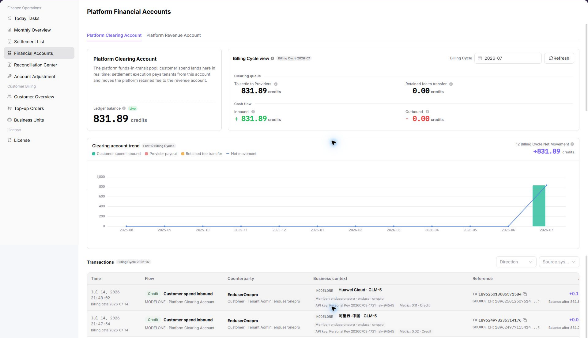
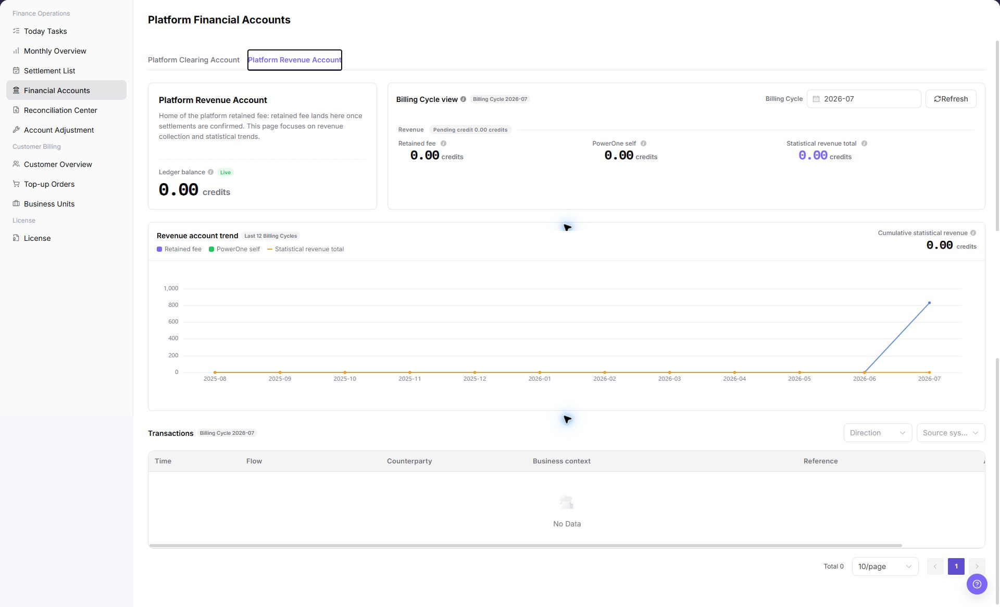

# Financial Accounts

::: info Document Information
Version: v1.0
Updated: 2026-07-10
:::

## Feature Overview

`Financial Accounts` is used to review platform clearing accounts, platform revenue accounts, balances, income, expense, available amount, and transactions. Billing operators use this page to confirm whether funds are in the expected account and continue to settlement, monthly overview, or reconciliation pages when amounts differ.

| Item | Content |
| --- | --- |
| Applicable role | Platform operator, billing operator |
| Navigation path | Billing > Finance Operations > Financial Accounts |
| Page route | `/billing/admin/financial-accounts` |
| Managed objects | Platform clearing account, platform revenue account, account balance, transactions, and transaction details |
| Typical use | Verify account balance, review fund changes, locate transactions, and support settlement and reconciliation |

#### Beginner Explanation

Financial Accounts is the platform's fund ledger. It shows account balance, income, expense, available amount, and transactions for accounts such as `Platform Clearing Account` and `Platform Revenue Account`.

Settlement List is the statement pool and focuses on whether an organization has a settlement record for a billing cycle. Financial Accounts focuses on where the money comes from, where it goes, and how much remains.

#### Terms Quick Reference

| Term | Meaning | Handling tip |
| --- | --- | --- |
| Platform Clearing Account | Temporary account for collecting and clearing transaction funds. | Verify inflow and clearing status before settlement. |
| Platform Revenue Account | Account for platform retained fee, service fee, commission, or other platform revenue. | Cross-check with Monthly Overview and settlement statements. |
| Account Balance | Current fund or credit balance displayed for the account. | Cross-check with income, expense, and transactions. |
| Transactions | Each income, expense, refund, or settlement-related fund change. | Start here when locating amount differences. |
| Last Update Time | Last refresh time of account data. | Avoid drawing conclusions from stale data. |

#### Account Relationship Notes

| Account type | Beginner view | Main use |
| --- | --- | --- |
| Platform Clearing Account | Temporary transit ledger for collected funds | Review fund inflow, clearing, and pre-settlement status. |
| Platform Revenue Account | Final platform revenue ledger | Review retained fee, service fee, or revenue summary. |
| Transactions | Fund change records | Investigate income, expense, refund, and settlement differences. |

## Where to Look

1. Start from the account list when confirming whether the balance is correct.
2. Open transaction details when investigating a specific fund change.
3. Open [Settlement List](../settlement-list/) when comparing settlement amounts.
4. Open [Monthly Overview](../monthly-overview/) when comparing billing-cycle revenue totals.
5. Open [Reconciliation Center](../reconciliation-center/) when account differences cannot be explained from account data alone.

## Prerequisites

1. The current account can access `Finance Operations > Financial Accounts`.
2. The target platform account type has been confirmed, such as `Platform Clearing Account` or `Platform Revenue Account`.
3. Before reviewing transactions, the target billing cycle, organization, transaction type, or transaction number has been confirmed.
4. Before investigating settlement differences, the settlement statement, monthly overview, or reconciliation scope has been confirmed.

## Page Description

The page usually displays account name, account type, account balance, income, expense, available amount, last update time, and transaction entry. Billing operators can start from account cards, then open details or transactions to verify fund changes.

| Area | Description |
| --- | --- |
| Account list | Shows platform clearing account, platform revenue account, and other financial accounts. |
| Account Balance | Shows current balance, available amount, income, and expense. |
| Details | Opens target account details and balance changes. |
| Transactions | Shows income, expense, refund, settlement, and other transactions under the selected account. |
| Last Update Time | Indicates whether account amount and transaction data have refreshed. |

The following screenshot shows the platform clearing account view. It includes account overview, billing-cycle view, and transactions.

The following screenshot shows the platform revenue account view. It includes revenue account overview, revenue trend, and transaction list.

## Main Operations

Use the following operations to review account information and transactions. This page records view-only checks. Do not perform adjustment, posting confirmation, clearing, export, or other high-risk actions when learning or taking screenshots.

### View Account List

1. Go to `Billing > Finance Operations > Financial Accounts`.
2. Review accounts such as `Platform Clearing Account` and `Platform Revenue Account`.
3. Check account balance, total income, total expense, available amount, and last update time.
4. If the list is empty, reset filters first, then confirm whether the current account has financial-account view permission.

### View Platform Clearing Account

1. Go to `Billing > Finance Operations > Financial Accounts`.
2. Find `Platform Clearing Account` in the account list.
3. Review account balance, income, expense, available amount, and last update time.
4. To verify fund flow, click `Details` or the transaction entry for the account.
5. Compare with Monthly Overview, Settlement List, or Reconciliation Center to confirm that the clearing account amount matches the billing-cycle settlement status.
6. For learning or screenshots only, view account information and transactions without performing adjustment, clearing, or posting confirmation actions.

### View Platform Revenue Account

1. Go to `Billing > Finance Operations > Financial Accounts`.
2. Find `Platform Revenue Account` in the account list.
3. Review account balance, income, expense, available amount, and last update time.
4. Focus on platform retained fee, self-operated revenue, or other platform revenue amounts.
5. Compare with Monthly Overview, Settlement Statement Details, and Financial Account transactions to confirm that revenue amount scopes are consistent.
6. For learning or screenshots only, view account information and transactions without performing adjustment, posting confirmation, or sensitive export actions.

### View Account Details

1. Go to `Billing > Finance Operations > Financial Accounts`.
2. Select the target account in the account list.
3. Open account details.
4. Review basic account information, balance changes, income and expense summary, and transactions.
5. Record the last update time to avoid using stale data for reconciliation.

### View Transactions

1. Go to `Billing > Finance Operations > Financial Accounts`.
2. Open the target account details.
3. Filter by transaction time, transaction type, or transaction number.
4. Open transaction details.
5. Verify amount, fund direction, related settlement statement, related order, or business source.
6. Before sharing transaction details in tickets or comments, desensitize amount, organization name, transaction number, and account information.

### Open Troubleshooting Pages

1. Go to `Billing > Finance Operations > Financial Accounts`.
2. Use filters or tabs to locate the target record.
3. Select the target row or entry related to financial accounts records and related status.
4. Click the visible `Open Troubleshooting Pages` entry when it is available.
5. Check the displayed details, status, and related fields before moving to the next page.

## Parameter Reference

| Field Name | Required | Field Type | Example | Description |
| --- | --- | --- | --- | --- |
| Platform Clearing Account | System-generated | Account type | Platform Clearing Account | Used to review clearing balance, income, expense, and transactions. |
| Platform Revenue Account | System-generated | Account type | Platform Revenue Account | Used to review platform retained fee, self-operated revenue, and other platform revenue. |
| Account Balance | System-generated | Amount | `12,345.67 credits` | Current fund or credit balance displayed for the account. |
| Income | System-generated | Amount | `10,000.00 credits` | Inbound amount in the current selected scope. |
| Expense | System-generated | Amount | `2,000.00 credits` | Outbound amount in the current selected scope. |
| Available Amount | System-generated | Amount | `8,000.00 credits` | Amount available for later clearing, confirmation, or statistics. |
| Last Update Time | System-generated | Date and time | `2026-07-08 10:00` | Indicates whether account amount and transaction data have refreshed. |
| Details | System-generated | Operation entry | `Details` | Opens target account details and balance changes. |
| Transactions | System-generated | Operation entry | `Transactions` | Opens income, expense, refund, settlement, and other transactions for the selected account. |
| Transaction Time | No | Time range | `2026-07-01 to 2026-07-31` | Filters transactions within a specific time range. |
| Transaction Type | No | Enum | `Income` | Distinguishes income, expense, refund, settlement, and other transaction types. |
| Transaction Number | No | Text | `TXN-202607080001` | Locates a specific transaction record. |
| Organization | No | Text | `Example Organization A` | Locates account transactions or settlement differences by organization. |

## Result Validation

| Check Item | Success Signal | If Abnormal |
| --- | --- | --- |
| Page access | The `Finance Operations > Financial Accounts` page opens and data loads normally. | Check role permissions and refresh the page. |
| Filter result | The list changes according to the selected filters. | Reset filters and search again. |
| Record detail | Details, status, amount, permission, or configuration values are visible. | Confirm the record scope and permissions. |
| Follow-up path | Related pages or dialogs can be opened from visible entries. | Return to the sidebar and enter the downstream page directly. |

## Pitfalls

- Do not rely on one amount field alone for financial confirmation; cross-check transactions, bills, settlement statements, and reconciliation results.
- Do not repeat high-risk billing operations when the first attempt fails; check status and error details first.
- Remove sensitive customer, bank, contract, token, Key, or internal processing information before sharing screenshots or tickets.
- Financial account amounts are sensitive billing information. Screenshots and documents must be desensitized.
- Adjustment, posting confirmation, clearing, and export are high-risk actions. This page records view-only steps and does not guide real submission.
- Do not record real account IDs, customer names, organization names, billing-cycle amounts, transaction numbers, internal transaction numbers, approval information, accounts, tokens, or keys.

## FAQ

#### Target billing data is not visible in Financial Accounts

The expected account, customer, order, bill, settlement, adjustment, or License record does not appear on this page.

**How to check:**

1. Confirm the current tenant, organization, customer, account, and role scope.
2. Check page filters such as billing cycle, time range, customer, account type, status, and keyword.
3. Verify that upstream actions, such as top-up, reconciliation, settlement, adjustment, or License activation, have completed successfully.
4. If the record was just created or updated, refresh the list and compare it with related transaction, bill, settlement, or operation records.

#### Amount, status, or billing cycle does not match in Financial Accounts

The displayed balance, consumption, settlement status, monthly bill, or License status differs from the expected result.

**How to check:**

1. Confirm account type, transaction direction, organization, and account transaction time range before comparing amounts.
2. Check whether pending top-up orders, adjustments, refunds, settlement reviews, or metering synchronization are still in progress.
3. Compare the summary number with the detail list and operation records on the related billing pages.
4. For financial-impacting differences, pause confirmation actions and escalate with desensitized record IDs, time range, customer scope, and screenshots without credentials.

#### What should I do if the target transaction record cannot be found?

Check the selected billing cycle, customer or project scope, status filters, and related asynchronous task records. Compare the result with transaction details, settlement records, and operation logs before repeating any high-risk billing action.

#### What should I do if the account amount is not updated for a long time?

Check the selected billing cycle, customer or project scope, status filters, and related asynchronous task records. Compare the result with transaction details, settlement records, and operation logs before repeating any high-risk billing action.

## Next Steps

1. Review related billing records, transactions, settlement statements, and account balance changes.
2. Keep only desensitized page paths, timestamps, status values, and screenshots when escalating.
3. Continue with the related reconciliation, settlement, top-up, or adjustment flow after the result is confirmed.

## Notes

- Billing amounts, settlements, balances, and customer information are sensitive. Desensitize them before sharing.
- Keep page routes, API fields, Key, AK/SK, License, and other product terms in their UI form.
- Do not record real account IDs, customer names, organization names, billing-cycle amounts, transaction numbers, internal transaction numbers, approval information, accounts, tokens, or keys in the manual, screenshots, notes, or tickets.
