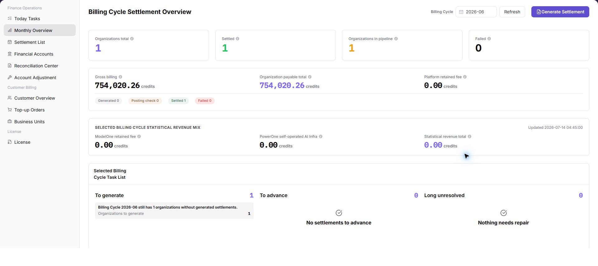

# Monthly Overview

::: info Document Information
Version: v1.0
Updated: 2026-07-10
:::

## Feature Overview

`Monthly Overview` is used to view, filter, and maintain monthly overview information. It helps platform operator, billing operator work with monthly overview records and related status from a consistent page entry.

| Item | Content |
| --- | --- |
| Applicable role | Platform operator, billing operator |
| Navigation path | Finance Operations > Monthly Overview |
| Page route | /operator/finance-operations/monthly-overview |
| Managed objects | Monthly Overview records and related status |
| Typical use | View, filter, and maintain monthly overview information |

### Beginner Explanation

Monthly Overview is part of the billing control loop. Treat it as a view for confirming money, quota, billing-cycle, customer, or settlement status before making financial decisions.

### Terms Quick Reference

| Term | Meaning | Handling tip |
| --- | --- | --- |
| Billing cycle | The month or settlement period used for billing, revenue, and reconciliation. | Keep the cycle consistent across pages. |
| Transaction | A balance change or revenue/expense record. | Use it to explain amount differences. |
| Settlement statement | A statement generated for an organization and billing cycle. | Check status and amount before follow-up. |
| Adjustment | A controlled correction for abnormal billing records. | Use only after impact assessment. |

## Prerequisites

1. The current account can access `Finance Operations > Monthly Overview`.
2. The target organization, member, customer, billing cycle, rule, or record scope has been confirmed.
3. Required upstream data is already available and the page has finished loading.
4. For high-risk changes, confirm the impact scope and rollback path before continuing.

## Page Description

The page usually includes filters, summary cards, data tables, detail entries, status fields, and related operation buttons for monthly overview records and related status.

| Area | Description |
| --- | --- |
| Filters | Narrow records by keyword, status, time range, organization, customer, member, or billing cycle. |
| Summary area | Displays key balances, counts, trends, warnings, or processing progress when available. |
| List or table | Shows records, statuses, timestamps, owners, amounts, and row-level actions. |
| Details or dialog | Provides more context before follow-up operations. |

The following screenshot shows monthly overview list.

## Main Operations

Use the following operations to work with monthly overview records and related status. Complete view-only checks before opening dialogs that may create, save, submit, activate, transfer, settle, publish, or delete data.

### View a Billing Cycle

1. Go to `Finance Operations > Monthly Overview`.
2. Use filters or tabs to locate the target record.
3. Select the target row or entry related to monthly overview records and related status.
4. Click the visible `View a Billing Cycle` entry when it is available.
5. Check the displayed details, status, and related fields before moving to the next page.

### Generate Settlement Statements

1. Go to `Finance Operations > Monthly Overview`.
2. Use filters or tabs to locate the target record.
3. Select the target row or entry related to monthly overview records and related status.
4. Click the visible `Generate Settlement Statements` entry when it is available.
5. Before confirming any high-risk dialog, review the affected scope, amount, permission, or configuration and cancel if the impact is unclear.

## Parameters

| Field | Required | Type | Example | Description |
| --- | --- | --- | --- | --- |
| Keyword or name | No | Text | `Example name` | Used to locate a specific record. |
| Status | No | Enum | `Enabled` | Used to determine the current processing or availability state. |
| Time range or billing cycle | No | Date / Month | `2026-07` | Used to narrow statistics, logs, bills, or settlements. |
| Organization / customer / member | No | Text | `Example organization` | Used to identify the business ownership scope. |
| Operation | System generated | Button / link | `View Details` | Provides row-level entry points for follow-up checks. |

## Pitfalls

- Do not rely on one amount field alone for financial confirmation; cross-check transactions, bills, settlement statements, and reconciliation results.
- Do not repeat high-risk billing operations when the first attempt fails; check status and error details first.
- Remove sensitive customer, bank, contract, token, Key, or internal processing information before sharing screenshots or tickets.

## Result Checks

| Check item | Success signal | If abnormal |
| --- | --- | --- |
| Page access | The `Finance Operations > Monthly Overview` page opens and data loads normally. | Check role permissions and refresh the page. |
| Filter result | The list changes according to the selected filters. | Reset filters and search again. |
| Record detail | Details, status, amount, permission, or configuration values are visible. | Confirm the record scope and permissions. |
| Follow-up path | Related pages or dialogs can be opened from visible entries. | Return to the sidebar and enter the downstream page directly. |

## FAQ

### Monthly Overview Troubleshooting

**Issue Symptom:**

The expected result is not visible on the `Monthly Overview` page, or the available action does not match the current business expectation.

**Possible Causes:**

- The current role, organization scope, status filter, time range, or billing cycle does not match the target record.
- Upstream data, permissions, synchronization, or review status has not finished updating.
- The action may be restricted because it affects monthly overview records and related status.

**Handling:**

1. Reset filters and search again from `Finance Operations > Monthly Overview`.
2. Open the target detail page and verify status, owner, time range, and related fields.
3. If the issue remains, provide desensitized page route, record ID, time range, and symptom summary for troubleshooting.

### Values Do Not Match Expectations

**Issue Symptom:**

The expected result is not visible on the `Monthly Overview` page, or the available action does not match the current business expectation.

**Possible Causes:**

- The current role, organization scope, status filter, time range, or billing cycle does not match the target record.
- Upstream data, permissions, synchronization, or review status has not finished updating.
- The action may be restricted because it affects monthly overview records and related status.

**Handling:**

1. Reset filters and search again from `Finance Operations > Monthly Overview`.
2. Open the target detail page and verify status, owner, time range, and related fields.
3. If the issue remains, provide desensitized page route, record ID, time range, and symptom summary for troubleshooting.

### The Action Button Is Unavailable

**Issue Symptom:**

The expected result is not visible on the `Monthly Overview` page, or the available action does not match the current business expectation.

**Possible Causes:**

- The current role, organization scope, status filter, time range, or billing cycle does not match the target record.
- Upstream data, permissions, synchronization, or review status has not finished updating.
- The action may be restricted because it affects monthly overview records and related status.

**Handling:**

1. Reset filters and search again from `Finance Operations > Monthly Overview`.
2. Open the target detail page and verify status, owner, time range, and related fields.
3. If the issue remains, provide desensitized page route, record ID, time range, and symptom summary for troubleshooting.

### Values Do Not Match Expectations

**Issue Symptom:**

The expected result is not visible on the `Monthly Overview` page, or the available action does not match the current business expectation.

**Possible Causes:**

- The current role, organization scope, status filter, time range, or billing cycle does not match the target record.
- Upstream data, permissions, synchronization, or review status has not finished updating.
- The action may be restricted because it affects monthly overview records and related status.

**Handling:**

1. Reset filters and search again from `Finance Operations > Monthly Overview`.
2. Open the target detail page and verify status, owner, time range, and related fields.
3. If the issue remains, provide desensitized page route, record ID, time range, and symptom summary for troubleshooting.

## Next Steps

1. Open the related detail page if the list value requires verification.
2. Cross-check transactions, monthly bills, settlement statements, and reconciliation results when amounts differ.
3. Escalate with desensitized record IDs, billing cycle, organization, customer, time range, and issue symptom when needed.

## Notes

- Billing amounts, settlements, balances, and customer information are sensitive. Desensitize them before sharing.
- Keep page routes, API fields, Key, AK/SK, License, and other product terms in their UI form.
- Keep credentials, private operational details, and sensitive customer data out of the manual.
