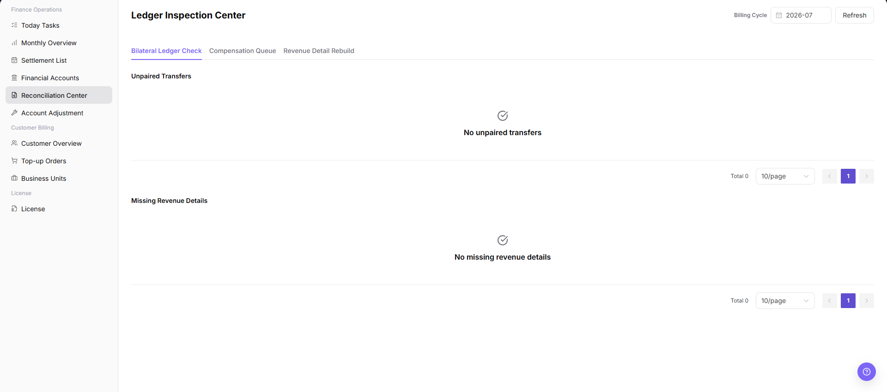
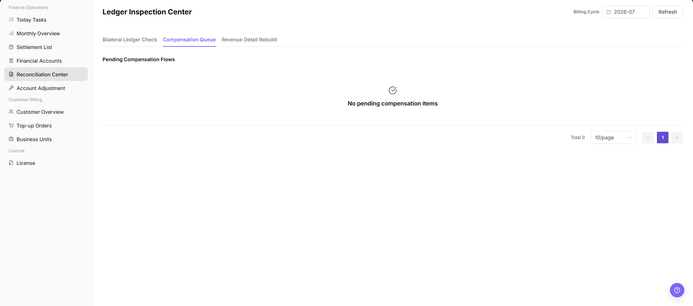
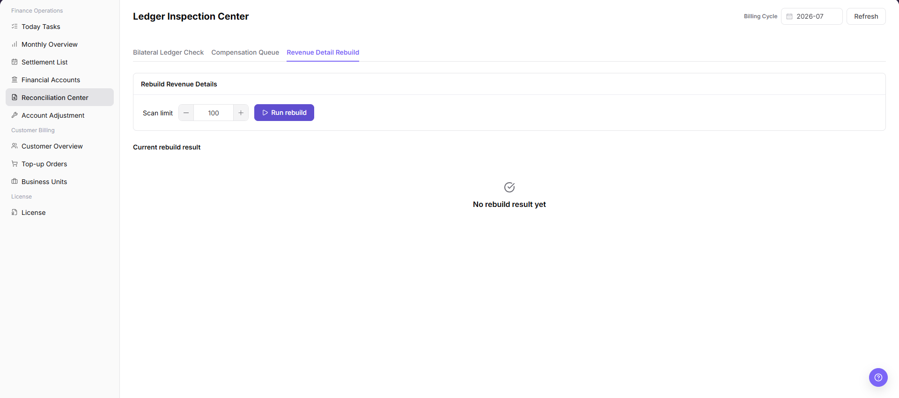

# Reconciliation Center

::: info Document Information
Version: v1.0
Updated: 2026-07-10
:::

## Feature Overview

`Reconciliation Center` is used to inspect billing-operation exceptions, including bilateral ledger checks, compensation queues, revenue detail rebuilds, unmatched transfers, and missing revenue details. Operators select a billing cycle, refresh inspection results, and then continue verification in Financial Accounts, Settlement List, or Account Adjustment when exceptions appear.

| Item | Content |
| --- | --- |
| Applicable role | Platform operator, billing operator |
| Navigation path | Billing > Finance Operations > Reconciliation Center |
| Page route | `/billing/admin/reconciliation` |
| Managed objects | Bilateral ledger check, compensation queue, revenue detail rebuild, unmatched transfer, and missing revenue detail |
| Typical use | Find billing exceptions, locate ledger differences, inspect compensation tasks, and rebuild missing revenue details |

#### Beginner Explanation

Reconciliation Center is the billing health-check page. It helps operators find records that may be unmatched, incomplete, or waiting for retry. It does not complete settlement by itself and should not be used as the only basis for financial adjustment.

#### Terms Quick Reference

| Term | Meaning | Handling tip |
| --- | --- | --- |
| Billing Cycle | The billing period to inspect. | Keep it consistent with Monthly Overview and Settlement List. |
| Bilateral Ledger Check | Checks whether fund-related ledgers can be matched on both sides. | If abnormal, verify related transactions in Financial Accounts. |
| Compensation Queue | Queue of billing tasks waiting for retry, compensation, or manual handling. | Review failure reason before any retry. |
| Revenue Detail Rebuild | Rebuilds missing revenue details. | Confirm billing cycle and impact scope before real submission. |
| Unmatched Transfer | Transfer record without a matched counterpart. | Verify account transactions and business records. |
| Missing Revenue Detail | Consumption or settlement evidence exists, but revenue detail is missing. | Refresh after rebuild and compare with settlement records. |

#### Reconciliation Object Quick Reference

| Object | Beginner view | Where to check next |
| --- | --- | --- |
| Bilateral Ledger Check | Checks whether fund ledgers can be paired. | Financial Accounts, Settlement List |
| Compensation Queue | Shows tasks needing retry, compensation, or manual handling. | Compensation queue details, Account Adjustment |
| Revenue Detail Rebuild | Rebuilds missing revenue details. | Revenue details, Settlement List |
| Unmatched Transfer | Transfer record cannot be matched yet. | Financial account transactions, business records |
| Missing Revenue Detail | Consumption or settlement evidence exists, but revenue detail is missing. | Revenue detail rebuild, Settlement List |

#### Where to Look First

| Symptom | Check first | Next step |
| --- | --- | --- |
| Unmatched transfer exists | Bilateral Ledger Check results | Go to Financial Accounts to verify transactions. |
| Missing revenue detail exists | Revenue Detail Rebuild results | Go to Settlement List to verify billing cycle. |
| Compensation queue is backlogged | Queue status and failure reason | Decide whether retry or manual handling is needed. |
| Amount differs from expectation | Billing cycle, organization, and fund direction | Go to Settlement List or Account Adjustment. |

## Prerequisites

1. The current account can access `Finance Operations > Reconciliation Center`.
2. The billing cycle to inspect has been confirmed.
3. Related settlement statements, financial account transactions, or business records are available for comparison.
4. Before rebuild or compensation, the impact scope and running tasks of the same type have been confirmed.
5. Manual adjustment follows the platform approval or finance handling process.

## Page Description

The page includes billing-cycle selection, refresh, inspection entries, and exception lists. Operators select a billing cycle and refresh results first, then review unmatched transfers, missing revenue details, and compensation queue status.

| Area | Description |
| --- | --- |
| Billing Cycle | Select the billing period to inspect. |
| Refresh | Reload inspection results for the selected billing cycle. |
| Bilateral Ledger Check | Checks matching status for fund-related ledgers. |
| Compensation Queue | Shows tasks requiring compensation, retry, or manual handling. |
| Revenue Detail Rebuild | Checks and rebuilds missing revenue details. |
| Unmatched Transfer | Shows transfer records without a matched counterpart. |
| Missing Revenue Detail | Shows records missing revenue details. |

## Main Operations

Use the following operations to view reconciliation results and exception areas. For learning or screenshots, only view results and counts. Do not perform retry, compensation, adjustment, confirmation, or real rebuild submission.

### View Reconciliation Results

1. Go to `Billing > Finance Operations > Reconciliation Center`.
2. Select the target `Billing Cycle`.
3. Click `Refresh`.
4. Review result update time or exception count changes.
5. Check unmatched transfers, missing revenue details, and compensation queue status.
6. Continue in Financial Accounts, Settlement List, or Account Adjustment according to the exception type.

### View Bilateral Ledger Check

1. Go to `Billing > Finance Operations > Reconciliation Center`.
2. Select the target `Billing Cycle`.
3. Click `Refresh` and wait for reconciliation results to update.
4. Review the `Bilateral Ledger Check` area, especially unmatched transfers, fund direction, transaction object, business context, and reference information.
5. If unmatched records or amount differences exist, continue verification in Financial Accounts, Settlement List, or transactions.
6. For learning or screenshots only, view check results and exception counts without performing compensation, adjustment, or confirmation actions.

### View Compensation Queue

1. Go to `Billing > Finance Operations > Reconciliation Center`.
2. Select the target `Billing Cycle`.
3. Click `Refresh` and confirm that compensation queue status has updated.
4. Review the `Compensation Queue` area, especially task status, failure reason, retry count, related transaction, related settlement statement, and processing time.
5. If pending, retrying, or failed items exist, first confirm whether unmatched transfers or missing revenue details exist in the same billing cycle.
6. For learning or screenshots only, view queue status and failure reason without performing retry, compensation, adjustment, or confirmation actions.

### View Revenue Detail Rebuild

1. Go to `Billing > Finance Operations > Reconciliation Center`.
2. Select the target `Billing Cycle`.
3. Review the `Revenue Detail Rebuild` area and confirm whether missing revenue details exist.
4. Verify organization, billing cycle, business source, related transaction, and exception reason for missing records.
5. If rebuild is required, first confirm that Monthly Overview, Settlement List, and Financial Account transactions use a consistent scope.
6. For learning or screenshots only, view rebuild entry, missing records, and check results without submitting a real rebuild task.

## Parameter Reference

| Field Name | Required | Field Type | Example | Description |
| --- | --- | --- | --- | --- |
| Billing Cycle | Yes | Month / billing period | `2026-07` | Selects the billing period to inspect. |
| Refresh | No | Button | `Refresh` | Reloads reconciliation results for the current billing cycle. |
| Bilateral Ledger Check | No | Operation entry | Bilateral Ledger Check | Checks whether fund-related ledgers can be matched. |
| Compensation Queue | No | Operation entry | Compensation Queue | Shows queue items requiring compensation, retry, or manual handling. |
| Revenue Detail Rebuild | No | Operation entry | Revenue Detail Rebuild | Checks or rebuilds missing revenue details. |
| Unmatched Transfer | System-generated | Exception list | `3 unmatched transfers` | Shows transfer records without a matched counterpart. |
| Missing Revenue Detail | System-generated | Exception list | `2 missing revenue details` | Shows records missing revenue details. |
| Task Status | System-generated | Status | Pending / Retrying / Failed | Shows current status of compensation or rebuild tasks. |
| Failure Reason | System-generated | Text | Example failure reason | Shows why a task failed or an inspection is abnormal. |
| Retry Count | System-generated | Number | `3` | Shows retry count of compensation or rebuild tasks. |
| Related Transaction | System-generated | Text | Desensitized transaction number | Locates the related transaction. |
| Related Settlement Statement | System-generated | Text | Desensitized settlement statement number | Locates the related settlement statement. |
| Actions | System-generated | Operation entry | View / Open | Provides view, jump, or follow-up entries. |

## Pitfalls

- Do not rely on one amount field alone for financial confirmation; cross-check transactions, bills, settlement statements, and reconciliation results.
- Do not repeat high-risk billing operations when the first attempt fails; check status and error details first.
- Remove sensitive customer, bank, contract, token, Key, or internal processing information before sharing screenshots or tickets.
- Bilateral Ledger Check is used to find exceptions. It does not prove that funds have been confirmed.
- Retry, compensation, adjustment, and confirmation actions in Compensation Queue are high-risk operations.
- Revenue Detail Rebuild may affect billing-cycle statistics, settlement statement amount, and revenue detail scope.
- Do not record real account IDs, organization names, customer names, billing-cycle amounts, transaction numbers, internal transaction numbers, approval information, accounts, tokens, or keys.

## Result Validation

| Check Item | Success Signal | If Abnormal |
| --- | --- | --- |
| Page access | The `Finance Operations > Reconciliation Center` page opens and data loads normally. | Check role permissions and refresh the page. |
| Filter result | The list changes according to the selected filters. | Reset filters and search again. |
| Record detail | Details, status, amount, permission, or configuration values are visible. | Confirm the record scope and permissions. |
| Follow-up path | Related pages or dialogs can be opened from visible entries. | Return to the sidebar and enter the downstream page directly. |
| Compensation queue | No pending or failed queue item remains. | Check failure reason and related upstream data. |
| Missing revenue details | Missing revenue detail list is empty. | Refresh after rebuild and verify related settlement records. |

## FAQ

#### Target billing data is not visible in Reconciliation Center

The expected account, customer, order, bill, settlement, adjustment, or License record does not appear on this page.

**How to check:**

1. Confirm the current tenant, organization, customer, account, and role scope.
2. Check page filters such as billing cycle, time range, customer, account type, status, and keyword.
3. Verify that upstream actions, such as top-up, reconciliation, settlement, adjustment, or License activation, have completed successfully.
4. If the record was just created or updated, refresh the list and compare it with related transaction, bill, settlement, or operation records.

#### Amount, status, or billing cycle does not match in Reconciliation Center

The displayed balance, consumption, settlement status, monthly bill, or License status differs from the expected result.

**How to check:**

1. Confirm inspection period, organization scope, unmatched transfers, and missing revenue details before drawing conclusions.
2. Check whether pending top-up orders, adjustments, refunds, settlement reviews, or metering synchronization are still in progress.
3. Compare the summary number with the detail list and operation records on the related billing pages.
4. For financial-impacting differences, pause confirmation actions and escalate with desensitized record IDs, time range, customer scope, and screenshots without credentials.

#### What should I do if the result does not change after refresh?

Check the selected billing cycle, customer or project scope, status filters, and related asynchronous task records. Compare the result with transaction details, settlement records, and operation logs before repeating any high-risk billing action.

#### What should I do if pending items remain in the compensation queue?

Check the selected billing cycle, customer or project scope, status filters, and related asynchronous task records. Compare the result with transaction details, settlement records, and operation logs before repeating any high-risk billing action.

#### What should I do if revenue details are still missing after rebuilding?

Check the selected billing cycle, customer or project scope, status filters, and related asynchronous task records. Compare the result with transaction details, settlement records, and operation logs before repeating any high-risk billing action.

## Next Steps

1. Review related billing records, transactions, settlement statements, and account balance changes.
2. Keep only desensitized page paths, timestamps, status values, and screenshots when escalating.
3. Continue with the related reconciliation, settlement, top-up, or adjustment flow after the result is confirmed.

## Notes

- Billing amounts, settlements, balances, and customer information are sensitive. Desensitize them before sharing.
- Keep page routes, API fields, Key, AK/SK, License, and other product terms in their UI form.
- Reconciliation results are investigation entries, not final financial conclusions.
- Rebuild or compensation must be preceded by billing-cycle and impact-scope confirmation.
- Do not record real account IDs, organization names, customer names, billing-cycle amounts, transaction numbers, internal transaction numbers, approval information, accounts, tokens, or keys in the manual, screenshots, notes, or tickets.
