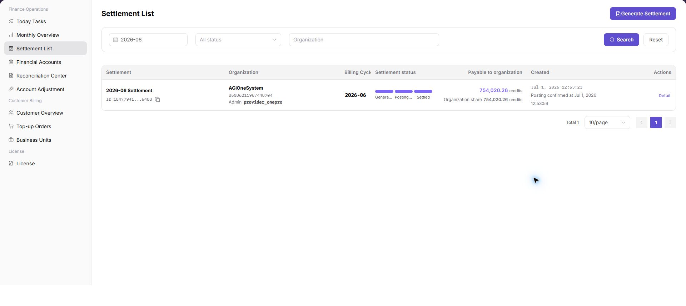
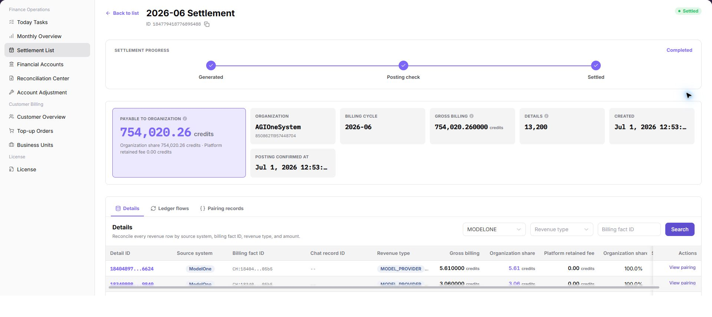
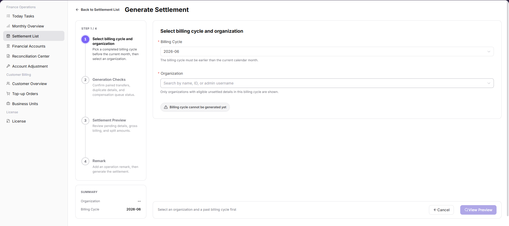
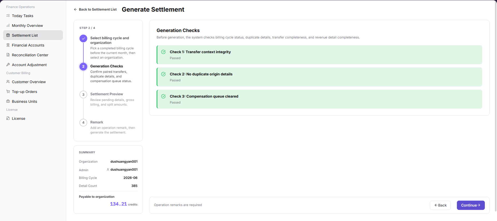
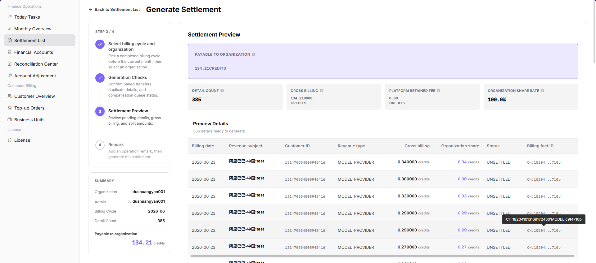
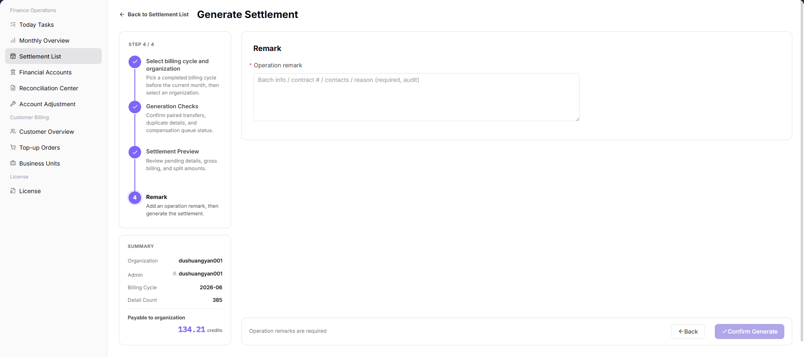

# Settlement List

::: info Document Information
Version: v1.0
Updated: 2026-07-10
:::

## Feature Overview

`Settlement List` is used to search, generate, and track organization settlement statements. Billing operators can filter settlement statements by billing cycle, status, and organization, open details to verify amount, status, and posting confirmation, and start the settlement generation flow from this page.

| Item | Content |
| --- | --- |
| Applicable role | Platform operator, billing operator |
| Navigation path | Billing > Finance Operations > Settlement List |
| Page route | `/billing/admin/provider-settlements` |
| Managed objects | Settlement statements, organizations, billing cycles, settlement status, payable amount, and posting confirmation |
| Typical use | Search settlement statements, view details, track settlement status, and generate settlement statements |

#### Beginner Explanation

Settlement List is like a settlement work order pool. Each settlement statement usually represents one organization in one billing cycle. Operators use the statement status to understand whether it has been generated, is waiting for posting confirmation, has been settled, or has failed.

Settlement List is not a complete finance backend. It provides entries for viewing, generating, and tracking settlement statements. Amounts, status, and posting confirmation should be cross-checked with [Monthly Overview](../monthly-overview/), [Financial Accounts](../financial-accounts/), and [Reconciliation Center](../reconciliation-center/).

#### Terms Quick Reference

| Term | Meaning | Handling tip |
| --- | --- | --- |
| Settlement statement | A settlement record for an organization in a billing cycle. | Open details to verify amount and status. |
| Billing Cycle | The month or settlement period of the statement. | Keep it consistent with Monthly Overview. |
| Posting confirmation | The finance-side status for confirming whether funds have been posted. | Check Financial Accounts if it remains unchanged for a long time. |
| Payable amount | The amount payable to the organization in the current settlement statement. | Cross-check it with Monthly Overview and account flows. |
| Settlement status | The processing stage of the settlement statement. | Decide the next action based on status. |
| Generation Checks | Pre-generation checks before creating settlement statements. | Do not submit repeatedly when checks fail. |
| Settlement Preview | Preview of settlement scope and amount before submission. | Verify organization and billing cycle again before submitting. |

## Where to Look First

1. Open [Monthly Overview](../monthly-overview/) to confirm the overall billing-cycle settlement status.
2. Open `Finance Operations > Settlement List` to search for a specific organization's settlement statement.
3. Open [Financial Accounts](../financial-accounts/) to reconcile account flows.
4. Open [Reconciliation Center](../reconciliation-center/) to investigate settlement exceptions.

## Prerequisites

1. The current account can access `Finance Operations > Settlement List`.
2. The target billing cycle, organization, or settlement status has been confirmed.
3. Before generating a settlement statement, statistics for the target billing cycle have been completed.
4. The current account has permission to generate settlement statements when generation is required.
5. For exception handling, the account can access Monthly Overview, Financial Accounts, and Reconciliation Center.

## Page Description

The page includes the `Generate Settlement` button, filters, settlement table, detail entry, and pagination.

| Area | Description |
| --- | --- |
| Generate Settlement | Generate settlement statements for eligible billing cycles and organizations. |
| Billing Cycle filter | Filter settlement statements by monthly billing cycle. |
| Status filter | Filter by all statuses or a specified settlement status. |
| Organization filter | Search settlement statements by organization keyword. |
| Settlement table | Shows settlement statement, organization, billing cycle, settlement status, payable amount, created time, and actions. |
| Details | Opens settlement statement details to verify status, amount, and posting confirmation. |

The following screenshot shows settlement list.

The following screenshot shows settlement details.

## Status Quick Reference

| Status | Meaning | Next action |
| --- | --- | --- |
| Generated | The settlement statement has been generated. | Open details and verify the amount. |
| Posting confirmation | The statement is waiting for posting or finance confirmation. | Check Financial Accounts and Reconciliation Center. |
| Settled | The settlement flow has completed. | Archive or continue downstream reconciliation. |
| Failed | Generation, posting, or settlement is abnormal. | Open details and investigate in Reconciliation Center. |

## Main Operations

Use the following operations to search, view, and generate settlement statements. Complete view-only checks before opening dialogs that may create, save, submit, confirm, or delete data.

### View Settlement Statement Details

1. Go to `Finance Operations > Settlement List`.
2. Find the target settlement statement in the table.
3. Click `Details` in the row.
4. Verify settlement statement, organization, billing cycle, status, amount, and posting confirmation.
5. If the status or amount is abnormal, return to the list, record the billing cycle, organization, and settlement statement number in a desensitized form, and investigate in Reconciliation Center.

### Generate Settlement

#### Pre-operation Checks

Before generating a settlement statement, confirm that:

1. Statistics for the target billing cycle have been completed.
2. The target organization scope has been confirmed.
3. No obvious exception exists in `Monthly Overview`.
4. `Financial Accounts` and `Reconciliation Center` have no blocking exceptions.
5. The current account has permission to generate settlement statements.

#### Steps

1. Go to `Finance Operations > Settlement List`.
2. Click `Generate Settlement`.
3. Select the target `Billing Cycle` and `Organization`.

   The following screenshot shows selecting billing cycle and organization. Use it to specify the settlement scope.

   

4. Review `Generation Checks` and confirm that no blocking exception exists.

   The following screenshot shows generation checks before settlement submission.

   

5. Review `Settlement Preview`, including organization, billing cycle, payable amount, and settlement status.

   The following screenshot shows settlement preview before generation.

   

6. Enter only desensitized processing notes in `Remark`. Do not write real bank accounts, contract numbers, customer-sensitive information, or internal handling comments.

   The following screenshot shows the remark step.

   

7. After submission, return to the settlement list and search by billing cycle and organization.
8. Click `Details` to confirm settlement status, amount, and posting confirmation information.

#### Risk Notes

- Do not generate settlement statements before billing-cycle data is verified.
- Do not repeatedly generate statements for the same organization and billing cycle.
- If generation fails, check generation checks, settlement details, or Reconciliation Center before retrying.
- `Submit` is a high-risk final action.
- Do not record real bank accounts, contract numbers, customer names, settlement statement numbers, internal transaction numbers, approval comments, accounts, tokens, or keys.

## Parameter Reference

| Field | Required | Type | Example | Description |
| --- | --- | --- | --- | --- |
| Settlement Statement | System-generated | Text | `SETTLE-202606-ORG001` | Settlement statement name or identifier used to locate a specific record. |
| Organization | System-generated | Text | `Example Organization A` | Organization that owns the settlement statement. |
| Billing Cycle | System-generated / Required in generation | Month | `2026-06` | Billing cycle to which the settlement belongs. |
| Settlement Status | System-generated | Enum | `Posting confirmation` | Current processing stage of the settlement statement. |
| Payable Amount | System-generated | Amount | `12,345.67 credits` | Amount payable to the organization in the current settlement statement. |
| Created At | System-generated | Date and time | `2026-07-08 10:00` | Time when the settlement statement was generated. |
| Generate Settlement | No | Operation entry | `Generate Settlement` | Opens the settlement generation flow. |
| Generation Checks | System-generated | Check result | `Passed` | Shows prerequisite checks for billing cycle, organization, and data completeness. |
| Settlement Preview | System-generated | Preview information | `Payable amount 12,345.67 credits` | Shows organization, billing cycle, amount, and settlement status before submission. |
| Remark | No | Text | `Example processing note` | Records desensitized processing notes. Do not include sensitive finance or customer information. |
| Submit | No | High-risk button | `Submit` | Confirms generation for the selected billing cycle and organization scope. |
| Details | System-generated | Operation entry | `Details` | Opens settlement statement details to verify status, amount, and posting confirmation. |

## Pitfalls

- Do not rely on one amount field alone for financial confirmation; cross-check transactions, bills, settlement statements, and reconciliation results.
- Do not repeat high-risk billing operations when the first attempt fails; check status and error details first.
- Remove sensitive customer, bank, contract, token, Key, or internal processing information before sharing screenshots or tickets.
- `Generate Settlement` affects the real billing-cycle settlement flow.
- `Submit` is a high-risk final action.
- If generation fails, investigate Generation Checks, settlement details, or Reconciliation Center first. Do not submit repeatedly.
- Do not record real bank accounts, contract numbers, customer names, settlement statement numbers, internal transaction numbers, approval comments, accounts, tokens, or keys.

## Result Validation

| Check item | Success signal | If abnormal |
| --- | --- | --- |
| Page access | The `Finance Operations > Settlement List` page opens and data loads normally. | Check role permissions and refresh the page. |
| Filter result | The list changes according to the selected filters. | Reset filters and search again. |
| Record detail | Details, status, amount, permission, or configuration values are visible. | Confirm the record scope and permissions. |
| Follow-up path | Related pages or dialogs can be opened from visible entries. | Return to the sidebar and enter the downstream page directly. |
| Generated record | After generation, the target statement can be searched by billing cycle and organization. | Check Generation Checks and failure reason. |

## Completion Checks

| Check item | Success signal | If abnormal |
| --- | --- | --- |
| Page access | The `Finance Operations > Settlement List` page opens and data loads normally. | Check role permissions and refresh the page. |
| Filter result | The list changes according to the selected filters. | Reset filters and search again. |
| Record detail | Details, status, amount, permission, or configuration values are visible. | Confirm the record scope and permissions. |
| Follow-up path | Related pages or dialogs can be opened from visible entries. | Return to the sidebar and enter the downstream page directly. |

## FAQ

#### Target billing data is not visible in Settlement List

The expected account, customer, order, bill, settlement, adjustment, or License record does not appear on this page.

**How to check:**

1. Confirm the current tenant, organization, customer, account, and role scope.
2. Check page filters such as billing cycle, time range, customer, account type, status, and keyword.
3. Verify that upstream actions, such as top-up, reconciliation, settlement, adjustment, or License activation, have completed successfully.
4. If the record was just created or updated, refresh the list and compare it with related transaction, bill, settlement, or operation records.

#### Amount, status, or billing cycle does not match in Settlement List

The displayed balance, consumption, settlement status, monthly bill, or License status differs from the expected result.

**How to check:**

1. Confirm that the same billing cycle, customer, account, currency, and resource scope are being compared.
2. Check whether pending top-up orders, adjustments, refunds, settlement reviews, or metering synchronization are still in progress.
3. Compare the summary number with the detail list and operation records on the related billing pages.
4. For financial-impacting differences, pause confirmation actions and escalate with desensitized record IDs, time range, customer scope, and screenshots without credentials.

#### The Generate Settlement button is unavailable

Check the selected billing cycle, customer or project scope, status filters, and related asynchronous task records. Compare the result with transaction details, settlement records, and operation logs before repeating any high-risk billing action.

#### Settlement amount is inconsistent with expectations

Check the selected billing cycle, customer or project scope, status filters, and related asynchronous task records. Compare the result with transaction details, settlement records, and operation logs before repeating any high-risk billing action.

#### Settlement statement generation fails

Check the selected billing cycle, customer or project scope, status filters, and related asynchronous task records. Compare the result with transaction details, settlement records, and operation logs before repeating any high-risk billing action.

#### Can a settlement statement be generated repeatedly?

Check the selected billing cycle, customer or project scope, status filters, and related asynchronous task records. Compare the result with transaction details, settlement records, and operation logs before repeating any high-risk billing action.

## Next Steps

1. Review related billing records, transactions, settlement statements, and account balance changes.
2. Keep only desensitized page paths, timestamps, status values, and screenshots when escalating.
3. Continue with the related reconciliation, settlement, top-up, or adjustment flow after the result is confirmed.

## Notes

- Billing amounts, settlements, balances, and customer information are sensitive. Desensitize them before sharing.
- Keep page routes, API fields, Key, AK/SK, License, and other product terms in their UI form.
- Do not record real bank accounts, contract numbers, customer names, settlement statement numbers, internal transaction numbers, approval comments, accounts, tokens, or keys in the manual, screenshots, notes, or tickets.
