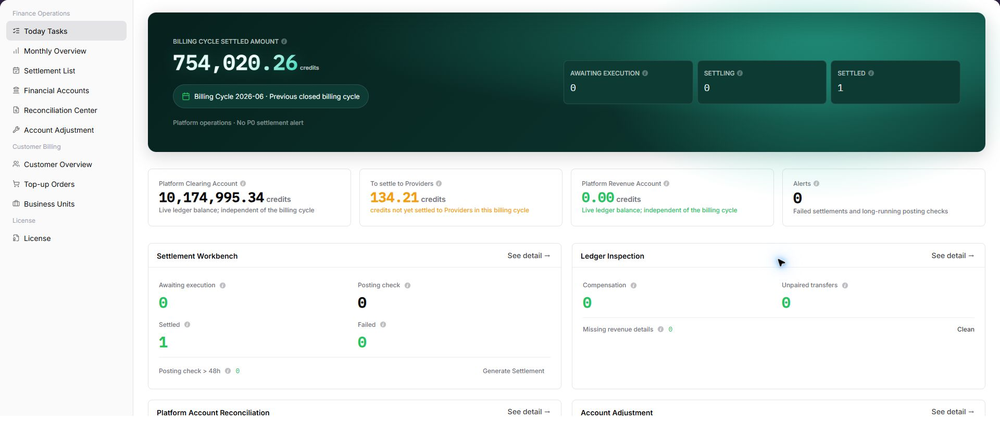

# Today Tasks

::: info Document Information
Version: v1.0
Updated: 2026-07-10
:::

## Feature Overview

`Today Tasks` is the finance operations workbench for viewing the current billing cycle settled amount, settlement progress, platform account status, alert items, and downstream processing entries.

| Item | Content |
| --- | --- |
| Applicable role | Platform operator, billing operator |
| Navigation path | Billing > Finance Operations > Today Tasks |
| Page route | `/billing/admin/tasks` |
| Managed objects | Billing cycle, settlement tasks, platform accounts, alert items, and downstream cards |
| Typical use | Check daily billing status, identify pending items, and open the corresponding processing page |

#### Beginner Explanation

Today Tasks is like the daily finance operations desk. Check the top metrics first to understand the billing cycle and account status, then use the four downstream cards to decide whether to review settlement, reconciliation, account records, or adjustment processing.

#### Terms Quick Reference

| Term | Meaning | Handling tip |
| --- | --- | --- |
| Today Tasks | Summary of billing items that need attention in the current billing cycle. | Check counts first, then open downstream details. |
| Task type | Settlement, reconciliation, platform account check, adjustment, and similar task categories. | Use the type to choose the next page. |
| Processing status | Awaiting Execution, Settling, Settled, and similar settlement states. | Open settlement or reconciliation details when status looks abnormal. |
| Alert Items | Failed settlement, long posting check, or other risks that need attention. | Prioritize alerts instead of checking amount only. |
| Downstream card | Card entry for Settlement Workbench, Billing Reconciliation, Platform Account Reconciliation, or Account Adjustment. | Open only after confirming the billing cycle and scope. |

## Prerequisites

1. The current account can access `Finance Operations > Today Tasks`.
2. The billing cycle and operation scope to review have been confirmed.
3. If settlement generation, adjustment, cleanup, compensation, or rebuild actions may be needed, the approval basis and impact scope have been prepared.

## Page Description

The page is composed of billing-cycle metrics, platform account metrics, alert items, and downstream task cards.

| Area | Description |
| --- | --- |
| Billing Cycle Settled Amount | Displays the settled amount in the selected billing cycle. |
| Settlement progress metrics | Displays Awaiting Execution, Settling, Settled, and similar state counts. |
| Platform account metrics | Displays Platform Clearing Account, Payable to Provider, Platform Revenue Account, and related amounts. |
| Alert Items | Displays failed settlement, long posting check, or other items that require attention. |
| Settlement Workbench | Opens settlement processing and may expose Generate Settlement. |
| Billing Reconciliation | Opens compensation queue, unpaired transfers, and revenue detail rebuild checks. |
| Platform Account Reconciliation | Displays clearing account difference and platform retained fee. |
| Account Adjustment | Displays adjustment capability status and processing entry. |

The following screenshot shows today tasks list.

## Main Operations

Use the following operations to work with today tasks records and related status. Complete view-only checks before opening dialogs that may create, save, submit, activate, transfer, settle, publish, or delete data.

### View Today Tasks Overview

1. Go to `Billing > Finance Operations > Today Tasks`.
2. Check `Billing Cycle Settled Amount`, the current billing cycle, and platform operation notice.
3. Review settlement progress metrics such as `Awaiting Execution`, `Settling`, and `Settled`.
4. Review `Platform Clearing Account`, `Payable to Provider`, `Platform Revenue Account`, and `Alert Items`.
5. Review the downstream cards: `Settlement Workbench`, `Billing Reconciliation`, `Platform Account Reconciliation`, and `Account Adjustment`.
6. For learning or screenshots only, view metrics and entries without clicking `Generate Settlement`, adjustment, or cleanup actions.

### Open Downstream Pages

1. Go to `Billing > Finance Operations > Today Tasks`.
2. In the `Settlement Workbench`, `Billing Reconciliation`, `Platform Account Reconciliation`, or `Account Adjustment` card, click `See detail`.
3. Continue filtering, viewing details, or checking exceptions on the downstream page.
4. If settlement generation or adjustment is required, confirm the billing cycle, tenant, amount, and approval basis before any final action.

## Parameter Reference

| Field Name | Required | Field Type | Example | Description |
| --- | --- | --- | --- | --- |
| Billing Cycle Settled Amount | System-generated | Amount | `0.00 credits` | Settled amount summary in the current billing cycle. |
| Awaiting Execution | System-generated | Number | `0` | Settlement tasks that still need operator execution. |
| Settling | System-generated | Number | `0` | Settlement tasks that are in progress. |
| Settled | System-generated | Number | `0` | Settlement tasks that have been completed. |
| Platform Clearing Account | System-generated | Amount | `0.00 credits` | Live ledger balance of the platform clearing account. |
| Payable to Provider | System-generated | Amount | `0.00 credits` | Amount not yet settled to providers in the current billing cycle. |
| Platform Revenue Account | System-generated | Amount | `0.00 credits` | Platform retained revenue account balance. |
| Alert Items | System-generated | Number | `0` | Failed settlements, long posting checks, or similar alert items. |
| Settlement Workbench | System-generated | Card entry | See detail / Generate Settlement | Opens settlement processing and settlement generation entry. |
| Billing Reconciliation | System-generated | Card entry | See detail / Clean | Opens compensation queue, unpaired transfers, and revenue detail rebuild checks. |
| Platform Account Reconciliation | System-generated | Card entry | See detail | Opens clearing account difference and retained fee checks. |
| Account Adjustment | System-generated | Card entry | See detail | Opens adjustment impact assessment, submit rule, audit trail, and processing entry. |

## Pitfalls

- Do not rely on one amount field alone for financial confirmation; cross-check transactions, bills, settlement statements, and reconciliation results.
- Do not repeat high-risk billing operations when the first attempt fails; check status and error details first.
- Remove sensitive customer, bank, contract, token, Key, or internal processing information before sharing screenshots or tickets.
- `Generate Settlement` affects the real billing-cycle settlement flow. Confirm billing cycle, tenant, amount, and approval basis before execution.
- `Account Adjustment` involves financial correction and is irreversible after submission.
- Cleanup, compensation, and rebuild actions require billing cycle, tenant, amount, and approval evidence before execution.

## Result Validation

| Check Item | Success Signal | If Abnormal |
| --- | --- | --- |
| Page access | The `Finance Operations > Today Tasks` page opens and data loads normally. | Check role permissions and refresh the page. |
| Filter result | The list changes according to the selected filters. | Reset filters and search again. |
| Record detail | Details, status, amount, permission, or configuration values are visible. | Confirm the record scope and permissions. |
| Follow-up path | Related pages or dialogs can be opened from visible entries. | Return to the sidebar and enter the downstream page directly. |

## FAQ

#### Target billing data is not visible in Today Tasks

The expected account, customer, order, bill, settlement, adjustment, or License record does not appear on this page.

**How to check:**

1. Confirm the current tenant, organization, customer, account, and role scope.
2. Check page filters such as billing cycle, time range, customer, account type, status, and keyword.
3. Verify that upstream actions, such as top-up, reconciliation, settlement, adjustment, or License activation, have completed successfully.
4. If the record was just created or updated, refresh the list and compare it with related transaction, bill, settlement, or operation records.

#### Amount, status, or billing cycle does not match in Today Tasks

The displayed balance, consumption, settlement status, monthly bill, or License status differs from the expected result.

**How to check:**

1. Confirm task type, timeout status, organization, and amount-related clues before comparing totals.
2. Check whether pending top-up orders, adjustments, refunds, settlement reviews, or metering synchronization are still in progress.
3. Compare the summary number with the detail list and operation records on the related billing pages.
4. For financial-impacting differences, pause confirmation actions and escalate with desensitized record IDs, time range, customer scope, and screenshots without credentials.

#### Quick entry does not redirect after clicking

Check the selected billing cycle, customer or project scope, status filters, and related asynchronous task records. Compare the result with transaction details, settlement records, and operation logs before repeating any high-risk billing action.

#### Alert count does not decrease

Check the selected billing cycle, customer or project scope, status filters, and related asynchronous task records. Compare the result with transaction details, settlement records, and operation logs before repeating any high-risk billing action.

## Next Steps

1. Review related billing records, transactions, settlement statements, and account balance changes.
2. Keep only desensitized page paths, timestamps, status values, and screenshots when escalating.
3. Continue with the related reconciliation, settlement, top-up, or adjustment flow after the result is confirmed.

## Notes

- Billing amounts, settlements, balances, and customer information are sensitive. Desensitize them before sharing.
- Keep page routes, API fields, Key, AK/SK, License, and other product terms in their UI form.
- Do not record real accounts, emails, tenant IDs, billing-cycle amounts, transaction numbers, tokens, or internal processing parameters in the manual, screenshots, notes, or tickets.
