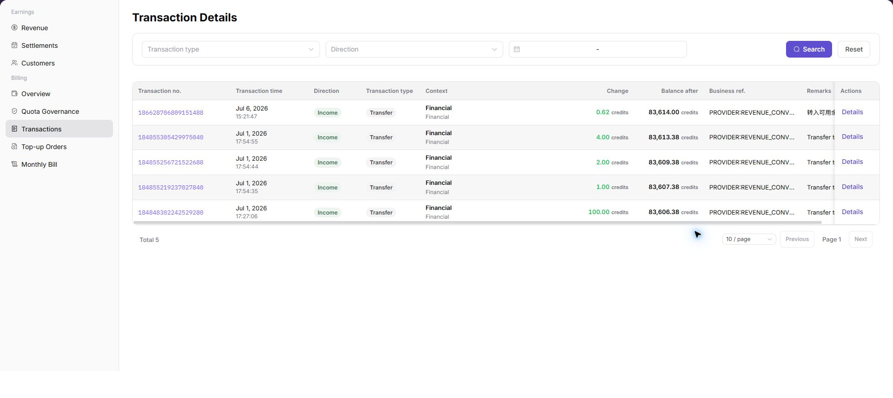

# Transactions

::: info Document Information
Version: v1.0
Updated: 2026-07-10
:::

## Feature Overview

`Transactions` is used to view, filter, and maintain transactions information. It helps user-side account, business admin, billing viewer work with transactions records and related status from a consistent page entry.

| Item | Content |
| --- | --- |
| Applicable role | User-side account, business admin, billing viewer |
| Navigation path | Billing > Transactions |
| Page route | /user/billing/transactions |
| Managed objects | Transactions records and related status |
| Typical use | View, filter, and maintain transactions information |

### Beginner Explanation

Transactions is part of the billing control loop. Treat it as a view for confirming money, quota, billing-cycle, customer, or settlement status before making financial decisions.

### Terms Quick Reference

| Term | Meaning | Handling tip |
| --- | --- | --- |
| Billing cycle | The month or settlement period used for billing, revenue, and reconciliation. | Keep the cycle consistent across pages. |
| Transaction | A balance change or revenue/expense record. | Use it to explain amount differences. |
| Settlement statement | A statement generated for an organization and billing cycle. | Check status and amount before follow-up. |
| Adjustment | A controlled correction for abnormal billing records. | Use only after impact assessment. |

## Prerequisites

1. The current account can access `Billing > Transactions`.
2. The target organization, member, customer, billing cycle, rule, or record scope has been confirmed.
3. Required upstream data is already available and the page has finished loading.
4. For high-risk changes, confirm the impact scope and rollback path before continuing.

## Page Description

The page usually includes filters, summary cards, data tables, detail entries, status fields, and related operation buttons for transactions records and related status.

| Area | Description |
| --- | --- |
| Filters | Narrow records by keyword, status, time range, organization, customer, member, or billing cycle. |
| Summary area | Displays key balances, counts, trends, warnings, or processing progress when available. |
| List or table | Shows records, statuses, timestamps, owners, amounts, and row-level actions. |
| Details or dialog | Provides more context before follow-up operations. |

The following screenshot shows transactions.

## Main Operations

Use the following operations to work with transactions records and related status. Complete view-only checks before opening dialogs that may create, save, submit, activate, transfer, settle, publish, or delete data.

### Query Transactions

1. Go to `Billing > Transactions`.
2. Use filters or tabs to locate the target record.
3. Select the target row or entry related to transactions records and related status.
4. Click the visible `Search Transactions` entry when it is available.
5. Check the displayed details, status, and related fields before moving to the next page.

### View a Single Transaction

1. Go to `Billing > Transactions`.
2. Use filters or tabs to locate the target record.
3. Select the target row or entry related to transactions records and related status.
4. Click the visible `View a Single Transaction` entry when it is available.
5. Check the displayed details, status, and related fields before moving to the next page.

## Parameters

| Field | Required | Type | Example | Description |
| --- | --- | --- | --- | --- |
| Keyword or name | No | Text | `Example name` | Used to locate a specific record. |
| Status | No | Enum | `Enabled` | Used to determine the current processing or availability state. |
| Time range or billing cycle | No | Date / Month | `2026-07` | Used to narrow statistics, logs, bills, or settlements. |
| Organization / customer / member | No | Text | `Example organization` | Used to identify the business ownership scope. |
| Operation | System generated | Button / link | `View Details` | Provides row-level entry points for follow-up checks. |

## Pitfalls

- Do not rely on one amount field alone for financial confirmation; cross-check transactions, bills, settlement statements, and reconciliation results.
- Do not repeat high-risk billing operations when the first attempt fails; check status and error details first.
- Remove sensitive customer, bank, contract, token, Key, or internal processing information before sharing screenshots or tickets.

## Result Checks

| Check item | Success signal | If abnormal |
| --- | --- | --- |
| Page access | The `Billing > Transactions` page opens and data loads normally. | Check role permissions and refresh the page. |
| Filter result | The list changes according to the selected filters. | Reset filters and search again. |
| Record detail | Details, status, amount, permission, or configuration values are visible. | Confirm the record scope and permissions. |
| Follow-up path | Related pages or dialogs can be opened from visible entries. | Return to the sidebar and enter the downstream page directly. |

## FAQ

### Target billing data is not visible in Transactions

The expected account, customer, order, bill, settlement, adjustment, or License record does not appear on this page.

**How to check:**

1. Confirm the current tenant, organization, customer, account, and role scope.
2. Check page filters such as billing cycle, time range, customer, account type, status, and keyword.
3. Verify that upstream actions, such as top-up, reconciliation, settlement, adjustment, or License activation, have completed successfully.
4. If the record was just created or updated, refresh the list and compare it with related transaction, bill, settlement, or operation records.

### Amount, status, or billing cycle does not match in Transactions

The displayed balance, consumption, settlement status, monthly bill, or License status differs from the expected result.

**How to check:**

1. Confirm that the same billing cycle, customer, account, currency, and resource scope are being compared.
2. Check whether pending top-up orders, adjustments, refunds, settlement reviews, or metering synchronization are still in progress.
3. Compare the summary number with the detail list and operation records on the related billing pages.
4. For financial-impacting differences, pause confirmation actions and escalate with desensitized record IDs, time range, customer scope, and screenshots without credentials.

## Notes

- Billing amounts, settlements, balances, and customer information are sensitive. Desensitize them before sharing.
- Keep page routes, API fields, Key, AK/SK, License, and other product terms in their UI form.
- Keep credentials, private operational details, and sensitive customer data out of the manual.
