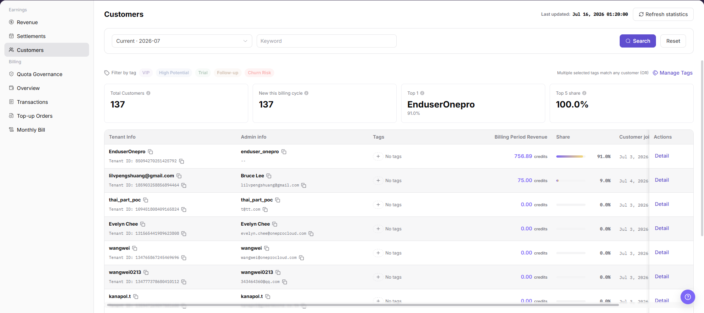

# Customers

::: info Document Information
Version: v1.0
Updated: 2026-07-23
:::

## Feature Overview

`Customers` is used to view Provider revenue by customer. The page focuses on billing cycle, keyword and tag filters, customer statistic cards, current-cycle revenue, revenue proportion, customer join time, latest revenue in the billing cycle, and the details entry. Providers can use it to locate key customers and verify customer-level revenue details.

| Item | Content |
| --- | --- |
| Applicable role | Provider account, customer operations user, revenue analyst |
| Navigation path | Billing > Earnings > Customers |
| Page route | `/billing/provider/customers` |
| Managed objects | Customer revenue, billing cycle, customer tags, current-cycle revenue, revenue proportion, join time, latest revenue, and details entry |
| Typical use | View customer-level revenue, locate key customers, and verify customer revenue details |

#### Beginner Explanation

Customers works like a Provider customer revenue dashboard. Start with the billing cycle, then use keyword or tag filters to narrow the customer list. Review customer total, new customers, top customers, and revenue proportion before opening `Details` for customer-level revenue records.

#### Terms Quick Reference

| Term | Meaning | Handling tip |
| --- | --- | --- |
| Customer Revenue | Revenue contributed by a customer in the selected billing cycle. | Reconcile it with Revenue Overview, Settlements, and Revenue Account Activity. |
| Tags | Labels used to classify customers, such as VIP, high-potential, trial, or follow-up. | Confirm tag meaning before filtering and impact scope before editing. |
| Top 1 Customer | The customer with the highest revenue contribution in the current billing cycle. | Do not judge long-term customer value by ranking alone. |
| Top 5 Proportion | The revenue proportion contributed by the top five customers in the current scope. | Keyword or tag filters may change the statistic scope. |
| Current-cycle Revenue | Revenue generated by the customer in the selected billing cycle. | Keep the billing cycle consistent before comparison. |
| Latest Revenue in Billing Cycle | The customer's latest revenue record or recent revenue performance in the selected cycle. | Check it together with customer details. |

## Prerequisites

1. The current account has permission to view `Earnings > Customers`.
2. The Provider revenue billing cycle to review has been confirmed.
3. Before opening customer details, confirm that the current account can view the target customer scope.

::: warning High-Risk Operation Boundary
Customer overview contains organization, administrator, tags, revenue amount, and proportion. For learning or screenshots, view only list fields and the details entry without modifying tags or exporting real customer revenue data.
:::

## Page Description

The following screenshot shows the Customers page. Customer names, organizations, administrator information, revenue amounts, and customer details in screenshots, exports, tickets, and comments must be desensitized.

| Area | Description |
| --- | --- |
| Billing Cycle | View customer revenue statistics by billing cycle. |
| Keyword | Filter by customer-related keywords. |
| Search | Query the customer list with the current filters. |
| Reset | Clear filters and restore the default list. |
| Tag Filter | Filter the customer list by tags. |
| Refresh Statistics | Refresh customer revenue statistics. |
| Statistic Cards | Display customer total, new customers in the billing cycle, Top 1 customer, and Top 5 proportion. |
| Customer List | Displays organization information, administrator information, tags, current-cycle revenue, proportion, customer join time, latest revenue in the billing cycle, and actions. |
| Details | Opens customer-level revenue details. |
| Manage Tags | Manages customer tag categories or tag configuration; this entry is not described as a main operation. |

## Main Operations

### View Customer Details

1. Go to `Earnings > Customers`.
2. Review customer statistic cards, including customer total, new customers in the billing cycle, Top 1 customer, and Top 5 proportion.
3. Select `Billing Cycle`, or use keyword and tag filters as needed to locate the target customer.
4. In the customer list, verify organization information, administrator information, tags, current-cycle revenue, proportion, customer join time, and latest revenue in the billing cycle.
5. Click `Details` in the target customer row.
6. In the details page or details area, review customer-level revenue details and cross-check with Revenue Overview, Settlements, or Revenue Account Activity.
7. For learning or screenshots only, view list fields and the details entry without modifying tags or exporting real customer revenue data.

## Parameter Reference

| Field | Required | Type | Example | Description |
| --- | --- | --- | --- | --- |
| Billing Cycle | No | Filter | 2026-07 | Selects the billing cycle for customer revenue statistics. |
| Keyword | No | Filter | Desensitized keyword | Searches by customer name, organization, or other customer-related keyword. |
| Search | No | Button | Search | Refreshes the customer list with the current filters. |
| Reset | No | Button | Reset | Clears filters and restores the default list. |
| Tag Filter | No | Filter | VIP | Filters the list by customer tags. |
| Refresh Statistics | No | Button | Refresh Statistics | Refreshes customer revenue statistics. |
| Customer Total | System generated | Statistic card | Desensitized count | Shows the total number of customers in the current statistic scope. |
| New Customers in Billing Cycle | System generated | Statistic card | Desensitized count | Shows the number of customers added in the current billing cycle. |
| Top 1 Customer | System generated | Statistic card | Desensitized customer | Shows the customer with the highest revenue contribution in the current billing cycle. |
| Top 5 Proportion | System generated | Statistic card | Desensitized proportion | Shows the revenue proportion contributed by the top five customers. |
| Organization Information | System generated | Table column | Desensitized organization | Shows customer organization information. |
| Administrator Information | System generated | Table column | Desensitized administrator | Shows customer administrator information. |
| Tags | System generated | Table column | High potential | Shows the current customer tags. |
| Current-cycle Revenue | System generated | Table column | Desensitized amount | Shows revenue contributed by the customer in the selected billing cycle. |
| Proportion | System generated | Table column | Desensitized proportion | Shows the customer's revenue proportion in the current scope. |
| Customer Join Time | System generated | Table column | 2026-07-08 | Shows when the customer joined. |
| Latest Revenue in Billing Cycle | System generated | Table column | Desensitized amount | Shows the customer's latest revenue in the billing cycle. |
| Details | No | Button | Details | Opens customer revenue details. |
| Manage Tags | No | High-risk entry | Manage Tags | May affect customer classification and operations follow-up, so it is not described as a main operation. |

## Pitfalls

- Customer overview contains organization, administrator, tags, revenue amount, and proportion. Desensitize screenshots, exports, tickets, and comments.
- Tag filters change the list scope and revenue proportion; confirm whether tags are enabled before reconciliation.
- Managing tags may affect customer classification and operations follow-up, so it is not described as a main operation.
- Customer revenue proportion is calculated within the current billing cycle and filter scope, not the full-platform scope.
- Do not record real customer names, organization names, administrator emails, accounts, amounts, settlement statement numbers, transaction numbers, Token, or Key.

## Result Validation

| Check item | Success signal | If abnormal |
| --- | --- | --- |
| Page loading | Customer statistic cards, filters, and customer list are displayed normally. | Refresh the page or check Provider revenue permissions. |
| Filters available | Billing cycle, keyword, and tag filters can locate customers. | Click `Reset` and filter again. |
| Customer fields visible | Organization information, administrator information, tags, current-cycle revenue, proportion, join time, and latest revenue are displayed normally. | Adjust billing cycle or filters and try again. |
| Details available | Clicking `Details` opens customer revenue details. | Check whether the customer has visible details or whether the account has permission. |
| High-risk action avoided | No tag modification or real customer-data export is performed during learning or screenshots. | If triggered by mistake, record the time and scope immediately and notify the owner for review. |

## FAQ

#### Customer list is empty

**Symptom:**

No customer records are visible after opening Customers.

**Possible cause:**

Billing cycle, keyword, or tag filters may be too narrow, or the current account may not have access to the corresponding customer scope.

**How to handle:**

Click `Reset` and select the billing cycle again. If the list is still empty, return to Revenue Overview to confirm whether the billing cycle has customer revenue.

#### Customer revenue proportion looks abnormal

**Symptom:**

A customer's current-cycle revenue or proportion differs from the expected result.

**Possible cause:**

The billing cycle may differ, tag filters may have changed the statistic scope, or latest revenue may not have fully refreshed in the list.

**How to handle:**

Confirm the billing cycle and filters, open `Details` to review customer revenue details, and reconcile with Revenue Overview, Settlements, or Revenue Account Activity.

#### What should I check before managing tags?

**Symptom:**

The page provides a `Manage Tags` entry.

**Possible cause:**

Tags affect customer filtering, operations classification, and follow-up.

**How to handle:**

Confirm tag meaning and customer scope before editing. For learning or screenshots, do not save tag changes.

## Next Steps

1. To return to the summary view, go to [Revenue](../revenue/).
2. To reconcile billing-cycle settlement records, go to [Settlements](../settlements/).
3. To reconcile received records, review Revenue Account Activity.

## Notes

- Customer overview contains organization, administrator, and revenue data. Desensitize screenshots before sharing.
- For learning or screenshots, view only list fields and the details entry without modifying tags or exporting real customer revenue data.
- Managing tags may affect customer classification. Confirm tag meaning, customer scope, and operation permissions before editing.
- When reconciling customer revenue, check billing cycle, filters, Revenue Overview, Settlements, and Revenue Account Activity together.
