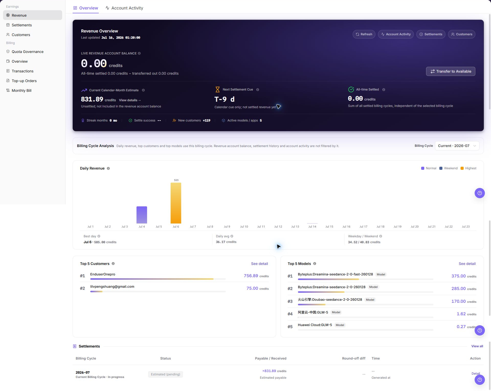

# Revenue

::: info Document Information
Version: v1.0
Updated: 2026-07-10
:::

## Feature Overview

`Revenue` is used to view Provider revenue overview, revenue account balance, current month estimate, billing cycle analysis, revenue account activity, settlements, and customer revenue details. Provider accounts can use this page to understand revenue trends, verify revenue account activity, and reconcile revenue with monthly settlements and customer details.

| Item | Content |
| --- | --- |
| Applicable role | Provider account, provider finance viewer, revenue operator |
| Navigation path | Billing > Earnings > Revenue |
| Page route | `/billing/provider/revenue` |
| Managed objects | Revenue overview, revenue account balance, account activity, billing cycle analysis, settlements, and customer revenue |
| Typical use | View provider revenue, verify revenue account activity, and reconcile revenue with settlements and customer details |

#### Beginner Explanation

Revenue works like a Provider earnings dashboard. Start with revenue account balance and current month estimate, then use billing cycle analysis to review daily revenue, top customers, and top models. For reconciliation, switch to Revenue Account Activity or open settlements and customer details.

#### Terms Quick Reference

| Term | Meaning | Handling tip |
| --- | --- | --- |
| Revenue Account Balance | Current balance of the Provider revenue account. | Verify it with revenue account activity and settlements. |
| Current Month Estimate | Estimated revenue for the current calendar month. | Do not treat it as final settled revenue. |
| Billing Cycle Analysis | Daily revenue, customer contribution, and model contribution by billing cycle. | Keep the billing cycle consistent when comparing data. |
| Revenue Account Activity | Activity or payout records of the revenue account. | Check this first when amount changes are unclear. |
| Settlements | Monthly settlement results by billing cycle. | Use it to reconcile estimated revenue and settled amount. |

## Prerequisites

1. The current account can access `Earnings > Revenue`.
2. The target Provider revenue scope has been confirmed.
3. The page has finished loading before you verify revenue, billing cycle, customer, or model data.

::: warning High-Risk Operation Boundary
Revenue account balance, activity amount, customer name, billing cycle, and settlement status are sensitive. For learning or screenshots only, view pages, tabs, list fields, and status without exporting real revenue data or recording real customer names, accounts, amounts, transaction numbers, settlement statement numbers, Token, or Key.
:::

## Page Description

The following screenshot shows Revenue Overview. Amounts, customers, and revenue details in screenshots are desensitized.

| Area | Description |
| --- | --- |
| Overview | Shows core Provider revenue metrics and billing cycle analysis. |
| Revenue Account Activity | Shows revenue account activity or payout records. |
| Revenue Account Balance | Current balance of the revenue account. |
| Current Month Estimate | Estimated revenue for the current calendar month. |
| Billing Cycle Analysis | Daily revenue, top customers, top models, and settlement overview for the selected billing cycle. |
| Settlements | Entry for monthly settlement records. |
| Customer Details | Entry for customer-level revenue details. |

## Main Operations

### View Revenue Overview

1. Go to `Earnings > Revenue`.
2. Review `Revenue Account Balance`, `Current Month Estimate`, next settlement cue, and historical settlement performance.
3. Confirm the current `Billing Cycle` used for analysis.
4. Review `Daily Revenue`, `Top Customers`, and `Top Models` to understand revenue trends and major sources.
5. To reconcile settlement results, review the settlement overview on the page or open monthly settlements.
6. For learning or screenshots only, view summary metrics and desensitized charts without exporting real revenue data or recording customer, amount, or account-sensitive information.

### View Revenue Account Activity

1. Go to `Earnings > Revenue`.
2. Switch to the `Revenue Account Activity` tab.
3. Review the revenue account activity list.
4. Verify activity time, activity type, amount, status, related billing cycle, and description as needed.
5. To reconcile with settlement results, return to Revenue Overview or open monthly settlements for the corresponding billing cycle.
6. For learning or screenshots only, view list fields and status without exporting real revenue data or recording customer, amount, or account-sensitive information.

## Parameter Reference

| Field | Required | Type | Example | Description |
| --- | --- | --- | --- | --- |
| Overview | No | Tab | `Overview` | Shows revenue overview and billing cycle analysis. |
| Revenue Account Activity | No | Tab | `Revenue Account Activity` | Shows revenue account activity or payout records. |
| Revenue Account Balance | System generated | Credits | `100.00 credits` | Current revenue account balance. Desensitize it in screenshots. |
| Current Month Estimate | System generated | Credits | `100.00 credits` | Estimated revenue for the current calendar month. It is not final settlement. |
| Billing Cycle | No | Month / cycle | `2026-07` | Controls the data scope for billing cycle analysis. |
| Daily Revenue | System generated | Chart | `Jul 6` | Daily revenue trend in the selected billing cycle. |
| Top Customers | System generated | Ranking | `Example customer` | Customers with higher contribution in the selected billing cycle. Desensitize customer information. |
| Top Models | System generated | Ranking | `Example model` | Models with higher contribution in the selected billing cycle. |
| Activity Time | System generated | Time | `2026-07-10 12:00:00` | Time when the revenue account activity occurred. |
| Activity Type | System generated | Enum | `Settlement posting` | Revenue account activity type. |
| Activity Amount | System generated | Credits | `100.00 credits` | Revenue account activity amount. Desensitize it in screenshots and tickets. |
| Activity Status | System generated | Enum | `Succeeded` | Processing status of the revenue account activity. |
| Related Billing Cycle | System generated | Billing cycle | `2026-07` | Billing cycle related to the activity record. |
| Description | No | Text | `Example description` | Activity description. Do not write real customer, account, or internal handling information. |

## Pitfalls

- Do not rely on revenue account balance alone. Cross-check revenue account activity, monthly settlements, and customer details.
- Current month estimate changes with consumption and settlement processing. Do not treat it as final credited amount.
- Empty Top Customers or Top Models is not always abnormal. Confirm whether the selected billing cycle has real revenue first.
- Revenue account balance, activity amount, customer name, billing cycle, and settlement status are sensitive. Desensitize screenshots, exports, tickets, and comments.
- For learning or screenshots only, view pages, tabs, list fields, and status without exporting real revenue data.

## Result Validation

| Check item | Success signal | If abnormal |
| --- | --- | --- |
| Page load | Revenue metrics, billing cycle analysis, and entries are visible. | Refresh the page or check whether the account has Provider revenue permission. |
| Overview readable | Revenue account balance, current month estimate, daily revenue, top customers, and top models are visible. | Wait for data refresh or switch to a billing cycle with revenue. |
| Activity list readable | Fields and status are visible under `Revenue Account Activity`. | Refresh the page or confirm activity view permission. |
| Reconciliation path | You can return to Revenue Overview or open monthly settlements for the corresponding billing cycle. | Re-enter the target page from the sidebar. |

## FAQ

#### Revenue balance does not match the expected value

The balance or estimated revenue in Revenue Overview differs from internal records.

**How to check:**

Confirm the billing cycle first, then check `Revenue Account Activity`, `Settlements`, and `Customers` to compare source, status, and customer-level data.

#### Top Customers or Top Models is empty

The customer ranking or model ranking in billing cycle analysis has no data.

**How to check:**

Switch to a billing cycle with existing revenue. If other metrics are also empty, check account permission and page loading status.

#### Revenue Account Activity list is empty

No activity record appears after switching to `Revenue Account Activity`.

**How to check:**

Return to Revenue Overview to check settlement history, then open monthly settlements to verify whether the corresponding billing cycle has been settled.

## Next Steps

1. To verify settlement status, go to [Settlements](../settlements/).
2. To verify revenue by customer, go to [Customers](../customers/).
3. To troubleshoot revenue account activity, keep only desensitized page paths, billing cycles, and status information.

## Notes

- Revenue Overview is a summary view. Final reconciliation should use revenue account activity, settlements, and customer details together.
- Revenue account balance, activity amount, customer name, account, billing cycle, transaction number, and settlement statement number are sensitive. Do not share them directly.
- Desensitize screenshots, exports, tickets, and comments.
- Do not record real customer names, accounts, amounts, transaction numbers, settlement statement numbers, Token, or Key.
