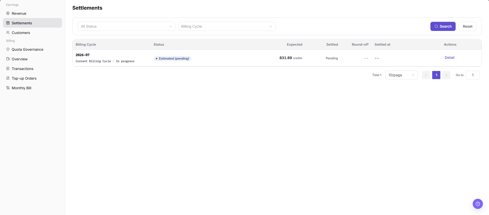

# Settlements

::: info Document Information
Version: v1.0
Updated: 2026-07-23
:::

## Feature Overview

`Settlements` is used to view Provider monthly settlement statements by billing cycle. The page focuses on settlement status, amount to settle, actual received amount, rounding adjustment, received time, and the details entry. Providers can use it to verify monthly settlement results and reconcile them with Revenue Overview and Revenue Account Activity.

| Item | Content |
| --- | --- |
| Applicable role | Provider account, provider finance viewer, revenue settlement operator |
| Navigation path | Billing > Earnings > Settlements |
| Page route | `/billing/provider/settlements` |
| Managed objects | Monthly settlement statements, billing cycles, settlement status, amount to settle, actual received amount, rounding adjustment, and received time |
| Typical use | View settlement statement details, verify settlement amount and received status, and reconcile with revenue overview and account activity |

#### Beginner Explanation

Settlements works like a monthly revenue statement for Providers. Each row usually represents one billing cycle and shows how the expected settlement amount maps to the received result. When checking amounts, review status, rounding adjustment, received time, and details together instead of relying on one field.

#### Terms Quick Reference

| Term | Meaning | Handling tip |
| --- | --- | --- |
| Billing Cycle | The month or settlement period covered by the statement. | Keep the cycle consistent across revenue and account-activity pages. |
| Amount to Settle | The amount calculated by settlement rules. | Reconcile it with Revenue Overview and statement details. |
| Actual Received Amount | The amount that has actually reached the target account. | Check it together with received time, rounding adjustment, and account activity. |
| Rounding Adjustment | A rounding or adjustment amount generated during settlement. | Include it when comparing calculated and received amounts. |
| Received Time | The time when the settlement amount was received. | Do not assume an exception while the status is still processing. |
| Transfer | Entry for transferring eligible settlement amounts to available balance. | Treat it as high risk and confirm billing cycle, amount, and permissions first. |

## Prerequisites

1. The current account has permission to view `Earnings > Settlements`.
2. The Provider revenue billing cycle to review has been confirmed.
3. Revenue Overview and Revenue Account Activity are available for amount reconciliation when needed.

::: warning High-Risk Operation Boundary
`Transfer`, settlement confirmation, or exporting real settlement data may affect revenue accounts or expose sensitive financial information. For learning or screenshots, view only list fields and the details entry without performing transfer, settlement confirmation, or export.
:::

## Page Description

The following screenshot shows the Settlements page. Amounts, customers, accounts, transaction numbers, and settlement statement information in screenshots, tickets, and comments must be desensitized.

| Area | Description |
| --- | --- |
| All Status | Filter monthly settlement statements by settlement status. |
| Billing Cycle | Filter settlement statements by billing cycle. |
| Search | Refresh the list with the current filters. |
| Reset | Clear filters and restore the default list. |
| Table | Displays billing cycle, status, amount to settle, actual received amount, rounding adjustment, received time, and actions. |
| Details | Opens settlement statement details. |

## Main Operations

### View Settlement Statement Details

1. Go to `Earnings > Settlements`.
2. Review monthly settlement statement records in the list.
3. Use `All Status` or `Billing Cycle` filters as needed to locate the target settlement statement.
4. In the target row, verify billing cycle, status, amount to settle, actual received amount, rounding adjustment, and received time.
5. Click `Details` in the row to view settlement statement details.
6. In the details page or details area, verify settlement composition, received information, processing status, and exception prompts.
7. For learning or screenshots only, view list fields and the details entry without performing transfer, settlement confirmation, or exporting real settlement data.

## Parameter Reference

| Field | Required | Type | Example | Description |
| --- | --- | --- | --- | --- |
| All Status | No | Filter | Settled | Filters the list by settlement status. |
| Billing Cycle | No | Filter | 2026-07 | Filters monthly settlement statements by billing cycle. |
| Search | No | Button | Search | Refreshes the list with the current filters. |
| Reset | No | Button | Reset | Clears filters and restores the default list. |
| Billing Cycle | System generated | Table column | 2026-07 | Shows the month or billing cycle of the settlement statement. |
| Status | System generated | Table column | Settled | Shows the current processing status of the settlement statement. |
| Amount to Settle | System generated | Table column | Desensitized amount | Shows the settlement amount calculated by rules. |
| Actual Received Amount | System generated | Table column | Desensitized amount | Shows the actual received amount for the billing cycle. |
| Rounding Adjustment | System generated | Table column | Desensitized amount | Shows rounding or adjustment amount generated during settlement. |
| Received Time | System generated | Table column | 2026-07-08 10:00 | Shows when the settlement amount was received. |
| Details | No | Button | Details | Opens settlement statement details. |
| Transfer | No | High-risk button | Transfer | May affect revenue account or available balance status; keep it as a risk boundary, not a learning operation step. |

## Pitfalls

- Settlement statements contain sensitive revenue, received amount, billing cycle, and settlement status.
- `Transfer`, settlement confirmation, and exporting real settlement data are high-risk actions.
- Do not rely on a single amount field; check amount to settle, actual received amount, rounding adjustment, received time, and details together.
- Amounts, received status, and received time may continue changing while the current billing cycle is still processing.
- Do not record real customer names, accounts, amounts, transaction numbers, settlement statement numbers, receiving accounts, Token, or Key.

## Result Validation

| Check item | Success signal | If abnormal |
| --- | --- | --- |
| Page loading | The monthly settlement statement list and filters are displayed normally. | Refresh the page or check Provider revenue permissions. |
| Filters available | `All Status` and `Billing Cycle` can locate the target settlement statement. | Click `Reset` and filter again. |
| Details available | Clicking `Details` opens settlement statement details. | Check whether the billing cycle has a visible settlement record. |
| Amounts verifiable | Amount to settle, actual received amount, rounding adjustment, and received time are visible. | Continue reconciliation with Revenue Overview and Revenue Account Activity. |
| High-risk action avoided | No transfer, settlement confirmation, or export is performed during learning or screenshots. | If triggered by mistake, record the time and scope immediately and notify the owner for review. |

## FAQ

#### Target billing data is not visible in Settlements

**Symptom:**

The list is empty after selecting a billing cycle, or the expected settlement statement is not visible.

**Possible cause:**

The selected status does not match the billing cycle, or the billing cycle has not generated a visible settlement record.

**How to handle:**

Click `Reset` and select the billing cycle again. If the list is still empty, return to Revenue Overview to confirm whether the billing cycle has revenue and settlement prompts.

#### Amount to settle and actual received amount do not match

**Symptom:**

The amount to settle differs from the actual received amount for a billing cycle.

**Possible cause:**

The settlement may include rounding adjustment, may still be processing, or received information may not have finished updating.

**How to handle:**

Check `Rounding Adjustment`, `Received Time`, and `Details` for the row. Continue reconciliation with Revenue Account Activity when needed.

#### Transfer button cannot continue

**Symptom:**

Clicking `Transfer` cannot continue, or the page says the current settlement statement cannot be transferred.

**Possible cause:**

The current billing-cycle status does not meet transfer conditions, or the account lacks processing permission.

**How to handle:**

Check settlement statement status and account permissions. Do not bypass page prompts when conditions are not met.

## Next Steps

1. To view revenue sources, go to [Revenue](../revenue/).
2. To reconcile received records, review Revenue Account Activity.
3. Before transfer or settlement confirmation, verify billing cycle, amount, receiving account, and permissions.

## Notes

- Settlement statements contain revenue and received information. Do not share screenshots without desensitization.
- `Transfer`, settlement confirmation, and exporting real settlement data may change fund status or expand sensitive-data exposure.
- For learning or screenshots, view only list fields and the details entry without performing transfer or settlement confirmation.
- Settlement status and received time may have processing delays; reconcile with details and Revenue Account Activity.
