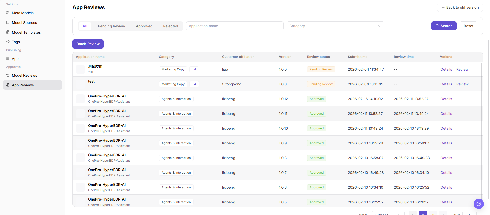

# App Reviews

::: info Document Information
Version: v1.0
Updated: 2026-07-08
:::

## Feature Overview

App Reviews helps operators review app requests, model permissions, call scopes, customer information, and review comments before an app is approved or rejected.

| Item | Content |
| --- | --- |
| Applicable role | Operator |
| Navigation path | Approval Management > App Reviews |
| Page route | /operator/approvals/app-reviews |
| Managed objects | App requests, model permissions, call scopes, customer information, and review comments |
| Typical use | Review whether an app is allowed to call model services |

### Beginner Explanation

App reviews work like an access gate before model capabilities are handed to customers. The focus is to confirm whether the app description, bound models, customer visibility scope, and call risks are clear.

### Terms Quick Reference

| Term | Description |
| --- | --- |
| App review record | Processing record after app publishing or changes enter the review workflow. |
| Bound model | The model or aggregation model actually called by the app. |
| Customer visibility scope | The set of customers allowed to access the app after publishing. |
| Supplementary materials | Explanations, authorization, or test information that the requester must provide. |
## Prerequisites

1. The current account has app review permission.
2. The requester has submitted the app description, bound models, customer visibility scope, and call entry.
3. Before review, the bound model status, customer authorization, and usage boundaries have been confirmed.
## Page Description

This page processes app publishing reviews and displays app name, bound models, requester, visible customers, call entry, usage notes, and review comments. Reviewers need to decide whether the app is ready for publishing and whether unauthorized visibility risks exist.

Page screenshot:

Used to view app publishing review status and processing entry points.

## Main Operations

### Steps

1. Go to `Approval Management > App Reviews`.
2. Filter by review status, app name, requester, or submission time.
3. Open review details and view app description, bound models, and visibility scope.
4. Check call entry, customer scope, and publishing materials.
5. Select approve, reject, or request supplementary materials, and fill in review comments.

### Parameters

| Field Name | Required | Field Type | Example | Description |
| --- | --- | --- | --- | --- |
| Review ID | System-generated | Text | `AR-20260706-001` | App review tracking identifier. |
| App Name | Yes | Text | `customer-assistant` | The app requested for publishing. |
| Bound Model | Yes | Text | `qwen-plus` | The model called by the app. |
| Visible Customers | Conditionally required | Multi-select | `customer-a` | Visibility scope after app publishing. |
| Review Comments | Conditionally required | Multiline text | `Usage boundaries need to be supplemented` | Required when rejecting or requesting supplementary materials. |

### Pitfalls

- App descriptions must not contain customer privacy, real business data, or internal Endpoints.
- Visibility scope should follow the least-privilege principle.
- A delisted or rate-limited bound model affects the app review conclusion.

### Result Checks

1. The review record status is updated to approved, rejected, or correction required.
2. After approval, the app enters the publishing list.
3. Target customers can see the app according to the visibility scope.
## FAQ

### App Review Is Rejected

**Symptom:**

The app does not pass review after submission.

**Possible Causes:**

- Usage notes are incomplete.
- The bound model status is unavailable.
- Customer visibility scope is too broad or lacks authorization.

**Handling:**

1. Supplement materials based on review comments.
2. Check the bound model status.
3. Narrow or explain the customer visibility scope.

### Customer Still Cannot See the App After Approval

**Symptom:**

After review approval, the customer side does not show the app.

**Possible Causes:**

- The publishing step has not completed.
- The customer is not in the visibility scope.
- App publishing synchronization is delayed.

**Handling:**

1. Go to the app publishing page and confirm status.
2. Verify customer visibility scope.
3. Wait for synchronization and validate again.

## Next Steps

1. Go to the app publishing page and confirm status.
2. View the customer call overview.
3. Adjust app description and model binding based on feedback.

## Notes

- App descriptions must not include customer privacy, internal Endpoints, or real API Keys.
- Apply the least-privilege principle when reviewing visibility scope.
- App review should not pass when the bound model is unavailable.
