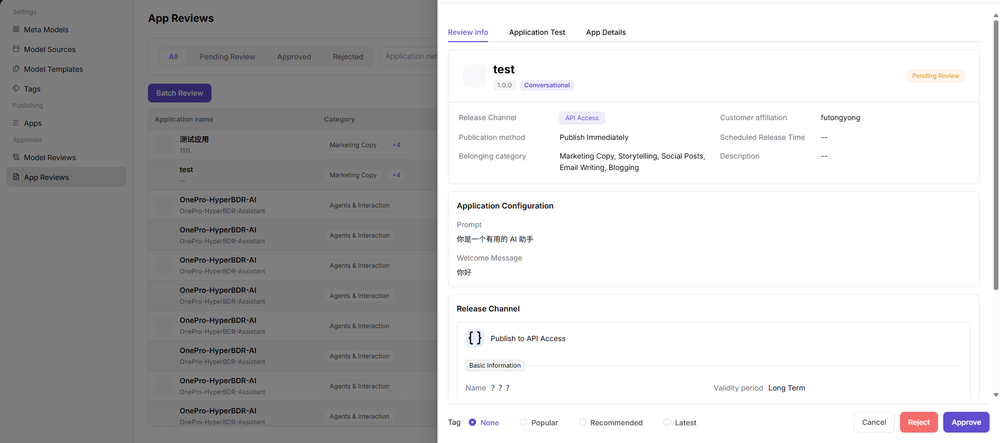

# App Reviews

::: info Document Information
Version: v1.0
Updated: 2026-07-08
:::

## Feature Overview

App Reviews helps operators review app requests, model permissions, call scopes, customer information, and review comments before an app is approved or rejected.

| Item | Content |
| --- | --- |
| Applicable role | Operator |
| Navigation path | Model Services > Approvals > App Reviews |
| Page route | /modelone/audit/app |
| Managed objects | App requests, model permissions, call scopes, customer information, and review comments |
| Typical use | Review whether an app is allowed to call model services |

#### Beginner Explanation

App reviews work like an access gate before model capabilities are handed to customers. The focus is to confirm whether the app description, bound models, customer visibility scope, and call risks are clear.

#### Terms Quick Reference

| Term | Description |
| --- | --- |
| App review record | Processing record after app publishing or changes enter the review workflow. |
| Bound model | The model or aggregation model actually called by the app. |
| Customer visibility scope | The set of customers allowed to access the app after publishing. |
| Supplementary materials | Explanations, authorization, or test information that the requester must provide. |

## Prerequisites

1. The current account has app review permission.
2. The requester has submitted the app description, bound models, customer visibility scope, and call entry.
3. Before review, the bound model status, customer authorization, and usage boundaries have been confirmed.

## Page Description

This page processes app publishing reviews and displays app name, bound models, requester, visible customers, call entry, usage notes, and review comments. Reviewers need to decide whether the app is ready for publishing and whether unauthorized visibility risks exist.

Page screenshot:

Used to view app publishing review status and processing entry points.

## Main Operations

### Review App

1. Go to `Model Services > Approvals > App Reviews`.
2. In the app review list, view `Application name`, `Category`, `Customer affiliation`, `Version`, `Review status`, `Submit time`, `Review time`, and `Actions`.
3. Use the `All`, `Pending Review`, `Approved`, and `Rejected` status tabs, or filter target records by `Application name` and `Category`.
4. Click `Details` or `Review` for the target app to open the review details.
5. On the details page, check `Review Info`, `Application Test`, `App Details`, release channel, application configuration, tags, and customer information.
6. Select `Approve` or `Reject` based on the review result. Before final confirmation, verify the review comment and impact scope again.
7. For page validation only, view details or open the review entry and then close it. Do not click the final `Approve` or `Reject`.

## Parameter Reference

| Field Name | Required | Field Type | Example | Description |
| --- | --- | --- | --- | --- |
| Application name | System-displayed | Text | `test` | Name of the app under review or already reviewed. |
| Category | System-displayed | Tag | `Marketing Copy` | Category that the app belongs to. |
| Customer affiliation | System-displayed | Text | `futongyong` | Customer or submitter that the app belongs to. |
| Version | System-displayed | Text | `1.0.0` | App version submitted for review. |
| Review status | System-displayed | Enum | `Pending Review` / `Approved` / `Rejected` | Lifecycle status of the app review. |
| Submit time | System-displayed | DateTime | `2026-02-04 10:11:49` | Time when the app was submitted for review. |
| Review time | System-displayed | DateTime | `2026-02-11 10:52:27` | Review completion time. Empty or `--` before review. |
| Review Comment | Conditionally required | Multiline text | `Usage boundaries need to be supplemented` | Required when rejecting or requesting supplementary materials. |
| Actions | Displayed by permission | Button | `Details` / `Review` | Entry for viewing details or processing the review. |

## Pitfalls

- App descriptions must not contain customer privacy, real business data, or internal Endpoints.
- Visibility scope should follow the least-privilege principle.
- A delisted or rate-limited bound model affects the app review conclusion.

## Result Validation

| Check Item | Success Criteria | Troubleshooting |
| --- | --- | --- |
| The review list can be opened | The app review list opens normally. | Return to the page and check permissions, menu entry, and page loading status. |
| Pending apps are displayed normally | Pending apps appear in the list with app name, customer, status, and time. | Return to the page and check permissions, filters, and data status. |
| Filters work | Status tabs, application name, and category filters can locate target records. | Return to the page and check filter conditions and data status. |
| Review details can be opened | Clicking `Details` or `Review` opens review information and app details. | Return to the page and check permissions and record status. |
| Review conclusion can be checked | Before final confirmation, the `Approve` or `Reject` action and review comment can be checked. | For page learning or validation, do not click the final confirmation button. |

## FAQ

#### App Review Is Rejected

**Symptom:**

The app does not pass review after submission.

**Possible Causes:**

- Usage notes are incomplete.
- The bound model status is unavailable.
- Customer visibility scope is too broad or lacks authorization.

**Handling:**

1. Supplement materials based on review comments.
2. Check the bound model status.
3. Narrow or explain the customer visibility scope.

#### Customer Still Cannot See the App After Approval

**Symptom:**

After review approval, the customer side does not show the app.

**Possible Causes:**

- The publishing step has not completed.
- The customer is not in the visibility scope.
- App publishing synchronization is delayed.

**Handling:**

1. Go to the app publishing page and confirm status.
2. Verify customer visibility scope.
3. Wait for synchronization and validate again.

#### Users Still Cannot See the App After Approval

**Symptom:**

The app review has passed, but the target customer or caller still cannot see the app entry.

**Possible Causes:**

App visibility scope, customer authorization, model permissions, or publishing status has not finished synchronizing.

**Handling:**

Check app publishing status, customer scope, and model permissions. If needed, refresh publishing configuration in the app list and ask the caller to re-enter the page for confirmation.

## Next Steps

1. Go to the app publishing page and confirm status.
2. View the customer call overview.
3. Adjust app description and model binding based on feedback.

## Notes

- App descriptions must not include customer privacy, internal Endpoints, or real API Keys.
- Apply the least-privilege principle when reviewing visibility scope.
- App review should not pass when the bound model is unavailable.
