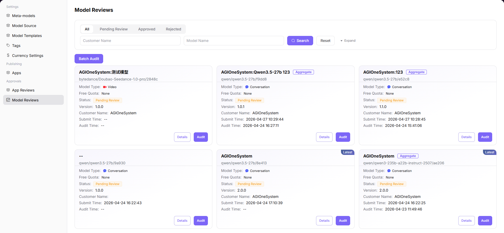

# Model Reviews

::: info Document Information
Version: v1.0
Updated: 2026-07-08
:::

## Feature Overview

Model Reviews helps operators review model publishing requests, source configuration, protocols, billing rules, rate limits, and review comments before a model is listed.

| Item | Content |
| --- | --- |
| Applicable role | Operator |
| Navigation path | Approval Management > Model Reviews |
| Page route | /operator/approvals/model-reviews |
| Managed objects | Model publishing requests, source configuration, protocols, billing, rate limits, and review comments |
| Typical use | Review whether a model can be listed |

### Beginner Explanation

Model review is like a quality check before listing. The focus is not only whether the name is complete, but also whether the model source, protocol, capability description, security boundary, and visibility scope are publishable.

### Terms Quick Reference

| Term | Description |
| --- | --- |
| Review record | Processing record after model publishing, update, or delisting enters the review workflow. |
| Authorization materials | Materials proving model source, usage rights, and publishing scope. |
| Risk notes | Notes on data, content safety, call stability, and cost risks. |
| Review comments | Handling comments given to the requester when approving, rejecting, or requesting supplementary materials. |
## Prerequisites

1. The current account has model review permission.
2. The requester has submitted model source, authorization materials, protocol description, test results, and usage boundaries.
3. The reviewer has clear criteria for approval, rejection, and supplementary materials.
## Page Description

This page processes reviews for model listing, updates, or delisting. It displays requested model, provider, meta-model, source credentials, risk notes, and review comments. Reviewers should provide clear conclusions around authorization, capability, compliance, and call availability.

Page screenshot:

Used to view review status, requester, model, and processing entry points.

## Main Operations

### Steps

1. Go to `Approval Management > Model Reviews`.
2. Filter by review status, requester, model name, or submission time.
3. Open review details and view model source, meta-model, protocol, and visibility scope.
4. Check authorization materials, test results, and risk notes.
5. Select approve, reject, or request supplementary materials, and fill in review comments.

### Parameters

| Field Name | Required | Field Type | Example | Description |
| --- | --- | --- | --- | --- |
| Review ID | System-generated | Text | `MR-20260706-001` | Model review tracking identifier. |
| Model Name | Yes | Text | `qwen-plus` | The model requested for listing or update. |
| Provider | Yes | Text | `provider-a` | Model source or provider. |
| Review Result | Yes | Enum | `Approved` | Approved, rejected, or supplementary materials required. |
| Review Comments | Conditionally required | Multiline text | `Authorization notes need to be supplemented` | The reason must be clear when rejecting or requesting supplementary materials. |

### Pitfalls

- Do not paste real keys, complete request headers, or raw customer call content into review comments.
- Before approval, confirm that model protocol, Token limits, and input/output modalities are consistent.
- When rejecting, state the missing materials clearly to avoid repeated submissions.

### Result Checks

1. After the review result is saved, the review record status is updated.
2. After approval, the model enters the publishing or listing flow.
3. When rejected or supplementary materials are required, the requester can see a clear reason.
## FAQ

### Review Materials Are Insufficient

**Symptom:**

Review details lack source authorization, protocol description, or test results.

**Possible Causes:**

- The requester submitted only the model name.
- Provider authorization boundaries are unclear.
- Connectivity or call tests were not completed.

**Handling:**

1. Reject or request supplementary materials.
2. List the authorization, protocol, and test items that need to be supplemented.
3. Review again after supplementation.

### Model Is Still Invisible After Approval

**Symptom:**

After review approval, the user-side model marketplace does not display the model.

**Possible Causes:**

- The model has not been officially listed.
- Visibility scope or tags are not configured.
- The publishing synchronization task has not completed.

**Handling:**

1. Check model publishing status.
2. Verify visibility scope and tags.
3. Wait for or trigger the synchronization task.

## Next Steps

1. Go to the model publishing or model settings page.
2. Validate model marketplace visibility.
3. Track call logs and user feedback.

## Notes

- Do not paste raw keys, complete request headers, or customer data into review comments.
- Before approval, focus on source authorization, protocol, Token limits, and usage boundaries.
- Rejection comments should list actionable supplementation items.
