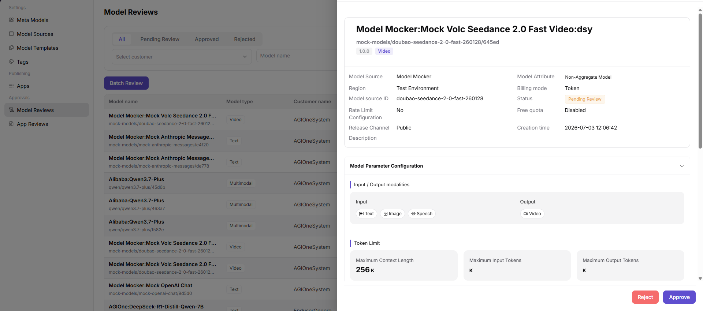

# Model Reviews

::: info Document Information
Version: v1.0
Updated: 2026-07-08
:::

## Feature Overview

Model Reviews helps operators review model publishing requests, source configuration, protocols, billing rules, rate limits, and review comments before a model is listed.

| Item | Content |
| --- | --- |
| Applicable role | Operator |
| Navigation path | Model Services > Approvals > Model Reviews |
| Page route | `/modelone/audit/model` |
| Managed objects | Model publishing requests, source configuration, protocols, billing, rate limits, and review comments |
| Typical use | Review whether a model can be listed |

#### Beginner Explanation

Model review is like a quality check before listing. The focus is not only whether the name is complete, but also whether the model source, protocol, capability description, security boundary, and visibility scope are publishable.

#### Terms Quick Reference

| Term | Description |
| --- | --- |
| Review record | Processing record after model publishing, update, or delisting enters the review workflow. |
| Authorization materials | Materials proving model source, usage rights, and publishing scope. |
| Risk notes | Notes on data, content safety, call stability, and cost risks. |
| Review comments | Handling comments given to the requester when approving, rejecting, or requesting supplementary materials. |

## Prerequisites

1. The current account has model review permission.
2. The requester has submitted model source, authorization materials, protocol description, test results, and usage boundaries.
3. The reviewer has clear criteria for approval, rejection, and supplementary materials.

## Page Description

This page processes reviews for model listing, updates, or delisting. It displays requested model, provider, meta-model, source credentials, risk notes, and review comments. Reviewers should provide clear conclusions around authorization, capability, compliance, and call availability.

Page screenshot:

Used to view review status, requester, model, and processing entry points.

## Main Operations

### Review Model

1. Go to `Model Services > Approvals > Model Reviews`.
2. In the model review list, view `Model name`, `Model type`, `Customer name`, `Version`, `Free quota`, `Status`, `Submit time`, `Review time`, and `Actions`.
3. Use the `All`, `Pending Review`, `Approved`, and `Rejected` status tabs, or filter target records by `Select customer` and `Model name`.
4. Click `Details` or `Review` for the target model to open the model review details.
5. On the details page, check model name, model source, region, model source ID, rate limit configuration, release channel, model attribute, billing mode, status, free quota, and creation time.
6. Continue checking `Model Parameter Configuration`, including input/output modalities, Token limits, protocols, capability description, and usage boundaries.
7. Select `Approve` or `Reject` based on the review result. Before final confirmation, verify the review comment and impact scope again.
8. For page validation only, view details or open the review entry and then close it. Do not click the final `Approve` or `Reject`.

## Parameter Reference

| Field Name | Required | Field Type | Example | Description |
| --- | --- | --- | --- | --- |
| Model name | System-displayed | Text | `Model Mocker:Mock Volc Seedance 2.0 Fast Video` | Name of the model under review or already reviewed. |
| Customer name | System-displayed | Text | `AGIOneSystem` | Customer or submitter that the model belongs to. |
| Model Source | System-displayed | Text | `Model Mocker` | Model source or provider. |
| Model type | System-displayed | Tag | `Video` / `Text` | Capability type of the model. |
| Version | System-displayed | Text | `1.0.0` | Model version submitted for review. |
| Free quota | System-displayed | Text | `None` | Whether the model has free quota configured. |
| Review status | System-displayed | Enum | `Pending Review` / `Approved` / `Rejected` | Lifecycle status of the model review. |
| Submit time | System-displayed | DateTime | `2026-07-08 16:49:47` | Time when the model was submitted for review. |
| Review time | System-displayed | DateTime | `2026-07-15 17:30:01` | Review completion time. Empty or `--` before review. |
| Review Comment | Conditionally required | Multiline text | `Authorization notes need to be supplemented` | Required when rejecting or requesting supplementary materials. |
| Actions | Displayed by permission | Button | `Details` / `Review` | Entry for viewing details or processing the review. |

## Pitfalls

- Do not paste real keys, complete request headers, or raw customer call content into review comments.
- Before approval, confirm that model protocol, Token limits, and input/output modalities are consistent.
- When rejecting, state the missing materials clearly to avoid repeated submissions.

## Result Validation

| Check Item | Success Signal | If Abnormal |
| --- | --- | --- |
| The review list can be opened | The model review list opens normally. | Return to the page and check permissions, menu entry, and page loading status. |
| Pending models are displayed normally | Pending models appear in the list with model name, customer, status, and time. | Return to the page and check permissions, filters, and data status. |
| Filters work | Status tabs, customer, and model name filters can locate target records. | Return to the page and check filter conditions and data status. |
| Review details can be opened | Clicking `Details` or `Review` opens model basic information and model parameter configuration. | Return to the page and check permissions and record status. |
| Review conclusion can be checked | Before final confirmation, the `Approve` or `Reject` action and review comment can be checked. | For page learning or validation, do not click the final confirmation button. |

## FAQ

#### Review Materials Are Insufficient

**Symptom:**

Review details lack source authorization, protocol description, or test results.

**Possible Causes:**

- The requester submitted only the model name.
- Provider authorization boundaries are unclear.
- Connectivity or call tests were not completed.

**Handling:**

1. Reject or request supplementary materials.
2. List the authorization, protocol, and test items that need to be supplemented.
3. Review again after supplementation.

#### Model Is Still Invisible After Approval

**Symptom:**

After review approval, the user-side model marketplace does not display the model.

**Possible Causes:**

- The model has not been officially listed.
- Visibility scope or tags are not configured.
- The publishing synchronization task has not completed.

**Handling:**

1. Check model publishing status.
2. Verify visibility scope and tags.
3. Wait for or trigger the synchronization task.

#### Model Still Cannot Be Called After Approval

**Symptom:**

The model review status is approved, but calls fail in the marketplace or Playground.

**Possible Causes:**

The model is not listed yet, model source connectivity is abnormal, billing or rate-limit configuration is incomplete, or the caller does not have visibility scope and a valid Key.

**Handling:**

Check model publishing status and visibility scope first. Then check model source, billing, rate limits, and call logs. Confirm whether the caller credential is valid.

## Next Steps

1. Go to the model publishing or model settings page.
2. Validate model marketplace visibility.
3. Track call logs and user feedback.

## Notes

- Do not paste raw keys, complete request headers, or customer data into review comments.
- Before approval, focus on source authorization, protocol, Token limits, and usage boundaries.
- Rejection comments should list actionable supplementation items.
