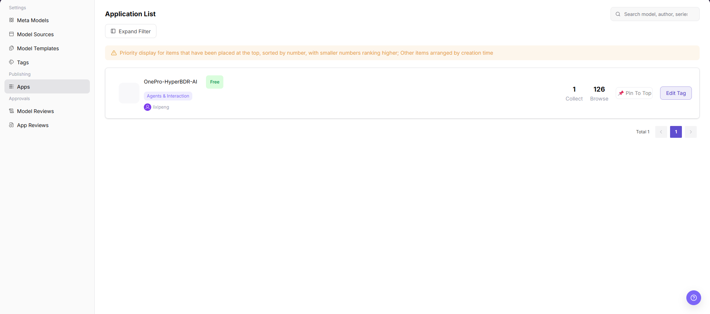

# App Publishing

::: info Document Information
Version: v1.0
Updated: 2026-07-06
:::

::: warning Security Notice
Model Services documentation and screenshots must not expose real API Keys, AK/SK pairs, Secret Keys, Endpoints, request header authentication values, model source credentials, internal access addresses, customer names, or business-sensitive data. Use placeholders in all examples.
:::

## Feature Overview

`App Publishing` is used to maintain or view apps, model permissions, call scopes, status, and publishing records. It supports model publishing, experimentation, calling, statistics, and operational governance.

| Item | Content |
| --- | --- |
| Applicable role | Operator |
| Navigation path | Publishing Management > Apps |
| Page route | /operator/publishing/apps |
| Managed objects | Apps, model permissions, call scopes, status, and publishing records |
| Typical use | Maintain apps that can call model services |

### Beginner Explanation

App publishing packages model capabilities into a customer-facing entry point. Operators focus on whether app information, visibility scope, called models, and publishing status are consistent.

### Terms Quick Reference

| Term | Description |
| --- | --- |
| App | A customer-facing usage entry that wraps model capabilities. |
| Bound model | The model actually called by the app backend. |
| Publishing status | Lifecycle status such as draft, under review, published, or delisted. |
| Call entry | Customer access entry for the app or API. Use placeholders in documentation. |
## Prerequisites

1. The current account has app publishing management permission.
2. The app bound model, call entry, customer visibility scope, and publishing notes are prepared.
3. Customer authorization and model status have been confirmed before publishing.
## Page Description

This page manages app publishing records, including app name, bound model, visibility scope, publishing status, call entry, and review information. Operators should confirm that app display information, model permissions, and customer visibility scope match.

Page screenshot:

Used to view app status, bound models, and visibility scope.

## Main Operations

### Steps

1. Go to `Publishing Management > Apps`.
2. Filter by app name, publishing status, or bound model.
3. Open app details and check model, visibility scope, and call entry.
4. When publishing or delisting is needed, fill in publishing notes and submit.
5. After publishing, validate app visibility and call entry from the customer perspective.

### Parameters

| Field Name | Required | Field Type | Example | Description |
| --- | --- | --- | --- | --- |
| App Name | Yes | Text | `customer-assistant` | App display name. |
| Bound Model | Yes | Dropdown | `qwen-plus` | The model called by the app. |
| Visibility Scope | Yes | Multi-select | `Specified customers` | Controls which customers can see the app. |
| Publishing Status | System-generated | Enum | `Published` | Current lifecycle status of the app. |
| Call Entry | System-generated | URL | `https://api.example.com/app` | Placeholder used as an example. |

### Pitfalls

- Before publishing, confirm that the bound model is listed and its authorization scope covers target customers.
- Before delisting an app, evaluate customer-side call impact.
- Redact customer names, internal app IDs, and call entries in screenshots.

### Result Checks

1. App publishing status matches the operation result.
2. From the customer perspective, the app is visible according to the visibility scope.
3. The app call entry is consistent with bound model configuration.
## FAQ

### Customer Cannot See the App After Publishing

**Symptom:**

The app status is published, but the customer-side list does not display it.

**Possible Causes:**

- The visibility scope does not include this customer.
- The bound model is not authorized or has been delisted.
- Publishing cache has not refreshed.

**Handling:**

1. Verify app visibility scope.
2. Check bound model status and authorization.
3. Refresh the customer-side page or wait for synchronization.

### App Call Fails

**Symptom:**

The customer can see the app, but calls return errors.

**Possible Causes:**

- The bound model is unavailable.
- Call entry or parameter mapping is incorrect.
- Customer quota or rate limits are triggered.

**Handling:**

1. Check model status and call logs.
2. Verify app parameter mapping.
3. View customer call error codes and quota.

## Next Steps

1. View app call logs.
2. Analyze customer call trends.
3. Adjust model or visibility scope based on customer feedback.

## Notes

- Confirm customer call impact before delisting an app.
- Redact customer names, app IDs, and call entries in screenshots.
- Real call addresses and credentials should only be displayed in secure platform areas.
