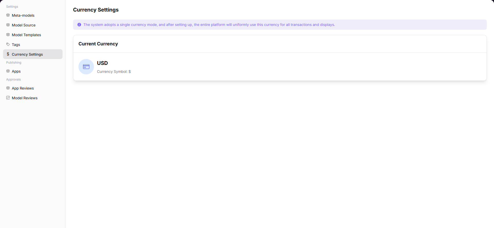

# Currency Settings

## Preface

| Item | Content |
|------|---------|
| Target Audience | Operator |
| Navigation Path | Settings > Currency Settings |
| Overview | Configure the unified settlement currency for the platform. All transactions and fee displays across the platform will be based on this currency |

## Page Structure

### Search Area

No search area. The current currency configuration is displayed directly.

### Action Buttons

Click the currently used currency card to switch currencies.

### Data List

The page displays the unified currency information used by the platform, including currency code and symbol.

### Page Screenshot

## Operations

### Viewing Current Currency Configuration

1. Enter the platform homepage, click the **"Settings > Currency Settings"** menu in the left navigation bar to enter the currency settings page.
2. View the current unified currency used by the platform. The page displays: "The system uses a single currency mode. After setting, the entire platform will uniformly use this currency for all transactions and displays."
3. To switch currency, click the currently used currency card and select the target currency in the popup:
   - Select the new currency (e.g., USD / CNY, etc.);
   - After confirmation, all platform transactions and fee displays will switch to the new currency.

#### Parameters

| Term | Type | Example | Description |
|------|------|---------|-------------|
| Current Currency | Text | `USD` | The currently effective unified settlement currency of the platform |
| Currency Symbol | Text | `$` | The symbol identifier for this currency, used for price display |

## Other Operations

| Operation | Steps |
|-----------|-------|
| View Current Currency Information | Enter the "Currency Settings" page to view the currently effective currency and corresponding currency symbol |

## Notes

* Switching currency will affect all transactions and fee displays across the entire platform. Please confirm before operating.
* Switching currency will not affect historical transaction records, but displayed values will be reconverted based on the new currency.
