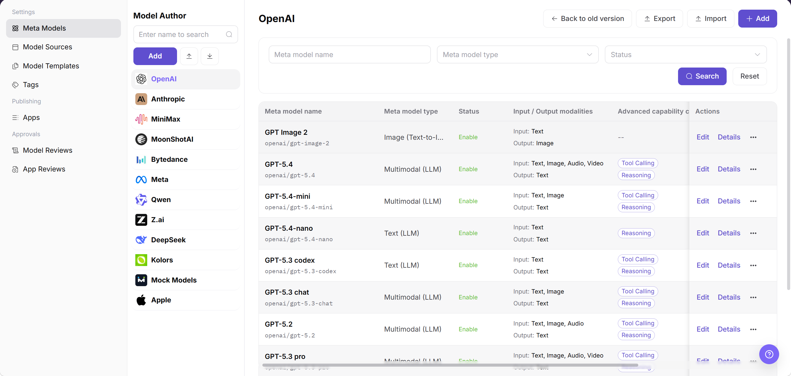
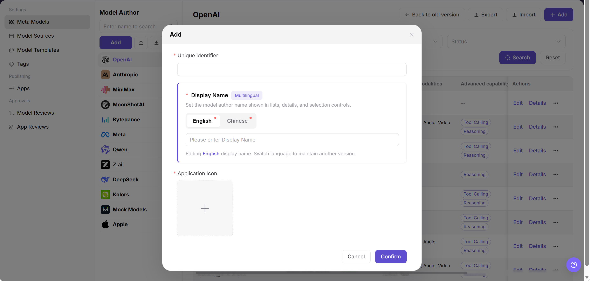
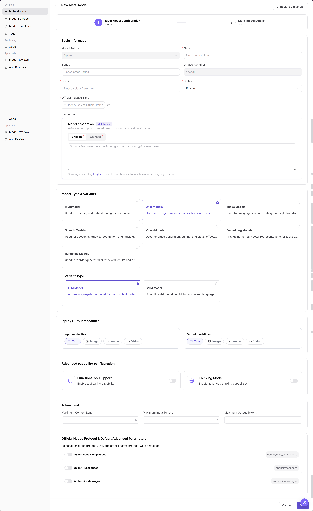
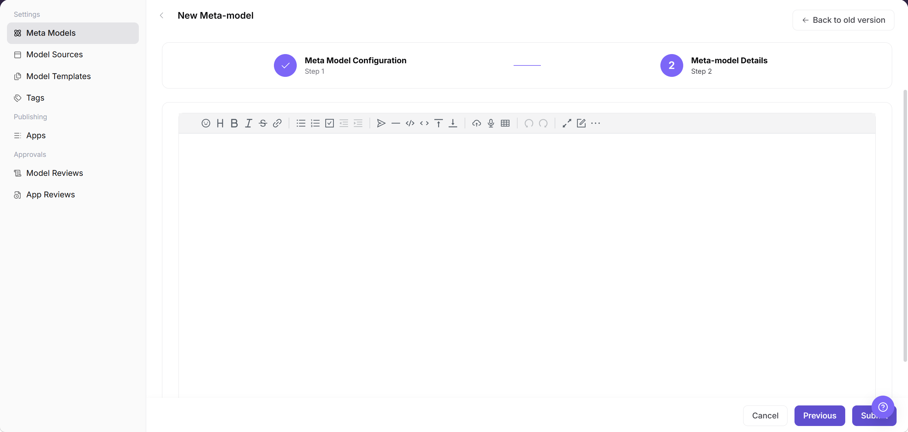

# Meta Models

::: info Document Information
Version: v1.0
Updated: 2026-07-08
:::

## Feature Overview

Meta-models help operators define model capabilities, protocols, modalities, Token limits, default parameters, and capability tags used by publishing and templates.

| Item | Content |
| --- | --- |
| Applicable role | Operator |
| Navigation path | Model Services > Settings > Meta Models |
| Page route | `/modelone/settings/meta` |
| Managed objects | Model capabilities, protocols, modalities, Token limits, default parameters, and capability tags |
| Typical use | Maintain model capability abstractions and protocol definitions |

#### Beginner Explanation

A meta-model is like a capability specification for a model. It defines which inputs and outputs the model supports, which protocol it uses, how many Tokens it can process, and which default parameters are used for Playground and calls. It is not a concrete provider instance; it is a foundational definition referenced by model publishing and template configuration.

#### Terms Quick Reference

| Term | Description |
| --- | --- |
| Meta-model | Abstract definition that describes model capabilities and call protocols. |
| Input/output modalities | Text, image, audio, or video input/output types supported by the model. |
| Token limits | Limits for model context, input length, and output length. |
| Official native protocol | Compatible protocol definition such as OpenAI or Anthropic. |

## Prerequisites

1. The current account has meta-model configuration permission.
2. Model type, input/output modalities, context length, Token limits, and default parameters have been confirmed.
3. Compatible protocols, Endpoint paths, and request/response formats have been confirmed by the technical owner.
4. Before adding or changing a meta-model, the impact on model publishing templates and published models has been evaluated.

## Page Description

This page maintains model capability abstractions, including input/output modalities, protocols, Token limits, capability tags, and default parameters. A meta-model is not a concrete provider instance. It is more like a capability specification referenced during model publishing.

Page screenshot:

Used to view meta-model status, modalities, protocols, and operation entry points.

## Main Operations

### Add Model Author

1. Go to `Model Services > Settings > Meta Models`.
2. In the `Model Author` area on the left, click `Add` to open the `Add` dialog.
3. Fill in `Unique identifier` to distinguish the model author.
4. In `Display Name`, maintain the `English` and `Chinese` display names.
5. Upload or select an `Application Icon`.
6. Before clicking `Confirm`, verify the field values. For page validation only, click `Cancel` to close the dialog.

### Add Meta Model

1. Go to `Model Services > Settings > Meta Models`.
2. Click `Add` in the upper-right corner to open the `New Meta-model` page.
3. In the `Meta Model Configuration` step, fill in or select `Model Author`, `Name`, `Series`, `Unique identifier`, `Scene`, `Status`, `Official Release Time`, and `Description`.
4. Select `Model Type & Variants`, then configure `Input / Output modalities` and `Advanced capability configuration`.
5. Fill in `Token limit`, and select `Official Native Protocol & Default Advanced Parameters`.

6. Click `Next` to go to the `Meta-model Details` page.
7. On `Meta-model Details`, maintain the model description, capability details, parameter descriptions, or other detail configuration required by the page.
8. Before final submission or saving, verify the configuration. For page validation only, click `Cancel` or go back to close the page.

## Parameter Reference

| Field Name | Required | Field Type | Example | Description |
| --- | --- | --- | --- | --- |
| Unique identifier | Yes | Text / read-only text | `qwen` | Unique identifier of a model author or meta-model. |
| Display Name | Yes | Multilingual text | `Qwen` | Display name of the model author in lists, details, and selectors. |
| Application Icon | Yes | Image upload | `qwen.png` | Icon shown for the model author in the list. |
| Model Author | Yes | Dropdown | `Qwen` | Model author that the new meta-model belongs to. |
| Name | Yes | Text | `Qwen Text` | Display name of the meta-model on the page and in publishing flows. |
| Series | Yes | Text | `Qwen` | Series that the meta-model belongs to. |
| Scene | Yes | Dropdown | `Text Generation` | Business scenario where the meta-model is used. |
| Status | Yes | Dropdown | `Enabled` | Controls whether the meta-model can be used in later flows. |
| Official Release Time | No | Date picker | `2026-07-08` | Official release time of the corresponding model capability. |
| Model description | No | Multilingual text | `For text generation.` | Description displayed on model cards and detail pages. |
| Model Type & Variants | Yes | Radio card | `Conversation Model` / `LLM Model` | Defines the capability category and subtype of the meta-model. |
| Input / Output modalities | Yes | Multi-select | `Text -> Text` | Declares the data input and output types supported by the model. |
| Function / Tool support | No | Toggle | `Off` | Controls whether tool calling capability is enabled. |
| Thinking mode | No | Toggle | `Off` | Controls whether deep thinking or reasoning capability is enabled. |
| Max context / Max input / Max output | Yes | Number | `128` K | Defines the upper Token limits for context, input, and output. |
| Official Native Protocol & Default Advanced Parameters | Yes | Toggle / parameter configuration | `OpenAI-ChatCompletions` | Selects the compatible protocol and maintains default advanced parameters. |

## Pitfalls

- Setting Token limits higher than the real model capability causes call failures.
- Protocol Endpoint paths should be paths or placeholder examples. Do not write real internal addresses.
- Incorrect input/output modality configuration affects model marketplace filtering.

## Result Validation

| Check Item | Success Signal | If Abnormal |
| --- | --- | --- |
| The new meta-model is visible in the list | The new meta-model appears in the list. | Return to the page and check permissions, filters, and configuration status. |
| The meta-model can be selected during publishing or template configuration | The meta-model is available when publishing models or configuring templates. | Return to the page and check permissions, filters, and configuration status. |
| Protocols, modalities, and Token limits match the real model capability | Protocols, modalities, and Token limits are consistent with the actual model. | Return to the page and check permissions, filters, and configuration status. |
| Default parameters take effect in Playground or call tests | Default parameters work as expected in Playground or call tests. | Return to the page and check permissions, filters, and configuration status. |

## FAQ

#### Cannot Select the Meta-model When Publishing a Model

**Symptom:**

After a model provider enters the publishing flow, the target item is missing from the meta-model dropdown.

**Possible Causes:**

- The meta-model is not enabled.
- Model type or modality does not match the publishing method.
- The current role or tenant does not have permission to use this meta-model.

**Handling:**

1. Confirm that the meta-model status is enabled.
2. Check model type, input/output modalities, and publishing method.
3. Check role, tenant, and visibility scope configuration.

#### Call Reports Token Limit Exceeded

**Symptom:**

Model Playground or API calls return context length, input length, or output length limit errors.

**Possible Causes:**

- The meta-model Token limit is smaller than the actual request.
- Default Max Tokens is set too high.
- The caller passed an excessively long context.

**Handling:**

1. Check the meta-model context, input, and output limits.
2. Adjust default parameters or call parameters.
3. Shorten the Prompt or conversation context and retry.

#### Meta-model Parameters Do Not Match During Model Publishing

**Symptom:**

When a provider publishes a model, the meta-model default parameters or context limits do not match the real model capability.

**Possible Causes:**

The meta-model protocol, modalities, Token limits, or default parameters are maintained incorrectly, or the template references an old configuration.

**Handling:**

Go back to the meta-model page and check protocols, modalities, and Token limits. Also check model template references, then validate the change with a test publishing flow.

## Next Steps

1. Select this meta-model in the model template or publishing flow and confirm that protocol, modalities, and Token limits are referenced correctly.
2. Use a representative model for one publishing validation and check whether input/output formats match.
3. When protocol, context length, or default parameters change, notify template maintainers and model providers.

## Notes

- Meta-model changes affect model publishing, template selection, and marketplace filtering. Confirm dependency scope before release.
- Token limits, protocol paths, and default parameters must match real model capability.
- Before adjusting input/output modalities, check whether published models can still be filtered and called correctly.
