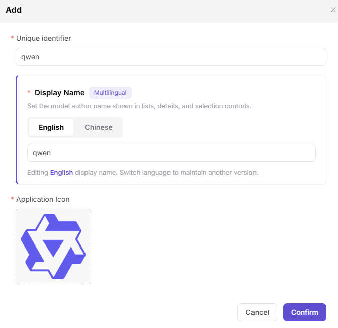
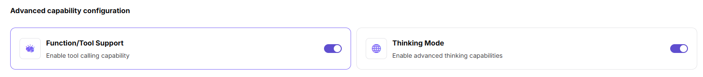
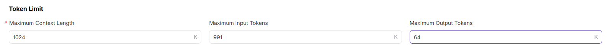
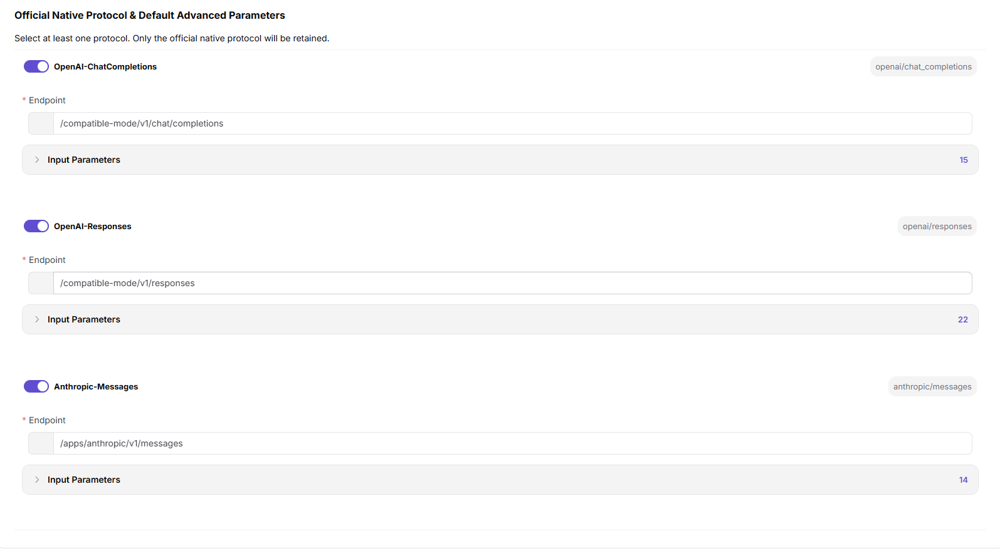
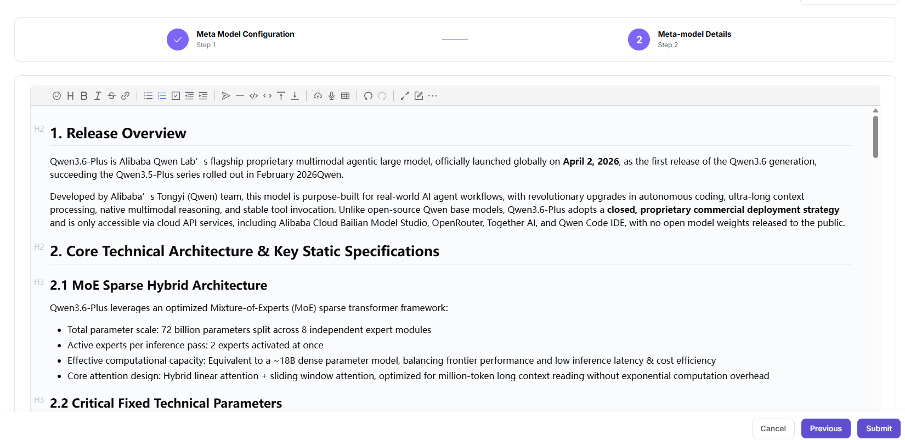

# Meta-models

## Preface

| Item            | Content                                                                                                                                                  |
| --------------- | -------------------------------------------------------------------------------------------------------------------------------------------------------- |
| Target Audience | Operator                                                                                                                                                 |
| Navigation Path | Settings > Meta-models                                                                                                                                   |
| Overview        | Manage model authors and meta-model configurations globally to provide foundational data support for model publishing, template creation, and other processes |

## Page Structure

### Search Area

The page top supports quick location of target meta-models by model author name.

### Action Buttons

- The **"Add"** button above the left-side model author list is used to add new model authors.
- The page top provides **"Export"** / **"Import"** buttons for batch management of model authors or meta-model configurations.
- Each model author card provides **"Edit"** / **"Delete"** operations.
- Each meta-model row provides **"+ Add"**, **"Edit"**, **"Copy"**, **"Details"**, **"Enable"** / **"Disable"**, **"Delete"** operations.

### Data List

- **Model Author List**: All authors are displayed in card format, with each card showing unique identifier, multilingual display name, and application icon.
- **Meta-model List**: After selecting an author, all meta-models under that author are displayed, with key information such as unique identifier, name, series, status, version, token limit, and model type.

## Operations

### Adding a Model Author

1. Enter the platform homepage, click the **"Settings > Meta-models"** menu in the left navigation bar to enter the meta-model management page.
2. Above the left-side model author list, click the **"Add"** button to pop up the "Add" window.

3. Configure model author information:
   - Fill in the **"Unique Identifier"** (e.g., `qwen`), used to uniquely identify this model author in the system;
   - **"Display Name"** (marked "Multilingual"): Used to set the display name of the model author in lists, details, and selection controls. Click the **"English"** / **"Chinese"** tabs to switch language tabs, with the prompt **"Currently editing English display name. Switch language to maintain another language version"**. Fill in the names for the English and Simplified Chinese environments in the corresponding tabs (e.g., English: `Qwen` / Chinese: `通义千问`);
   - Upload the **"Application Icon"** (e.g., Qwen brand icon).
4. After confirming all information is correct, click the **"Confirm"** button to complete the addition; to discard, click **"Cancel"**.

#### Parameters

| Term | Type | Example | Description |
|------|------|---------|-------------|
| Unique Identifier | Text | `qwen` | Required. The unique identifier of the model author |
| Display Name | Multilingual Text | `Qwen / 通义千问` | Required. Configure display names under the "English" and "Chinese" tabs respectively |
| Application Icon | Image | `Qwen Brand Icon` | Required. The display icon for the model author |

### Adding a Meta-model

1. On the "Meta-models" management page, select the target model author (e.g., `Qwen`), and click the **"+ Add"** button on the right to enter the "Add Meta-model" process.

#### **Step 1: Meta-model Configuration**:

- **Basic Information**:
   - Select **"Model Author"** (e.g., Qwen);
   - Fill in the **"Name"** (e.g., Qwen3.6-Plus);
   - Fill in the **"Series"** (e.g., Qwen3.6);
   - Fill in the **"Unique Identifier"** (e.g., `qwen/qwen3.6-plus`, auto-formatted as `author/series-name`);
   - Select **"Scenario"** (e.g., Language & Text Processing / Text Generation);
   - Select **"Status"** (Enabled / Disabled);
   - Select the **"Official Release Date"** (date picker, e.g., 2026-04-02).
   - **Multilingual Description**: Click the **"Multilingual"** tab at the top of the **"Model Description"** card to switch language tabs (English / Chinese). Fill in the model introduction in each language version using the rich text editor. The **"Multilingual"** marker indicates that this field needs to maintain multiple language versions simultaneously. The content supports inserting links (model_url can be maintained), and switching languages allows maintaining the other language version.

- **Model Type & Subtype**:
   - **"Multimodal"**: For simultaneously processing, understanding, and generating two or more modalities of information;
   - **"Chat Model"**: For text generation, dialogue, and other natural language processing tasks;
   - **"Image Model"**: For image generation, editing, and style transfer tasks;
   - **"Audio Model"**: For speech synthesis, recognition, and music generation tasks;
   - **"Video Model"**: For video generation, editing, and special effects processing tasks;
   - **"Embedding Model"**: For embedding query vectors for tasks such as retrieval, matching, and classification;
   - **"Reranker Model"**: For reranking generation or retrieval results, prioritizing the most relevant content.

- **Input / Output Modalities**:
   - **"Input Modalities"** (multi-select): Text / Image / Audio / Video;
   - **"Output Modalities"** (multi-select): Text / Image / Audio / Video.

- **Advanced Capability Configuration**:
   - **"Function / Tool Support"**: When enabled, supports tool calling functionality;
   - **"Thinking Mode"**: When enabled, supports deep thinking and reasoning capabilities.

- **Token Limit**:
   - **"Max Context"** (e.g., 1024K);
   - **"Max Input"** (e.g., 991K);
   - **"Max Output"** (e.g., 64K).

- **Official Native Protocol and Default Parameters**:
   - **OpenAI-ChatCompletions** (protocol code `openai/chat_completions`): Fill in the **"Endpoint"** (e.g., `/compatible-mode/v1/chat/completions`), and configure **"Input Parameters"** (Temperature, Top-P, N, Stream, Max Tokens, Presence Penalty, Frequency Penalty, User, Seed, Parallel Tool Calls, etc., with "Required" toggle);
   - **OpenAI-Responses** (protocol code `openai/responses`): Fill in the **"Endpoint"** (e.g., `/compatible-mode/v1/responses`), and configure **"Input Parameters"**;
   - **Anthropic-Messages** (protocol code `anthropic/messages`): Fill in the **"Endpoint"** (e.g., `/apps/anthropic/v1/messages`), and configure **"Input Parameters"**.

- Click **"Next"** to enter the meta-model details.

#### **Step 2: Meta-model Details**:

- **Meta-model Details**: Fill in the complete detailed introduction of the model in the rich text editor (supports rich text format, link insertion, etc.).

- After confirming all information is correct, click the **"Submit"** button to complete the addition.

#### Parameters

| Term | Type | Example | Description |
|------|------|---------|-------------|
| Model Author | Dropdown | `Qwen` | Required. The affiliated model author |
| Name | Text | `Qwen3.6-Plus` | Required. Custom meta-model identifier |
| Series | Text | `Qwen3.6` | Required. The model's version series |
| Unique Identifier | Text | `qwen/qwen3.6-plus` | Required. The model's unique identifier in the system (auto-formatted as `author/series-name`) |
| Scenario | Dropdown | `Language & Text Processing / Text Generation` | Required. The model's application business scenario |
| Status | Dropdown | `Enabled / Disabled` | Required. Controls whether the model is available |
| Official Release Date | Date | `2026-04-02` | Required. The model's official release date |
| Multilingual Description | Multilingual Rich Text | `English + Chinese model introduction` | Required. Adapts to multilingual environment display |
| Model Type | Multi-select | `Multimodal / Chat Model / Image Model / Audio Model / Video Model / Embedding Model / Reranker Model` | Required. Classifies model functional categories (select as needed) |
| Input Modalities | Multi-select | `Text / Image / Audio / Video` | Required. Input data types supported by the model |
| Output Modalities | Multi-select | `Text / Image / Audio / Video` | Required. Output data types supported by the model |
| Advanced Capability - Function / Tool Support | Toggle | `On / Off` | Optional. When enabled, supports tool calling |
| Advanced Capability - Thinking Mode | Toggle | `On / Off` | Optional. When enabled, supports deep thinking and reasoning |
| Max Context | Number | `1024K` | Required. Token context length upper limit |
| Max Input | Number | `991K` | Required. Single input Token upper limit |
| Max Output | Number | `64K` | Required. Single output Token upper limit |
| Official Native Protocol - OpenAI-ChatCompletions | Toggle + Protocol Code | `openai/chat_completions` | Required. When enabled, configure Endpoint and Input Parameters |
| Official Native Protocol - OpenAI-Responses | Toggle + Protocol Code | `openai/responses` | Required. When enabled, configure Endpoint and Input Parameters |
| Official Native Protocol - Anthropic-Messages | Toggle + Protocol Code | `anthropic/messages` | Required. When enabled, configure Endpoint and Input Parameters |
| Endpoint | URL | `/compatible-mode/v1/chat/completions` | Required. The endpoint path corresponding to the protocol |
| Input Parameters | Parameter List | `Temperature / Top-P / N / Stream / Max Tokens / Presence Penalty / Frequency Penalty / User / Seed / Parallel Tool Calls` | Optional. Preset input parameters by protocol (Required toggle available) |
| Meta-model Details | Rich Text | `Model features, parameter introduction` | Required. The complete detailed description of the model |

## Other Operations

| Operation | Steps |
|-----------|-------|
| Edit Model Author | On the left model author list, click the target author's **"Edit"** button → Modify unique identifier, display name, application icon, etc. → Click **"Confirm"** |
| Edit Meta-model | On the meta-model list, click the target meta-model's **"Edit"** button → Modify meta-model configuration → Click **"Submit"** |
| Copy Meta-model | Click the target meta-model's **"Copy"** button → Quickly create a new meta-model based on the existing one |
| View Meta-model Details | Click the target meta-model's **"Details"** button → View complete model configuration and introduction information |
| Enable / Disable Meta-model | Click the target meta-model's **"Enable"** / **"Disable"** button → Toggle the model's availability status |
| Delete Model Author | On the left model author list, click the target author's **"Delete"** button → Confirm operation (**This action is irreversible. Please operate with caution.**) |
| Delete Meta-model | Click the target meta-model's **"Delete"** button → Confirm operation (**This action is irreversible. Please operate with caution.**) |
| Export / Import Configuration | Click the **"Export"** / **"Import"** buttons at the top right of the page → Batch management of model author or meta-model configuration |

## Notes

- **Deletion operations are irreversible.** Please operate with caution.
- Before deleting a model author, all meta-models under that author must be cleared first.
- Meta-models are foundational data for templates, publishing, and model marketplace processes. Modifications may affect published model configurations.
- Multilingual fields must maintain both English and Chinese versions simultaneously. Switch language tabs to maintain the other language version.
