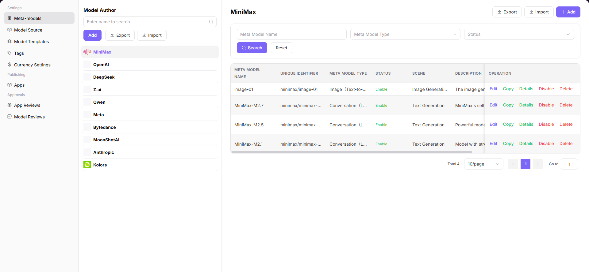

# Meta-models

## Preface

| Item | Content |
|------|---------|
| Target Audience | Operator |
| Navigation Path | Settings > Meta-models |
| Overview | Manage model authors and meta-model configurations globally to provide foundational data support for model publishing |

## Page Structure

### Search Area

The page top provides search and filter functions, supporting quick location of target meta-models by model author name.

### Action Buttons

* The **"Add"** button above the model author list on the left is used to add new model authors
* The **"+ Add"** button on the right side of the meta-model list is used to add new meta-models
* The page top-right provides **"Export"** / **"Import"** buttons for batch configuration management

### Data List

The left side displays the model author list, and the right side shows the meta-model list under the corresponding author.

### Page Screenshot

## Operations

### Adding a Model Author

1. Enter the platform homepage, click the **"Settings > Meta-models"** menu in the left navigation bar to enter the meta-model management page.
2. Click the **"Add"** button above the model author list on the left to pop up the "Add" window.
3. Configure model author information:
   - Fill in the **Unique Identifier** (e.g., `qwen`);
   - Configure **Multilingual Display Name** (fill in names for English and Simplified Chinese environments respectively);
   - Upload **Application Icon**.
4. After confirming all information is correct, click the **"Confirm"** button to complete the addition.

#### Parameters

| Term | Type | Example | Description |
|------|------|---------|-------------|
| Unique Identifier | Text | `qwen` | Required. The unique identifier of the model author |
| Multilingual Display Name | Multilingual Text | `Qwen / 通义千问` | Required. Configure English and Simplified Chinese display names respectively |
| Application Icon | Image | `Qwen Brand Icon` | Required. The display icon for the model author |

### Adding a Meta-model

1. On the "Meta-models" management page, select the target model author (e.g., `Qwen`), and click the **"+ Add"** button on the right to enter the "Add Meta-model" process.
2. Configure basic meta-model information:
   - Select **Model Author**;
   - Fill in **Name** (e.g., `Qwen3.6-plus`);
   - Fill in **Series** (e.g., `Qwen3.6`);
   - Select **Scenario**;
   - Set **Status** (Enabled / Disabled);
   - Fill in **Official Release Date**;
   - Configure **Multilingual Description**;
   - Select **Model Type** (Multimodal, Chat Model, Image Model, etc.);
   - Configure **Input / Output Modalities** (Text, Image, Audio, Video);
   - Enable / Disable **Advanced Capabilities** (Function / Tool Support, Thinking Mode);
   - Set **Token Limits** (Max Context, Max Input, Max Output);
   - Select **Official Native Protocol** (e.g., `OpenAI-ChatCompletions`, `OpenAI-Responses`).
3. Complete the meta-model details:
   - Fill in the detailed model introduction, supporting rich text format.
4. After confirming all information is correct, click the **"Submit"** button to complete the addition.

#### Parameters

| Term | Type | Example | Description |
|------|------|---------|-------------|
| Model Author | Dropdown | `Qwen` | Required. The affiliated model author |
| Name | Text | `Qwen3.6-plus` | Required. Custom meta-model identifier |
| Series | Text | `Qwen3.6` | Required. The model's version series |
| Scenario | Dropdown | `Text Generation / Multimodal Chat` | Required. The model's application business scenario |
| Status | Dropdown | `Enabled / Disabled` | Required. Controls whether the model is available |
| Official Release Date | Date | `2026-01-01` | Required. The model's official release date |
| Multilingual Description | Multilingual Text | `English and Chinese model introduction` | Optional. Adapts to multilingual environment display |
| Model Type | Single Select | `Multimodal / Chat Model / Image Model` | Required. Classifies model functional categories |
| Input / Output Modalities | Multi-select | `Text / Image / Audio / Video` | Required. The interaction media supported by the model |
| Advanced Capabilities | Toggle | `Function Calling / Thinking Mode` | Optional. Enables model extended capabilities |
| Token Limits | Number | `Max Context 1024K` | Required. Sets context, input, and output length limits |
| Official Native Protocol | Multi-select | `OpenAI-ChatCompletions` | Required. The interface protocol adapted by the model |
| Meta-model Details | Rich Text | `Model features, parameter introduction` | Optional. The complete detailed description of the model |

## Other Operations

| Operation | Steps |
|-----------|-------|
| Edit Model Author | On the left model author list, click the target author's **"Edit"** button → Modify display name, icon, etc. → Click **"Confirm"** |
| Edit Meta-model | On the meta-model list, click the target meta-model's **"Edit"** button → Modify meta-model configuration → Submit update |
| Copy Meta-model | Click the target meta-model's **"Copy"** button → Quickly create a new meta-model based on the existing one |
| View Meta-model Details | Click the target meta-model's **"Details"** button → View complete model configuration and introduction |
| Enable / Disable Meta-model | Click the target meta-model's **"Enable"** / **"Disable"** button → Toggle model's availability status |
| Delete Model Author / Meta-model | Click the target author / meta-model's **"Delete"** button → Confirm operation (**This action is irreversible. Please operate with caution.**) |
| Export / Import Configuration | Click **"Export"** / **"Import"** buttons at the top right of the page → Batch management of model author or meta-model configuration |

## Notes

* **Deletion operations are irreversible.** Please operate with caution. Deleted data cannot be recovered.
* Before exporting / importing configurations, ensure the file format is correct to avoid overwriting existing data.
* After disabling a meta-model, models published based on that meta-model will not be able to provide services externally.
