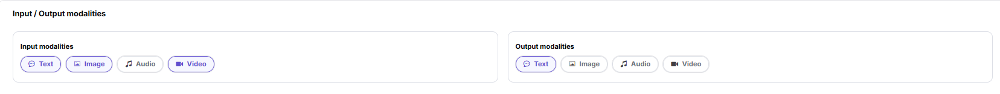

# Meta-models

:::: info Document Information
Version: v1.0
Updated: 2026-07-08
::::

## Feature Overview

`Meta-models` is used to maintain or view model capabilities, protocols, modalities, Token limits, default parameters, and capability tags. It supports model publishing, experimentation, calling, statistics, and operational governance.

| Item | Content |
| --- | --- |
| Applicable role | Operator |
| Navigation path | System Settings > Meta-models |
| Page route | /operator/settings/meta-models |
| Managed objects | Model capabilities, protocols, modalities, Token limits, default parameters, and capability tags |
| Typical use | Maintain model capability abstractions and protocol definitions |

### Beginner Explanation

A meta-model is like a capability specification for a model. It defines which inputs and outputs the model supports, which protocol it uses, how many Tokens it can process, and which default parameters are used for Playground and calls. It is not a concrete provider instance; it is a foundational definition referenced by model publishing and template configuration.

### Terms Quick Reference

| Term | Description |
| --- | --- |
| Meta-model | Abstract definition that describes model capabilities and call protocols. |
| Input/output modalities | Text, image, audio, or video input/output types supported by the model. |
| Token limits | Limits for model context, input length, and output length. |
| Official native protocol | Compatible protocol definition such as OpenAI or Anthropic. |

## Prerequisites

1. The current account has meta-model configuration permission.
2. Model type, input/output modalities, context length, Token limits, and default parameters have been confirmed.
3. Compatible protocols, Endpoint paths, and request/response formats have been confirmed by the technical owner.
4. Before adding or changing a meta-model, the impact on model publishing templates and published models has been evaluated.
## Page Description

This page maintains model capability abstractions, including input/output modalities, protocols, Token limits, capability tags, and default parameters. A meta-model is not a concrete provider instance. It is more like a capability specification referenced during model publishing.

Page screenshot:

Used to view meta-model status, modalities, protocols, and operation entry points.

## Main Operations

### Steps

1. Go to `System Settings > Meta-models`.
2. Add or edit meta-model basic information.
3. Select input modalities and output modalities.
4. Configure compatible protocols such as OpenAI and Anthropic and their Endpoint paths.
5. Maintain context, maximum input, maximum output, and default parameters, then save.

Key screenshots:

Basic information determines the display name and capability category during model publishing.

Modality configuration affects model marketplace filters and Playground entries.

Token limits should match the real model capability.

### Parameters

| Field Name | Required | Field Type | Example | Description |
| --- | --- | --- | --- | --- |
| Meta-model Name | Yes | Text | `Qwen Text` | Model capability abstraction name. |
| Input/output Modalities | Yes | Multi-select | `Text -> Text` | Declares the data types supported by the model. |
| Protocol | Yes | Multi-select | `openai/chat_completions` | Compatible call protocols for the model. |
| Token Limits | Yes | Number | `128000` | Context, input, or output Token upper limit. |
| Default Parameters | No | JSON | `{"temperature":0.7}` | Default parameters for protocol calls. |

### Pitfalls

- Setting Token limits higher than the real model capability causes call failures.
- Protocol Endpoint paths should be paths or placeholder examples. Do not write real internal addresses.
- Incorrect input/output modality configuration affects model marketplace filtering.

### Result Checks

1. The new meta-model is visible in the list.
2. The meta-model can be selected when publishing models or configuring templates.
3. Protocols, modalities, and Token limits match the actual model capability.
4. Default parameters take effect as expected in Playground or call tests.
## FAQ

### Cannot Select the Meta-model When Publishing a Model

**Symptom:**

After a model provider enters the publishing flow, the target item is missing from the meta-model dropdown.

**Possible Causes:**

- The meta-model is not enabled.
- Model type or modality does not match the publishing method.
- The current role or tenant does not have permission to use this meta-model.

**Handling:**

1. Confirm that the meta-model status is enabled.
2. Check model type, input/output modalities, and publishing method.
3. Check role, tenant, and visibility scope configuration.

### Call Reports Token Limit Exceeded

**Symptom:**

Model Playground or API calls return context length, input length, or output length limit errors.

**Possible Causes:**

- The meta-model Token limit is smaller than the actual request.
- Default Max Tokens is set too high.
- The caller passed an excessively long context.

**Handling:**

1. Check the meta-model context, input, and output limits.
2. Adjust default parameters or call parameters.
3. Shorten the Prompt or conversation context and retry.
## Next Steps

1. Select this meta-model in the model template or publishing flow and confirm that protocol, modalities, and Token limits are referenced correctly.
2. Use a representative model for one publishing validation and check whether input/output formats match.
3. When protocol, context length, or default parameters change, notify template maintainers and model providers.

## Notes

- Meta-model changes affect model publishing, template selection, and marketplace filtering. Confirm dependency scope before release.
- Token limits, protocol paths, and default parameters must match real model capability.
- Before adjusting input/output modalities, check whether published models can still be filtered and called correctly.
