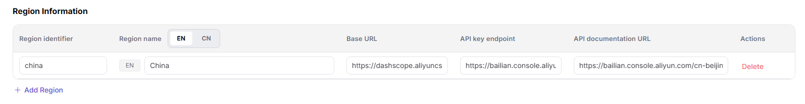

# Model Source

## Preface

| Item            | Content                                                                                                                                                                                                              |
| --------------- | -------------------------------------------------------------------------------------------------------------------------------------------------------------------------------------------------------------------- |
| Target Audience | Operator                                                                                                                                                                                                             |
| Navigation Path | Settings > Model Source                                                                                                                                                                                              |
| Overview        | Manage model service source channels and regional node configurations, defining API call addresses, key addresses, and authentication information, providing foundational data support for model publishing, template creation, and other processes |

## Page Structure

### Search Area

The page top supports multi-dimensional filtering by model source name, identifier, and region.

### Action Buttons

- The page top-right provides the **"Add"** button for adding new model sources.
- Each model source card provides a **"..." (More)** button, including **"Edit"**, **"Details"**, and **"Delete"** operations.

### Data List

The page displays all model sources in card format, with each card showing multilingual name, identifier, region count, Base URL, and the number of associated meta-models.

## Operations

### Adding a Model Source

1. Enter the platform homepage, click the **"Settings > Model Source"** menu in the left navigation bar to enter the model source management page.
2. Click the **"Add"** button at the top right of the page to enter the "Add Model Source" configuration page.

- **Basic Information**:
   - **"Name"** (marked "Multilingual"): Used to set the model source name displayed in lists, details, and selection controls. Click the **"English"** / **"Chinese"** tabs to switch language tabs, with the prompt **"Currently editing English name. Switch language to maintain another language version"**. Fill in the names for the English and Simplified Chinese environments in the corresponding tabs (e.g., English: `Alibaba` / Chinese: `阿里巴巴`);
   - Fill in the **"Model Source Identifier"** (e.g., `alibaba-china`), used to uniquely identify this model source.

- **Region Information**:
   - **"Region Identifier"** (e.g., `china`);
   - **"Region Name"** (multilingual, marked with "English / Chinese" dual tabs): e.g., English: `China` / Chinese: `中国`;
   - **"Base URL"** (e.g., `https://dashscope.aliyuncs.com`);
   - **"API Key Address"** (e.g., `https://bailian.console.aliyun.com`);
   - **"API Documentation Address"** (e.g., `https://bailian.console.aliyun.com/cn-bei`);
   - Click the **"Delete"** button at the end of a row to remove that region; click **"+ Add Region"** to add more regional nodes.

- **Request Header Configuration**: The default authentication field is `Authorization: Bearer <key>`. Click **"+ Add Request Header"** to add custom request headers (authentication field name + authentication value).

- After confirming all information is correct, click the **"Confirm"** button to complete the addition; to discard, click **"Cancel"**.

#### Parameters

| Term | Type | Example | Description |
|------|------|---------|-------------|
| Name | Multilingual Text | `Alibaba / 阿里巴巴` | Required. Configure display names under the "English" and "Chinese" tabs respectively |
| Model Source Identifier | Text | `alibaba-china` | Required. The unique identifier of the model source |
| Region Identifier | Text | `china` | Required. The unique identifier of the regional node |
| Region Name | Multilingual Text | `China / 中国` | Required. The multilingual name of the regional node (English / Chinese dual tabs) |
| Base URL | URL | `https://dashscope.aliyuncs.com` | Required. The base API address of the model service |
| API Key Address | URL | `https://bailian.console.aliyun.com` | Optional. The official address for obtaining API keys |
| API Documentation Address | URL | `https://bailian.console.aliyun.com/cn-bei` | Optional. The API documentation address of the model service |
| Request Header - Authentication Field Name | Text | `Authorization` | Optional. The authentication field key name in the request header |
| Request Header - Authentication Value | Text | `Bearer <key>` | Optional. The authentication value in the request header, supporting template variables |

## Other Operations

| Operation | Steps |
|-----------|-------|
| Edit Model Source | Click the target model source card's **"..." (More)** button → Select **"Edit"** → Modify name, region, request header, etc. → Click **"Confirm"** |
| View Model Source Details | Click the target model source card's **"..." (More)** button → Select **"Details"** → View complete configuration information |
| Delete Model Source | Click the target model source card's **"..." (More)** button → Select **"Delete"** → Confirm operation (**This action is irreversible. Please operate with caution.**) |
| Filter and Search | Enter model source name, identifier, or region → Click the **"Search"** button to quickly locate the target source |

## Notes

- **Deletion operations are irreversible.** Please operate with caution.
- Before deleting a model source, all associations with meta-models and templates must be removed first.
- When configuring regions and request headers, ensure the Base URL and authentication information are accurate to avoid call failures.
- Multilingual fields must maintain both English and Chinese versions simultaneously. Switch language tabs to maintain the other language version.
