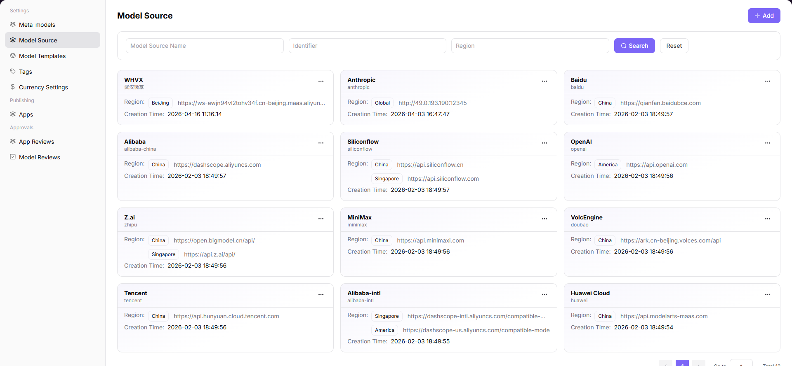

# Model Source

## Preface

| Item | Content |
|------|---------|
| Target Audience | Operator |
| Navigation Path | Settings > Model Source |
| Overview | Manage model service source channels and regional node configurations, defining API call addresses and authentication information |

## Page Structure

### Search Area

The page top provides search functionality, supporting quick location of target sources by model source name, identifier, or region.

### Action Buttons

* The page top-right provides the **"Add"** button for adding new model sources
* Each model source card provides a **"..." (More)** button, including Edit, Details, and Delete operations

### Data List

The page displays all model sources in card format, with each card containing name, identifier, and region count information.

### Page Screenshot

## Operations

### Adding a Model Source

1. Enter the platform homepage, click the **"Settings > Model Source"** menu in the left navigation bar to enter the model source management page.
2. Click the **"Add"** button at the top right of the page to enter the "Add Model Source" configuration page.
3. Configure basic model source information:
   - Fill in the **Multilingual Name** (configure names for English and Simplified Chinese environments respectively);
   - Fill in the **Model Source Identifier** (e.g., `alibaba-china`).
4. Configure region information:
   - Add region: fill in **Region Identifier**, **Region Name (Multilingual)**, **BASE URL**, **API Key Address**, **API Documentation Address**;
   - Multiple regional nodes can be added via the "Add Region" button.
5. Configure request header information:
   - Add request header: fill in **Authentication Field Name** (e.g., `Authorization`) and **Authentication Value** (e.g., `Bearer <key>`);
   - Multiple request header configurations can be added via the "Add Request Header" button.
6. After confirming all information is correct, click the **"Confirm"** button to complete the addition.

#### Parameters

| Term                                       | Type              | Example                                    | Description                                                                             |
| ------------------------------------------ | ----------------- | ------------------------------------------ | --------------------------------------------------------------------------------------- |
| Name (Multilingual)                        | Multilingual Text | `Alibaba / 阿里巴巴`                           | Required. The multilingual display name of the model source                             |
| Model Source Identifier                    | Text              | `alibaba-china`                            | Required. The unique identifier of the model source                                     |
| Region Identifier                          | Text              | `china`                                    | Required. The unique identifier of the regional node                                    |
| Region Name (Multilingual)                 | Multilingual Text | `China / 中国`                               | Required. The multilingual name of the regional node                                    |
| BASE URL                                   | Text              | `https://dashscope.aliyuncs.com`           | Required. The base API address of the model service                                     |
| API Key Address                            | Text              | `https://bailian.console.aliyun.com`       | Optional. The official address for obtaining API keys                                   |
| API Documentation Address                  | Text              | `https://bailian.console.aliyun.com/cn-i/` | Optional. The API documentation address of the model service                            |
| Request Header - Authentication Field Name | Text              | `Authorization`                            | Required. The authentication field key name in the request header                       |
| Request Header - Authentication Value      | Text              | `Bearer <key>`                             | Required. The authentication value in the request header, supporting template variables |

## Other Operations

| Operation | Steps |
|-----------|-------|
| Edit Model Source | Click the target model source card's **"..." (More)** button → Select **"Edit"** → Modify configuration information → Click **"Confirm"** |
| View Details | Click the target model source card's **"..." (More)** button → Select **"Details"** → View complete configuration information |
| Delete Model Source | Click the target model source card's **"..." (More)** button → Select **"Delete"** → Confirm operation (**This action is irreversible. Please operate with caution.**) |
| Filter and Search | Enter model source name, identifier, or region → Click "Search" to quickly locate the target source |

## Notes

* **Deletion operations are irreversible.** Please operate with caution. Deleted data cannot be recovered.
* When adding regions and request headers, ensure the BASE URL and authentication information are accurate to avoid call failures.
* The filter and search functions support multi-condition combinations, which can improve positioning efficiency.
