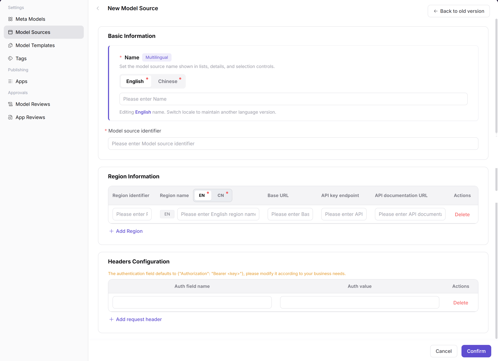

# Model Sources

::: info Document Information
Version: v1.0
Updated: 2026-07-08
:::

## Feature Overview

Model Sources helps operators maintain upstream source channels, regions, Base URLs, request headers, authentication information, and connectivity status for model access.

| Item | Content |
| --- | --- |
| Applicable role | Operator |
| Navigation path | Model Services > Settings > Model Sources |
| Page route | `/modelone/settings/vendor` |
| Managed objects | Source channels, regions, Base URLs, request headers, authentication information, and connectivity status |
| Typical use | Maintain upstream model service sources |

#### Beginner Explanation

Model sources are like an address book for upstream model services. If a source is configured incorrectly, later model templates and published models will fail to call it.

#### Terms Quick Reference

| Term | Description |
| --- | --- |
| Source channel | Vendor, organization, or access channel that owns the model service. |
| Base URL | Base address of the upstream model service. |
| Request header | Authentication or custom Header attached when calling the upstream service. |
| Connectivity | Result of the platform test for upstream service reachability. |

## Prerequisites

1. The current account has model source maintenance permission.
2. Endpoint, Base URL, region, authentication method, and request header fields are prepared.
3. Network connectivity and certificate policy for the upstream model service have been confirmed.
4. Credentials used for connectivity tests have been entered through a secure method.

## Page Description

This page maintains upstream model sources, including Endpoint, region, request header authentication, source channel, and connectivity. If the model source is configured incorrectly, subsequent model publishing and calls will fail.

Page screenshot:

Used to view source status, region, and connectivity.

## Main Operations

### Add Model Source

1. Go to `Model Services > Settings > Model Sources`.
2. Click `Add` to open the `New Model Source` page.
3. In `Basic Information`, maintain the `English` and `Chinese` display names for `Name`.
4. Fill in `Model source identifier` to distinguish the model source.
5. In `Region Information`, maintain `Region identifier`, `Region name`, `Base URL`, `API key endpoint`, and `API documentation URL`. To add more regions, click `Add Region`.
6. In `Headers Configuration`, maintain `Auth field name` and `Auth value`. To add more headers, click `Add request header`.
7. Before clicking `Confirm`, verify the field values. For page validation only, click `Cancel` to close the page.

## Parameter Reference

| Field Name | Required | Field Type | Example | Description |
| --- | --- | --- | --- | --- |
| Name | Yes | Multilingual text | `DashScope` | Model source name displayed in lists, details, and selectors. |
| Model source identifier | Yes | Text | `dashscope-cn` | Unique identifier of the model source. |
| Region identifier | Yes | Text | `cn-shanghai` | Identifier of the region where the source service is located. |
| Region name | Yes | Multilingual text | `East China 1` | Display name of the region where the source service is located. |
| Base URL | Yes | URL | `https://api.example.com/v1` | Upstream service base address. Use a placeholder in examples. |
| API key endpoint | No | URL | `https://example.com/keys` | URL for obtaining or managing upstream API Keys. |
| API documentation URL | No | URL | `https://example.com/docs` | Upstream service API documentation URL. |
| Auth field name | Conditionally required | Text | `Authorization` | Authentication field name in the request header. |
| Auth value | Conditionally required | Text | `Bearer <key>` | Authentication value in the request header. Do not write real keys. |
| Connectivity Status | System-generated | Enum | `Passed` | Tests whether the upstream service is reachable. |

## Pitfalls

- Do not misspell the protocol prefix or path in Endpoint.
- Request header authentication values should use secure inputs and should not be written in remarks.
- After connectivity passes, still test the protocol with a concrete model.

## Result Validation

| Check Item | Success Criteria | Troubleshooting |
| --- | --- | --- |
| The model source shows connected or available status in the list | The model source shows connected or available status in the list. | Return to the page and check permissions, filters, and configuration status. |
| The source can be selected in template and model publishing flows | The source can be selected in template and model publishing flows. | Return to the page and check permissions, filters, and configuration status. |
| Request headers, region, and Base URL match upstream service requirements | Request headers, region, and Base URL match upstream service requirements. | Return to the page and check permissions, filters, and configuration status. |
| Connectivity testing failures show clear error messages | When connectivity testing fails, a clear error message is visible. | Return to the page and check permissions, filters, and configuration status. |

## FAQ

#### Model Source Connectivity Test Fails

**Symptom:**

After saving the source, the connection test returns timeout, 401, 403, or 5xx.

**Possible Causes:**

- Endpoint, path, or region is incorrect.
- Request header authentication value is invalid or lacks permission.
- Network, proxy, certificate, or firewall access is unavailable.

**Handling:**

1. Check Endpoint, region, and path.
2. Update authentication request headers or credential references.
3. Contact the network or upstream service administrator to check connectivity.

#### Template Cannot Reference the Model Source

**Symptom:**

The source has been created, but it cannot be selected in the model template or publishing flow.

**Possible Causes:**

- The source is not enabled.
- Source provider or region does not match the template.
- Source synchronization status is abnormal.

**Handling:**

1. Confirm source status and provider.
2. Check template applicability scope.
3. Refresh synchronization and select again.
#### Calls Still Fail Even Though the Source Connectivity Is Normal

**Symptom:**

The model source connectivity test passes, but calls fail in Model Marketplace or Playground.

**Possible Causes:**

The connectivity test only validates basic networking. Actual call parameters, model source ID, request headers, rate limits, or billing configuration may still be incomplete.

**Handling:**

Compare the actual call request and check Base URL, model source ID, request headers, and protocol. Then view call logs for error codes and upstream return summaries.

## Next Steps

1. Run the connectivity test immediately and confirm that Endpoint, authentication request headers, and return format are usable.
2. Select this source in related models or templates and validate whether the call chain works.
3. Periodically check source health, rate-limit policy, and credential validity.

## Notes

- Model sources involve Endpoints, request headers, and authentication information. All examples must use placeholders.
- Passing connectivity testing does not guarantee long-term availability. Review provider rate limits, allowlists, and health status as well.
- After changing authentication method or request headers, validate Playground and API calls for associated models.
