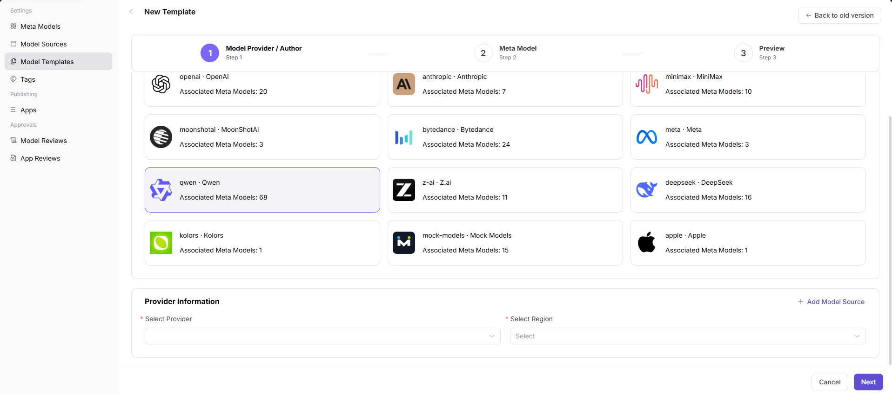
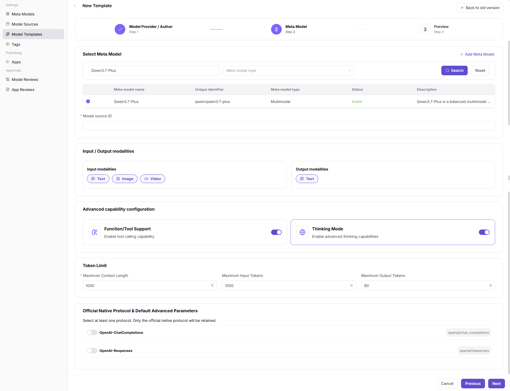
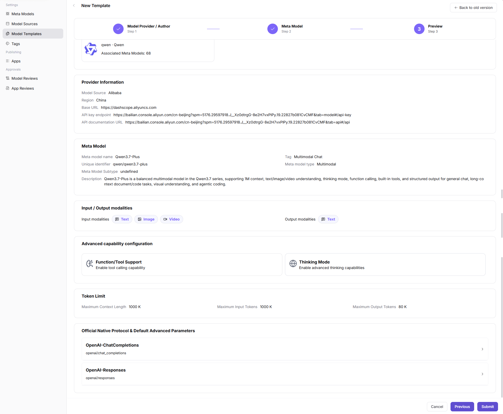

# Model Templates

::: info Document Information
Version: v1.0
Updated: 2026-07-08
:::

## Feature Overview

Model Templates helps operators maintain reusable publishing templates that connect vendors, model sources, protocols, default parameters, request headers, and publishing forms.

| Item | Content |
| --- | --- |
| Applicable role | Operator |
| Navigation path | Model Services > Settings > Model Templates |
| Page route | `/modelone/settings/provider-template` |
| Managed objects | Vendor templates, source previews, protocols, default parameters, and publishing forms |
| Typical use | Provide reusable templates for model publishing |

#### Beginner Explanation

A model template is like a preset for the model publishing form. After a template is configured, model providers can fill fewer repeated fields, but the Endpoint, request headers, and default parameters in the template must be secure and controlled.

#### Terms Quick Reference

| Term | Description |
| --- | --- |
| Template | Reusable model publishing configuration set. |
| Vendor configuration preview | Displays Base URL, documentation URL, and request header examples. |
| Default advanced parameters | Preset parameters such as temperature and max Token used when publishing a model. |
| Protocol mapping | Mapping between the template and model call protocols. |

## Prerequisites

1. The current account has model template maintenance permission.
2. Selectable providers, authors, meta-models, and model sources have been maintained.
3. Default parameters, request header previews, and publishing form fields have been confirmed.
4. Before enabling the template, the publishing flow has been validated with a sample model.

## Page Description

This page maintains model publishing templates. A template combines provider, meta-model, default parameters, protocol, and source preview to help model providers reduce repeated input.

Page screenshot:

Used to view template status, provider, and associated configuration.

## Main Operations

### Add Template

1. Go to `Model Services > Settings > Model Templates`.
2. Click `Add` to open the `New Template` page.
3. In the `Model Provider / Author` step, select a model author card.
4. In `Provider Information`, select `Select Provider` and `Select Region`. To maintain a new source configuration, click `Add Model Source`.
5. Before clicking `Next`, verify the provider and region information.

6. In the `Meta Model` step, filter and select the target meta model, then fill in `Model source ID`.
7. Check `Input / Output modalities`, `Advanced capability configuration`, `Token Limit`, and `Official Native Protocol & Default Advanced Parameters`.
8. Before clicking `Next`, verify the meta model and protocol parameters.

9. In the `Preview` step, check `Provider Information`, `Meta Model`, `Input / Output modalities`, `Advanced capability configuration`, `Token Limit`, and protocol parameters.
10. Before clicking the final `Submit`, verify the configuration. For page validation only, click `Cancel` or go back to close the page.

## Parameter Reference

| Field Name | Required | Field Type | Example | Description |
| --- | --- | --- | --- | --- |
| Model Author | Yes | Card selection | `Qwen` | Model author associated with the template. |
| Select Provider | Yes | Dropdown | `Alibaba` | Model source or provider corresponding to the template. |
| Select Region | Yes | Dropdown | `China` | Region where the model source is located. |
| Meta model name | Yes | Filter / radio selection | `Qwen3.7-Plus` | Meta model associated with the template by default. |
| Model source ID | Yes | Text | `qwen/qwen3.7-plus` | Model identifier in the upstream model source. |
| Input / Output modalities | System-filled | Tag | `Text` / `Image` / `Video` | Supported input and output modalities from the selected meta model. |
| Function/Tool Support | System-filled | Toggle / read-only information | `Enabled` | Tool calling capability of the selected meta model. |
| Thinking Mode | System-filled | Toggle / read-only information | `Enabled` | Advanced thinking or reasoning capability of the selected meta model. |
| Token Limit | System-filled | Number | `1000 K` | Context, input, and output Token limits of the selected meta model. |
| Official Native Protocol & Default Advanced Parameters | System-filled | Protocol configuration | `OpenAI-ChatCompletions` | Protocols and default advanced parameters supported by the selected meta model. |

## Pitfalls

- Template default parameters affect all models that reference the template.
- Provider and meta-model capability mismatches cause call failures after publishing.
- Request header previews can contain placeholders only.

## Result Validation

| Check Item | Success Signal | If Abnormal |
| --- | --- | --- |
| The template can be selected in the model publishing flow | The template can be selected in the model publishing flow. | Return to the page and check permissions, filters, and configuration status. |
| Provider, meta-model, source preview, and default parameters are carried into the publishing form correctly | Provider, meta-model, source preview, and default parameters are carried into the publishing form correctly. | Return to the page and check permissions, filters, and configuration status. |
| Protocols, modalities, and Token limits are consistent with the associated meta-model | Protocols, modalities, and Token limits are consistent with the associated meta-model. | Return to the page and check permissions, filters, and configuration status. |
| Disabled templates no longer appear in new publishing flows | After the template is disabled, it no longer appears in new publishing flows. | Return to the page and check permissions, filters, and configuration status. |

## FAQ

#### Target Template Is Missing from Publishing Flow

**Symptom:**

The model provider cannot see the expected template when creating a model.

**Possible Causes:**

- The template is not enabled.
- The meta-model or source associated with the template is unavailable.
- The template's applicable provider does not match the current selection.

**Handling:**

1. Confirm template status.
2. Check associated meta-model, source, and provider.
3. Re-enter the publishing flow and verify the dropdown.

#### Parameters Carried by the Template Are Incorrect

**Symptom:**

Parameters, request headers, or modalities auto-filled in the publishing form do not match expectations.

**Possible Causes:**

- Template default parameters were not updated.
- Meta-model limits changed but the template was not synchronized.
- Source preview still points to old configuration.

**Handling:**

1. Update template default parameters and request header preview.
2. Check meta-model limits.
3. After saving, run through the publishing flow with a test model.
#### Template Is Selectable but Publishing Form Fields Are Missing

**Symptom:**

The template can be selected when publishing a model, but the form does not bring in the expected fields or default parameters.

**Possible Causes:**

The template is not associated with the correct source, meta-model, or protocol; default parameter configuration is incomplete; or the template version has not refreshed.

**Handling:**

Return to the template page and check source preview, protocol, and default parameters. After saving, re-enter the publishing flow and verify whether fields are brought in.

## Next Steps

1. Use the template to create or update a test model and confirm that default parameters, pricing, and visibility scope take effect.
2. Go to model details or Playground and validate the call examples and parameter descriptions generated by the template.
3. After template changes, notify affected providers to avoid using old rules in the publishing flow.

## Notes

- Template default parameters affect the model marketplace and Playground user experience. Confirm the rules before release.
- The meta-model, source, pricing, and visibility scope associated with the template should stay consistent.
- After adjusting a template, sample-check model details, quick-start examples, and call logs to confirm they are displayed according to the new template.
