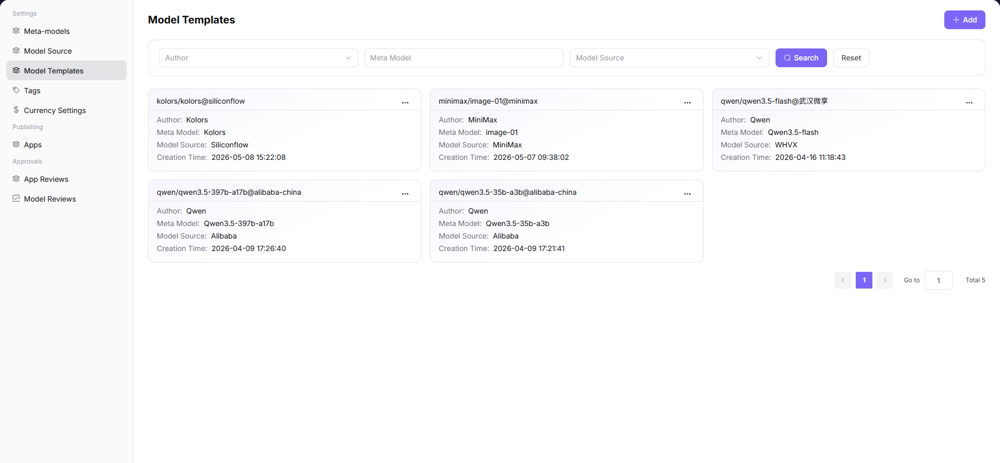

# Model Templates

## Preface

| Item | Content |
|------|---------|
| Target Audience | Operator |
| Navigation Path | Settings > Model Templates |
| Overview | Create and manage model templates to quickly generate instance configurations based on specific meta-models |

## Page Structure

### Search Area

The page top provides search and filter functionality, supporting quick location of target templates by keywords, model author, or model source.

### Action Buttons

* The page top-right provides the **"Add"** button for creating new templates
* Each template card provides a **"..." (More)** button, including Edit, Details, and Delete operations
* The page top-right provides **"Export"** / **"Import"** buttons for batch configuration management

### Data List

The page displays all templates in list format, with each template containing author, model source, meta-model, and other information.

### Page Screenshot

## Operations

### Adding a Template

1. Enter the platform homepage, click the **"Settings > Model Templates"** menu in the left navigation bar to enter the template management page.
2. Click the **"Add"** button at the top right of the page to enter the template creation process.
3. Select basic association information:
   - Select **Model Author**;
   - Select **Model Source** and the corresponding region;
   - Click **"Next"**.
4. Configure meta-model basic information:
   - Select **Meta-model**;
   - Fill in **Model Source ID**;
   - Configure **Input / Output Modalities**;
   - Enable or disable **Advanced Capabilities**;
   - Set **Token Limits** related parameters;
   - Select adapted **Official Native Protocol**;
   - Click **"Next"**.
5. Verify the overall template configuration information, confirm author, model source, meta-model, and capability parameters are correct, then click **"Submit"** to complete the template addition.

#### Parameters - Basic Association Information

| Term | Type | Example | Description |
|------|------|---------|-------------|
| Model Author | Dropdown | `Qwen` | Required. The author to which the template belongs |
| Model Source | Dropdown | `Alibaba-China` | Required. The source channel for model calls |
| Region | Dropdown | `China` | Required. The available region corresponding to the model source |

#### Parameters - Meta-model Configuration Information

| Term | Type | Example | Description |
|------|------|---------|-------------|
| Meta-model | Dropdown | `Qwen3.5-397b-a17b` | Required. The meta-model to generate the template from |
| Model Source ID | Text | `qwen3.5-397b-a17b` | Required. The unique identifier of the model on the corresponding source platform |
| Input / Output Modalities | Multi-select | `Text, Image` | Required. Configure the interaction data types supported by the template |
| Advanced Capabilities | Toggle | `Function Calling, Thinking Mode` | Optional. Enable model extended advanced capabilities |
| Token Limits | Number | `Max Context 256K` | Required. Set context, input, and output length limits |
| Official Native Protocol | Multi-select | `OpenAI-ChatCompletions` | Required. The interface protocol type adapted by the template |

## Other Operations

| Operation | Steps |
|-----------|-------|
| Edit Template | Click the target template's **"..." (More)** button at the top right → Select **"Edit"** → Modify association information and meta-model configuration → Click **"Submit"** |
| View Template Details | Click the target template's **"..." (More)** button at the top right → Select **"Details"** → View complete template configuration information → Click the back arrow at the top left to exit |
| Delete Template | Click the target template's **"..." (More)** button at the top right → Select **"Delete"** → **This action is irreversible. Please operate with caution.** |
| Filter and Search | Enter keywords, select model author or model source at the top of the page → Click the **"Search"** button → Quickly locate the target template |
| Export / Import Configuration | Click the **"Export"** / **"Import"** buttons at the top right of the page → Batch management of template configuration |

## Notes

* **Deletion operations are irreversible.** Please operate with caution.
* When editing a template, modified configurations will affect new instances created based on that template.
* Before exporting / importing configurations, ensure the file format is correct to avoid overwriting existing data.
