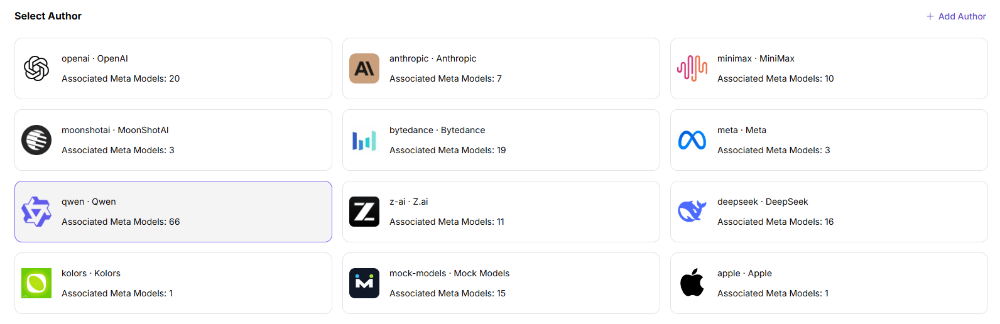
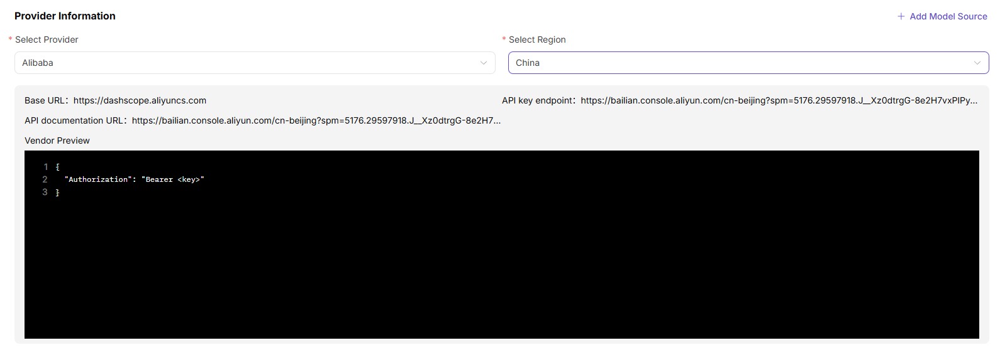
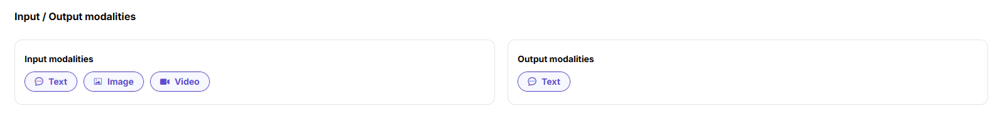
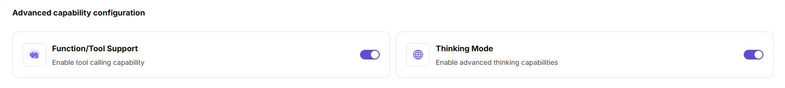
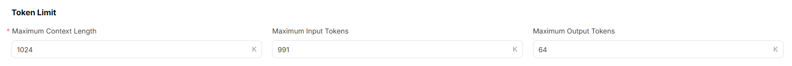

# Model Templates

## Preface

| Item            | Content                                                                                                                                                              |
| --------------- | -------------------------------------------------------------------------------------------------------------------------------------------------------------------- |
| Target Audience | Operator                                                                                                                                                             |
| Navigation Path | Settings > Model Templates                                                                                                                                           |
| Overview        | Based on configured model authors, model sources, and meta-models, pre-generate standard template configurations as a quick-reuse foundation for the model publishing process |

## Page Structure

### Search Area

The page top provides filter conditions such as keyword, model author, and model source, which can be combined to quickly locate target templates.

### Action Buttons

- The page top-right provides the **"Add"** button for creating new templates.
- The page top provides **"Export"** / **"Import"** buttons for batch management of template configurations.
- Each template card provides a **"..." (More)** button, including **"Edit"**, **"Details"**, and **"Delete"** operations.

### Data List

The page displays all templates in card format, with each template showing template name, associated meta-model, associated model source, associated region, and other key information.

## Operations

### Adding a Template

1. Enter the platform homepage, click the **"Settings > Model Templates"** menu in the left navigation bar to enter the template management page.
2. Click the **"Add"** button at the top right of the page to enter the template creation process.

#### **Step 1: Model Provider / Author**:

- **"Select Author"**: Select the target author from the author card list (cards contain identifier, display name, and associated meta-model count). Click **"+ Add Author"** to create a new author.

- **"Provider Information"**:
   - Select **"Provider"** (Required);
   - Select **"Region"** (Required);
   - The page displays **"Current Vendor Configuration Preview"**: includes Base URL, API Key Address, API Documentation Address, and request header configuration code snippet (e.g., `{ "Authorization": "Bearer <key>" }`);
   - Click **"+ Add Model Source"** to create a new model source.

- Click **"Next"**.

#### **Step 2: Meta-model**:

- **"Select Meta-model"**: Use the search bar (meta-model name / unique identifier + meta-model type dropdown) in the meta-model list to filter and single-select the target meta-model (list headers include meta-model name, unique identifier, meta-model type, status, description). Click **"+ Add Meta-model"** to create a new meta-model.
- Fill in the **"Model Source ID"** (Required, e.g., `qwen3.6-plus`).

- **Input / Output Modalities**: Select **"Input Modalities"** (multi-select: Text / Image / Video) and **"Output Modalities"** (multi-select) respectively.

- **Advanced Capability Configuration**: Enable the **"Function / Tool Support"** and **"Thinking Mode"** capability toggles.

- **Token Limit**: Set **"Max Context"**, **"Max Input"**, and **"Max Output"**.

- **Official Native Protocol and Default Advanced Parameters**: At least one protocol (OpenAI-ChatCompletions / OpenAI-Responses / Anthropic-Messages) must be selected. Fill in the Endpoint and configure the input parameters.

- Click **"Next"**.

#### **Step 3: Preview**:

- Verify the overall template configuration information (selected author, provider information, meta-model, input / output modalities, advanced capability configuration, token limit, official native protocol and default advanced parameters). Click **"Submit"** to complete the template addition; to modify, click **"Previous"** to return to the corresponding step.

#### Parameters - Basic Association Information (Step 1)

| Term | Type | Example | Description |
|------|------|---------|-------------|
| Model Author | Card Selection | `qwen / Qwen` | Required. The model author to which the template belongs (with associated meta-model count) |
| Provider | Dropdown | `Alibaba-China` | Required. The source channel for model calls |
| Region | Dropdown | `China` | Required. The available region corresponding to the model source |
| Vendor Config Preview - Base URL | URL | `https://dashscope.aliyuncs.com` | Optional. The base API address of the model service (display only) |
| Vendor Config Preview - API Key Address | URL | `https://bailian.console.aliyun.com/...` | Optional. The official address for obtaining API keys (display only) |
| Vendor Config Preview - API Documentation Address | URL | `https://bailian.console.aliyun.com/...` | Optional. The API documentation address of the model service (display only) |
| Vendor Config Preview - Request Header | JSON | `{ "Authorization": "Bearer <key>" }` | Optional. The request header configuration code snippet (display only) |

#### Parameters - Meta-model Configuration Information (Step 2)

| Term | Type | Example | Description |
|------|------|---------|-------------|
| Meta-model | Radio | `Qwen3.6-plus` (unique identifier `qwen/qwen3.6-plus`) | Required. The meta-model from which to generate the template |
| Model Source ID | Text | `qwen3.6-plus` | Required. The unique identifier of the model on the corresponding source platform |
| Input Modalities | Multi-select | `Text / Image / Video` | Required. The input data types supported by the template |
| Output Modalities | Multi-select | `Text` | Required. The output data types supported by the template |
| Advanced Capability - Function / Tool Support | Toggle | `On / Off` | Optional. When enabled, supports tool calling |
| Advanced Capability - Thinking Mode | Toggle | `On / Off` | Optional. When enabled, supports deep thinking and reasoning |
| Max Context | Number | `1024K` | Required. Token context length upper limit |
| Max Input | Number | `991K` | Required. Single input Token upper limit |
| Max Output | Number | `64K` | Required. Single output Token upper limit |
| Official Native Protocol - OpenAI-ChatCompletions | Toggle + Protocol Code | `openai/chat_completions` | Required. The interface protocol type adapted by the template |
| Official Native Protocol - OpenAI-Responses | Toggle + Protocol Code | `openai/responses` | Required. The interface protocol type adapted by the template |
| Official Native Protocol - Anthropic-Messages | Toggle + Protocol Code | `anthropic/messages` | Required. The interface protocol type adapted by the template |
| Endpoint | URL | `/compatible-mode/v1/chat/completions` | Required. The endpoint path corresponding to the protocol |
| Input Parameters | Parameter List | `Temperature / Top-P / N / Stream / Max Tokens / Presence Penalty / Frequency Penalty / User / Seed / Parallel Tool Calls` | Optional. Preset input parameters by protocol (Required toggle available) |

## Other Operations

| Operation | Steps |
|-----------|-------|
| Edit Template | Click the target template's **"..." (More)** button at the top right → Select **"Edit"** → Modify Step 1 association information or Step 2 meta-model configuration → Click **"Submit"** |
| View Template Details | Click the target template's **"..." (More)** button at the top right → Select **"Details"** → View complete template configuration information → Click the back arrow at the top left to exit |
| Delete Template | Click the target template's **"..." (More)** button at the top right → Select **"Delete"** → **This action is irreversible. Please operate with caution.** |
| Filter and Search | Enter keywords, select model author or model source at the top of the page → Click the **"Search"** button → Quickly locate the target template |
| Export / Import Configuration | Click the **"Export"** / **"Import"** buttons at the top right of the page → Batch management of template configurations |

## Notes

- **Deletion operations are irreversible.** Please operate with caution.
- Templates are pre-generated based on model authors, model sources, and meta-models. Before modifying a template configuration, confirm that it will not affect published models.
- Multilingual fields must maintain both English and Chinese versions simultaneously. Switch language tabs to maintain the other language version.
- Before adding a template, ensure that the model author, model source, and meta-model have all been configured.
