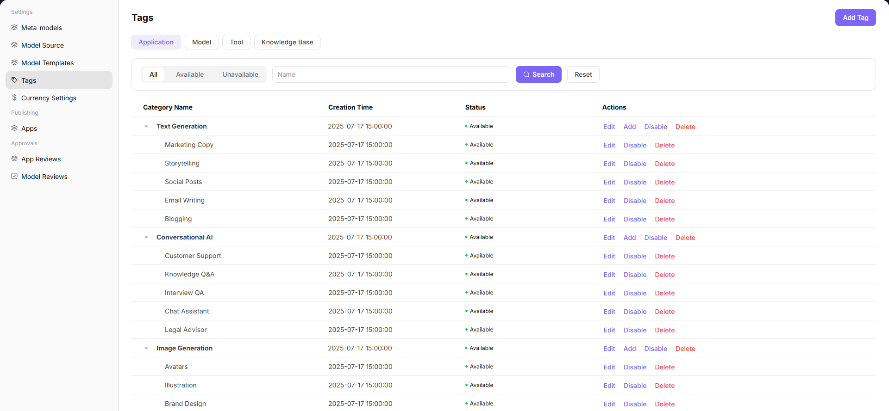

# Tags

## Preface

| Item            | Content                                                                                              |
| --------------- | ---------------------------------------------------------------------------------------------------- |
| Target Audience | Operator                                                                                             |
| Navigation Path | Settings > Tags                                                                                      |
| Overview        | Define and manage the classification tag system for applications, models, tools, and knowledge bases |

## Page Structure

### Search Area

The page top provides filter functionality, supporting filtering by tag type (Application / Model / Tool / Knowledge Base) and status (All / Available / Unavailable), or directly searching by name.

### Action Buttons

* The page top-right provides the **"Add Tag"** button for creating new tags
* Each tag provides **"Edit"**, **"Add"** (sub-tag), **"Enable" / "Disable"**, **"Delete"** operation buttons

### Data List

The page displays the tag list in tree structure, supporting hierarchical display of level-1 tags and sub-tags.

### Page Screenshot

## Operations

### Adding a Tag

1. Enter the platform homepage, click the **"Settings > Tags"** menu in the left navigation bar to enter the tag management page.
2. Click the **"Add Tag"** button at the top right of the page to pop up the "Add Tag" window:
3. Fill in the **Code** (e.g., `text_generation`);
4. Configure **Multilingual Name** (fill in names for English and Simplified Chinese environments respectively);
5. Configure **Multilingual Remarks**;
6. Click **"Confirm"** to complete the addition.

#### Parameters

| Term | Type | Example | Description |
|------|------|---------|-------------|
| Code | Text | `text_generation` | Required. The unique identifier of the tag |
| Name (Multilingual) | Text | `Text Generation / 文本生成` | Required. Configure display names for English and Simplified Chinese environments respectively |
| Remarks (Multilingual) | Text | `Description text` | Optional. Supplementary description information for the tag, supporting multilingual configuration |

## Other Operations

| Operation | Steps |
|-----------|-------|
| Filter and Search | Filter by tag type (Application / Model / Tool / Knowledge Base) and status (All / Available / Unavailable) at the top, or directly search by name |
| Edit Tag | Click the target tag's **"Edit"** button → Modify code, multilingual name, remarks, etc. → Click **"Confirm"** |
| Add Sub-tag | Click the target level-1 category's **"Add"** button → Fill in sub-tag information → Click **"Confirm"** |
| Enable / Disable | Click the target tag's **"Enable"** / **"Disable"** button → Confirm status change |
| Delete Tag | Click the target tag's **"Delete"** button → This action is irreversible. Please operate with caution. |

## Notes

* Once the tag code is saved, it cannot be modified. Please fill in with caution.
* **Deletion operations are irreversible.** Please operate with caution. Deleted data cannot be recovered.
* After disabling a tag, associated applications or models will no longer display that tag.
