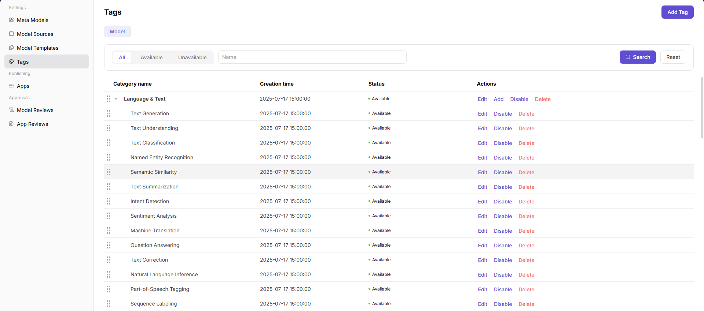
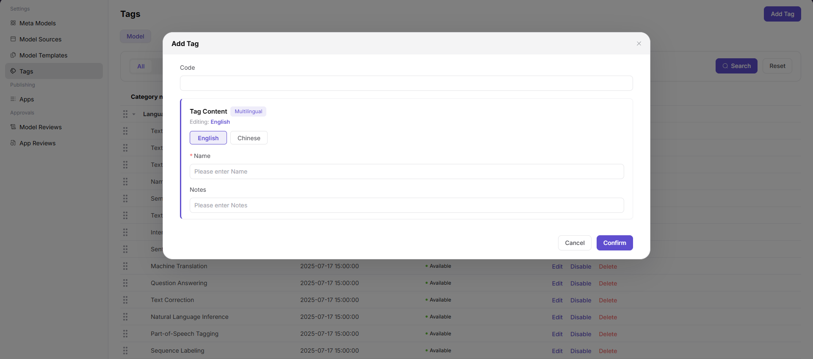

# Tag Management

::: info Document Information
Version: v1.0
Updated: 2026-07-08
:::

## Feature Overview

Tag Management helps operators maintain model tags, tag groups, display order, and enabled status so users can filter and discover models consistently.

| Item | Content |
| --- | --- |
| Applicable role | Operator |
| Navigation path | Model Services > Settings > Tags |
| Page route | `/modelone/settings/tags` |
| Managed objects | Model tags, tag groups, display order, and enabled status |
| Typical use | Maintain model marketplace filters and display tags |

#### Beginner Explanation

Tags are like shelf labels in the model marketplace. They help users filter models by capability, industry, recommendation level, or scenario. Confusing tag names directly reduce discovery efficiency.

#### Terms Quick Reference

| Term | Description |
| --- | --- |
| Tag group | Organizes tags by capability, industry, recommendation, or scenario. |
| Applicable object | Model, app, or content type to which a tag can be bound. |
| Sort value | Controls the display order of tags in filter areas or details pages. |
| Enabled/disabled status | Controls whether a tag can continue to be bound and filtered. |

## Prerequisites

1. The current account has tag maintenance permission.
2. Tag groups, naming rules, sorting rules, and applicable objects have been determined.
3. Before adding a tag, check whether synonymous or duplicate tags already exist.
4. Before taking a tag offline, confirm the number of bound models and impact on filter entries.

## Page Description

This page maintains the tag system for models, apps, or content, including tag name, group, sort order, enabled/disabled status, and display scope. Operators should unify naming rules and avoid duplicate tags and internal abbreviations.

Page screenshot:

Used to view tag names, categories, sort order, and enabled status.

## Main Operations

### Add Tag

1. Go to `Model Services > Settings > Tags`.
2. Click `Add Tag` to open the `Add Tag` dialog.
3. Fill in `Code` to distinguish the tag.
4. In `Tag Content`, maintain the `English` and `Chinese` values for `Name`.
5. Fill in `Notes` as needed to describe the tag purpose or usage boundary.
6. Before clicking `Confirm`, verify the field values. For page validation only, click `Cancel` to close the dialog.

## Parameter Reference

| Field Name | Required | Field Type | Example | Description |
| --- | --- | --- | --- | --- |
| Code | Yes | Text | `long-context` | Unique identifier of the tag. |
| Tag Content | Yes | Multilingual text | `Long Context` | User-visible tag content. |
| Name | Yes | Text | `Long Context` | Tag name maintained for the current language version. |
| Notes | No | Text | `For long-context models` | Tag purpose, usage boundary, or operational note. |
| Status | System-generated | Enum | `Available` | Controls whether the tag can be used. |

## Pitfalls

- Do not use internal project codenames as user-visible tags.
- Before disabling a tag, check bound models and filter entries.
- Do not mix capability tags, industry tags, and recommendation tags in the same group.

## Result Validation

| Check Item | Success Criteria | Troubleshooting |
| --- | --- | --- |
| The tag can be bound on model editing or app editing pages | The tag can be bound on model editing or app editing pages. | Return to the page and check permissions, filters, and configuration status. |
| Users can filter correct results by tag on the discovery page | Users can filter correct results by tag on the discovery page. | Return to the page and check permissions, filters, and configuration status. |
| Disabled tags no longer appear as new binding options | After disabling, the tag no longer appears as a new binding option. | Return to the page and check permissions, filters, and configuration status. |

## FAQ

#### Tag Filter Result Is Empty

**Symptom:**

No models are displayed after a user clicks a tag.

**Possible Causes:**

- No listed models are bound to this tag.
- The tag status is disabled.
- Model visibility scope does not include the current user.

**Handling:**

1. Check tag binding relationships.
2. Confirm tag enabled status.
3. Verify model listing and visibility scope.

#### Tag Meanings Are Duplicated

**Symptom:**

There are multiple tags with similar meanings in the list.

**Possible Causes:**

- Unified naming rules are missing.
- Different operators created tags based on personal habits.
- Tag group boundaries are unclear.

**Handling:**

1. Merge duplicate tags.
2. Migrate model binding relationships.
3. Supplement tag naming and grouping rules.

#### Market Filters Do Not Change After Saving Tags

**Symptom:**

A tag has been added or modified, but the Model Marketplace filter options do not change.

**Possible Causes:**

The tag is not enabled, is not bound to any model, or the marketplace index and cache have not refreshed.

**Handling:**

Confirm that the tag is enabled and bound to models. Recheck after the index refreshes. If there is still no change, check the Model Marketplace filter configuration.

## Next Steps

1. Bind tags to models or apps.
2. Validate filtering on the discovery page.
3. Periodically clean up low-usage or duplicate tags.

## Notes

- Do not use internal project codenames as user-visible tags.
- Migrate bound models before merging tags.
- For tags involving customer names or industry-specific labels, confirm display boundaries.
