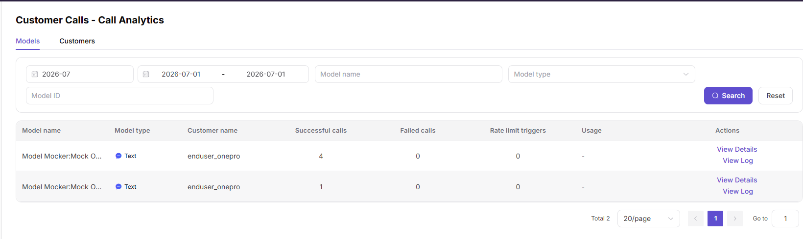

# Customer Call Analytics

:::: info Document Information
Version: v1.0
Updated: 2026-07-08
::::

## Feature Overview

`Customer Call Analytics` is used to maintain or view customer trends, model distribution, call volume, Tokens, fees, and success rate. It supports model publishing, experimentation, calling, statistics, and operational governance.

| Item | Content |
| --- | --- |
| Applicable role | Model provider |
| Navigation path | Customer Calls > Call Analytics |
| Page route | /user/customer-calls/call-analytics |
| Managed objects | Customer trends, model distribution, call volume, Tokens, fees, and success rate |
| Typical use | Perform operations analysis by customer dimension |

### Beginner Explanation

Customer Call Analytics is like a customer operations analysis table. It compares customer call trends, model preferences, failure rates, and revenue contribution.
### Terms Quick Reference

| Term | Description |
| --- | --- |
| Customer trend | Call changes aggregated by customer. |
| Model share | Share of different models in customer calls. |
| Revenue contribution | Revenue or consumption generated by customer calls. |
| Abnormal fluctuation | Call volume, fees, or failure rate deviates significantly from normal ranges. |

## Prerequisites

1. The current account has permission to view customer call analytics.
2. Customer scope, model scope, statistical time, and granularity have been determined.
3. Data redaction requirements have been confirmed before export.
## Page Description

This page is only for customer operations analysis. It focuses on customer call trends, model preferences, revenue contribution, failure rates, and abnormal fluctuations.

Page screenshot:

Used to analyze call trends by customer, model, and time.

## Main Operations

### Steps

1. Go to `Customer Calls > Call Analytics`.
2. Select customer scope, models, and statistical granularity.
3. View customer call trends, Token changes, and fee changes.
4. Compare contribution across customers or models.
5. Drill down abnormal customers into call logs for troubleshooting.

### Parameters

| Field Name | Required | Field Type | Example | Description |
| --- | --- | --- | --- | --- |
| Customer Scope | Yes | Multi-select | `Key customers` | Customer set included in analysis. |
| Statistical Granularity | Yes | Enum | `Day` | Trend aggregation granularity. |
| Model | No | Dropdown | `qwen-plus` | Split by model. |
| Revenue Contribution | System-generated | Number | `120 Credits` | Customer-contributed revenue. |
| Failure Rate | System-generated | Percentage | `1.2%` | Percentage of failed customer requests. |

### Pitfalls

- Customer analytics supports operational judgment and does not directly prove the cause of a single request.
- Before cross-customer comparison, align time range and model scope.
- Fee and revenue data must be redacted before export.

### Result Checks

1. Trend charts show customer call volume, Tokens, failure rate, and fee changes.
2. After customer, model, or time filters change, the statistical scope updates together.
3. Analysis conclusions can be cross-checked against customer call overview and call logs.
## FAQ

### Customer Trend Fluctuates Significantly

**Symptom:**

A customer's call volume or fees fluctuate sharply during the statistical period.

**Possible Causes:**

- Customer business activity changed.
- Customer-side retries or batch tasks occurred.
- Model delisting, rate limits, or pricing rules changed.

**Handling:**

1. Split the trend by model.
2. View customer call logs during the abnormal period.
3. Check publishing, rate-limit, and billing change records.

### Customer Contribution Ranking Is Abnormal

**Symptom:**

Customer contribution ranking differs from expectations.

**Possible Causes:**

- Statistical time ranges differ.
- Some calls are free, deducted, or unsettled.
- Customer name or ownership dimension changed.

**Handling:**

1. Align the statistical time range.
2. Check settlement rules with revenue details.
3. Confirm customer ownership and name mapping.
## Next Steps

1. Go to customer call logs and sample-check abnormal requests.
2. View model revenue to verify customer contribution.
3. Develop customer operations or rate-limit strategies based on trends.
## Notes

- Customer-dimensional analytics involves commercially sensitive information.
- Redact customer names, fees, and business identifiers before export.
- Trend conclusions should be interpreted together with business activity and statistical delay.
