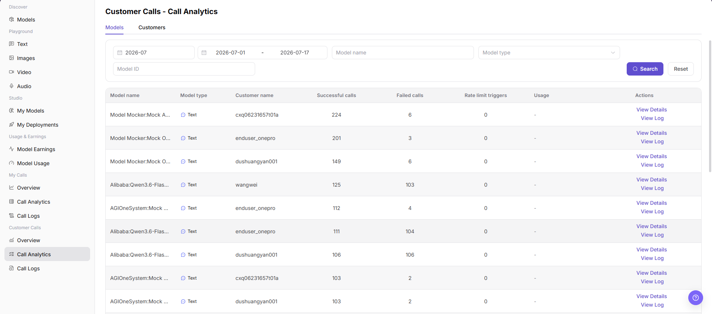
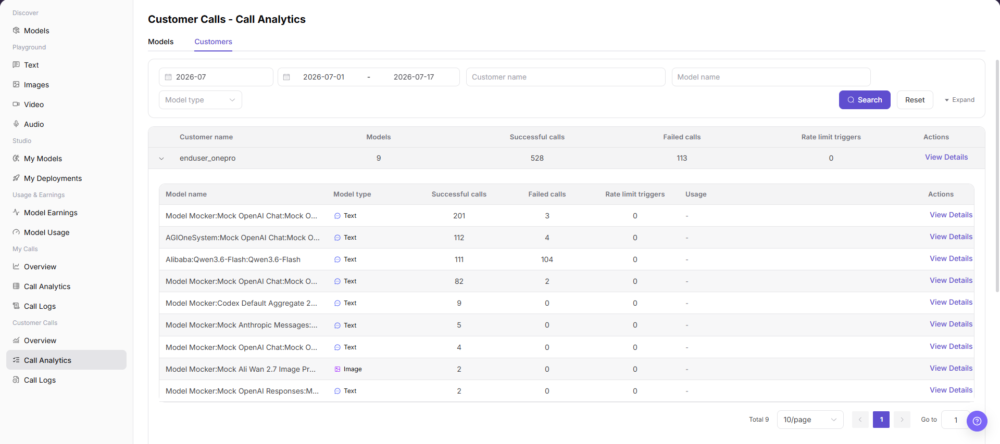

# Customer Calls - Call Analytics

::: info Document Information
Version: v1.0
Updated: 2026-07-08
:::

## Feature Overview

`Customer Calls - Call Analytics` is used to view customer-side call statistics from the Models and Customers tabs, including model name, model type, customer name, successful calls, failed calls, rate limit triggers, usage, and action entries. It helps model providers locate high-frequency and abnormal call objects.

| Item | Content |
| --- | --- |
| Applicable role | Model provider |
| Navigation path | Model Services > Customer Calls > Call Analytics |
| Page route | `/modelone/monitoring/monitor/list` |
| Managed objects | Customer call analytics, model list, customer list, successful calls, failed calls, and rate limit triggers |
| Typical use | View customer-side call statistics by model or customer |

#### Beginner Explanation

Call Analytics is like a ranking table for customer calls. The `Models` tab helps users see which models are called by which customers, while the `Customers` tab helps users see how many models a customer uses and expand customer-level model details.

#### Terms Quick Reference

| Term | Description |
| --- | --- |
| Models | Displays call statistics by model and customer combination. |
| Customers | Displays call statistics aggregated by customer and can expand model details under a customer. |
| Successful calls | Number of calls completed successfully within the filter range. |
| Failed calls | Number of calls that failed, timed out, or returned errors within the filter range. |
| Rate limit triggers | Number of calls that hit rate-limit policies. |
| Usage | Token, quota, or other call usage information shown by the page. |

## Prerequisites

1. The current account has access to the `Call Analytics` page.
2. The month, date range, model, customer, or model type to view has been clarified.
3. Sensitive fields such as customer names, model names, call volume, and usage are displayed according to permissions.

## Page Description

Customer call analytics may contain customer names, model names, call volume, usage, costs, Keys, request content, and business identifiers. This document only describes viewing the model list and customer list, and does not display real customer information, Keys, request content, cost details, or internal test parameters. If the page provides an export entry, this document only describes the viewing boundary and does not guide exporting sensitive data.

Model list screenshot:

Customer list screenshot:

## Main Operations

### View Customer Calls - Model List

1. Go to `Model Services > Customer Calls > Call Analytics`.
2. Click or confirm that the current tab is `Models`.
3. Select filters such as month, date range, model name, model type, or model ID.
4. Click `Search` to refresh the model list. To clear filters, click `Reset`.
5. In the model list, view model name, model type, customer name, successful calls, failed calls, rate limit triggers, usage, and action entries.
6. Click `View Details` to view statistics for the target model and customer combination. To inspect a single request, click `View Log` or go to `Customer Calls > Call Logs`.

### View Customer Calls - Customer List

1. Go to `Model Services > Customer Calls > Call Analytics`.
2. Click the `Customers` tab.
3. Select filters such as month, date range, customer name, model name, or model type.
4. Click `Search` to view matching customer records. To view more filters, click `Expand`.
5. In the customer list, view customer name, models, successful calls, failed calls, rate limit triggers, and action entries.
6. Expand a target customer to view model name, model type, successful calls, failed calls, rate limit triggers, and usage for each model under the customer. Click `View Details` if details are needed.

## Parameter Reference

| Field Name | Required | Field Type | Example | Description |
| --- | --- | --- | --- | --- |
| Month | Yes | Month selector | `2026-07` | Controls the statistical month for call analytics. |
| Date Range | Yes | Date range | `2026-07-01 to 2026-07-17` | Controls the query time range for list data. |
| Analytics Tab | Yes | Tab | `Models` / `Customers` | Switches between the model list and customer list. |
| Model Name | No | Input | Enter on page | Filters the model list or customer list by model name. |
| Model Type | No | Selector | `Text` / `Image` | Filters statistics by model capability type. |
| Model ID | No | Input | Enter on page | Filters by model ID on the Models tab. |
| Customer Name | No | Input / text | Enter on page | Filters statistics by customer name on the Customers tab. |
| Models | System-generated | Number | Displayed on page | Shows the number of models used by a customer on the Customers tab. |
| Successful Calls | System-generated | Number | Displayed on page | Number of successful calls within the selected range. |
| Failed Calls | System-generated | Number | Displayed on page | Number of failed calls within the selected range. |
| Rate Limit Triggers | System-generated | Number | Displayed on page | Number of rate-limit triggers within the selected range. |
| Usage | System-generated | Text / tag | Displayed on page | Shows token, quota, or other call usage information. |
| Actions | No | Action entry | `View Details` / `View Log` | Opens analytics details or jumps to call logs. |

## Result Validation

| Check Item | Success Criteria | Handling If Abnormal |
| --- | --- | --- |
| Page is accessible | The `Customer Calls - Call Analytics` page opens normally, and `Customer Calls > Call Analytics` is highlighted in the sidebar. | Check account permissions, navigation path, and page loading status. |
| Model list displays normally | The `Models` tab shows model name, model type, customer name, successful calls, failed calls, rate limit triggers, and action entries. | Adjust the month, date range, or model filters and retry. |
| Customer list displays normally | The `Customers` tab shows customer name, models, successful calls, failed calls, rate limit triggers, and action entries. | Adjust the date range, customer name, or model name and retry. |
| Filters are available | After switching month, date range, model, customer, or model type, list data changes accordingly. | Check whether filters are too narrow, and click `Reset` if needed. |
| Search / Reset works | `Search` displays matching data, and `Reset` clears filters. | Check network status, page API responses, and account permissions. |
| List data is consistent | Successful calls, failed calls, rate limit triggers, and usage in the list are consistent with details or logs. | Open `View Details` or `View Log` for cross-checking. |

## FAQ

#### What if the model list is empty?

First confirm that the month and date range cover customer calls, and then check whether model name, model type, and model ID filters are too narrow. Click `Reset` and search again if needed.

#### What if the model count in the customer list is abnormal?

Switch to the target customer and expand details to check the model list under that customer. If it is still inconsistent, go to call logs and troubleshoot by customer and time range.

#### Can I export customer call analytics?

Customer call analytics may contain customer names, model names, call volume, usage, costs, and business identifiers. Before exporting, confirm permissions, redaction requirements, and usage scope. This document only describes viewing lists and does not guide exporting sensitive data.

## Next Steps

1. Click `View Details` to view statistics for the target model or customer.
2. Click `View Log` or go to `Customer Calls > Call Logs` to locate a single request.
3. Return to `Customer Calls > Overview` to view trends, consumption statistics, and TOP rankings.

## Notes

- Customer names, model names, call volume, costs, Keys, request content, and business identifiers are sensitive operational information.
- Before external communication or screenshots, redact customer names, Keys, request content, cost details, and internal test parameters.
- Call analytics is aggregated data. Use call logs when troubleshooting a single request.
