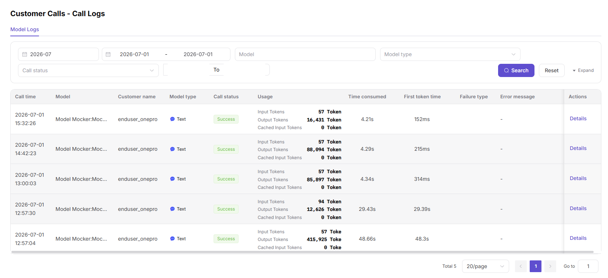

# Customer Call Logs

## Feature Overview

`Customer Call Logs` is used to maintain or view customer single-request logs, request IDs, error codes, customer identifiers, and model return summaries. It supports model publishing, experimentation, calling, statistics, and operational governance.

| Item | Content |
| --- | --- |
| Applicable role | Model provider |
| Navigation path | Customer Calls > Call Logs |
| Page route | /user/customer-calls/call-logs |
| Managed objects | Customer single-request logs, request IDs, error codes, customer identifiers, and model return summaries |
| Typical use | Troubleshoot call issues by customer dimension |

### Beginner Explanation

Customer Call Logs are like customer request ticket details. They are used to explain failures, timeouts, rate limits, or billing disputes reported by customers.
### Terms Quick Reference

| Term | Description |
| --- | --- |
| Customer identifier | Redacted identifier of the calling customer or app. |
| Request ID | Single-request tracking identifier. |
| Error code | Type of failed request. |
| Response summary | Redacted return status or error summary. |

## Prerequisites

1. The current account has permission to view customer call logs.
2. Customer name, request ID, time range, or error code has been prepared.
3. Troubleshooting materials must not contain complete customer Prompts, response bodies, or API Keys.
## Page Description

This page only shows customer-side single-request logs and is used to explain customer-reported failures, timeouts, or billing disputes.

Page screenshot:

Used to locate customer request failures, timeouts, or billing disputes.

## Main Operations

### Steps

1. Go to `Customer Calls > Call Logs`.
2. Select customer, model, and time range.
3. Filter by request ID, status, or error code.
4. Open a log and view the redacted error summary and elapsed time.
5. Provide request ID, error code, and time range to the relevant handler.

### Parameters

| Field Name | Required | Field Type | Example | Description |
| --- | --- | --- | --- | --- |
| Customer | Yes | Dropdown | `customer-a` | Calling customer. |
| Request ID | Conditionally required | Text | `req-20260706-001` | Single-request tracking identifier. |
| Error Code | No | Text | `5xx` | Failure type. |
| Model | No | Dropdown | `qwen-plus` | Called model. |
| Response Summary | System-generated | Text | `timeout` | Redacted error summary. |

### Pitfalls

- Do not send customer Prompts, response bodies, or API Keys to public groups.
- Analyze multiple failed requests from the same customer by aggregating time ranges.
- Customer-side errors may come from rate limits, balance, model status, or upstream timeouts.

### Result Checks

1. Logs can be filtered by customer, request ID, model, status, and time range.
2. Log details show error code, latency, Tokens, and redacted response summary.
3. Customer-reported issues can be located to the corresponding request or time period.
## FAQ

### Cannot Find the Request Provided by Customer

**Symptom:**

Logs cannot be located by the time or request ID provided by the customer.

**Possible Causes:**

- Request ID is incomplete or belongs to another environment.
- Time range, time zone, or customer filter is inconsistent.
- Logs exceed the retention period.

**Handling:**

1. Confirm the complete request ID and time zone with the customer.
2. Expand the time range and clear filters.
3. Confirm log retention period.

### Many Failures from the Same Customer

**Symptom:**

A customer has many failed logs in a short time.

**Possible Causes:**

- Batch parameter errors on the customer side.
- Customer concurrency triggers rate limits.
- Upstream model or network is abnormal.

**Handling:**

1. Aggregate failure reasons by error code.
2. Sample-check request summaries and parameters.
3. Combine model status and customer call analytics to determine impact scope.
## Next Steps

1. Provide request ID, error code, and time range to the customer or operator.
2. Go to customer call analytics to assess impact scope.
3. Adjust customer rate limits or model configuration when needed.
## Notes

- Do not export or distribute complete customer request content.
- Redact customer names, request headers, Tokens, and fees before screenshots.
- Customer logs are for troubleshooting and do not replace revenue settlement details.
