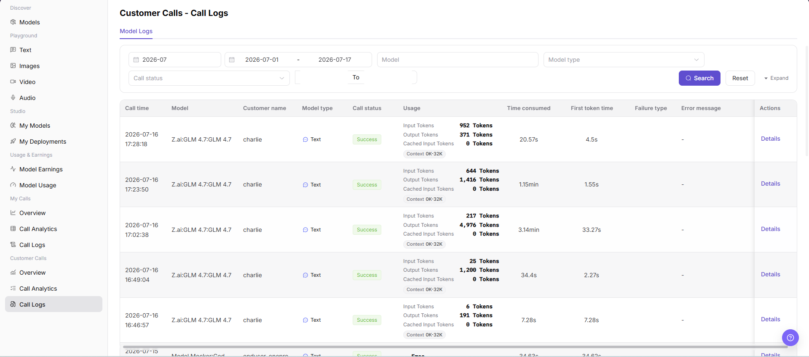

# Customer Calls - Call Logs

::: info Document Information
Version: v1.0
Updated: 2026-07-08
:::

## Feature Overview

`Customer Calls - Call Logs` is used to view customer-side single model call records, including call time, model, customer name, model type, call status, usage, time consumed, first token time, failure type, error message, and the details entry. It helps model providers troubleshoot customer-reported failures, timeouts, rate limits, or usage anomalies.

| Item | Content |
| --- | --- |
| Applicable role | Model provider |
| Navigation path | Model Services > Customer Calls > Call Logs |
| Page route | `/modelone/monitoring/monitor/log` |
| Managed objects | Customer-side call logs, models, customer names, call status, usage, and error messages |
| Typical use | Troubleshoot single-call issues by customer and model |

#### Beginner Explanation

Customer call logs are like receipts for customer requests. Users can filter records by time, model, model type, or call status, and then click `Details` to view more information about a single call.

#### Terms Quick Reference

| Term | Description |
| --- | --- |
| Call time | Time when a single customer call occurred. |
| Customer name | Name of the customer or caller that initiated the call. |
| Call status | Call processing result, such as `Success` or a failed status. |
| Usage | Input tokens, output tokens, cached input tokens, context size, or free usage information shown by the page. |
| Time consumed | Total time consumed by the request. |
| First token time | Time consumed before the first token is returned by a text model. |
| Failure type | Category of a failed request. |

## Prerequisites

1. The current account has access to the `Call Logs` page.
2. The month, date range, model, model type, or call status to view has been clarified.
3. Troubleshooting materials must not contain complete customer requests, response bodies, Keys, accounts, or cost details.

## Page Description

Customer call logs may contain customer information, request content, response content, Key names, costs, error details, and business troubleshooting information. This document only describes viewing call logs and does not display real customer information, request content, response content, Keys, accounts, cost details, or internal test parameters. If the page provides an export entry, this document only describes the viewing boundary and does not guide exporting sensitive data.

Page screenshot:

## Main Operations

### View Customer Calls - Call Logs

1. Go to `Model Services > Customer Calls > Call Logs`.
2. On the `Model Logs` tab, view call time, model, customer name, model type, call status, usage, time consumed, first token time, failure type, error message, and action entries.
3. Select filters such as month, date range, model, model type, or call status.
4. Click `Search` to view matching customer call logs.
5. Click `Reset` to clear filters. To view more filters, click `Expand`.
6. Click `Details` for the target log to view more information about a single customer call. When viewing or taking screenshots, hide sensitive content such as requests, responses, Keys, accounts, and costs.

## Parameter Reference

| Field Name | Required | Field Type | Example | Description |
| --- | --- | --- | --- | --- |
| Month | Yes | Month selector | `2026-07` | Controls the statistical month for call logs. |
| Date Range | Yes | Date range | `2026-07-01 to 2026-07-17` | Controls the query time range for call logs. |
| Model | No | Input | Enter on page | Filters call logs by model name. |
| Model Type | No | Selector | `Text` | Filters call logs by model capability type. |
| Call Status | No | Selector | `Success` | Filters logs by call processing result. |
| Call Time | System-generated | Time | Displayed on page | Shows when a single customer call occurred. |
| Customer Name | System-generated | Text | Displayed on page | Shows the customer that initiated the call. |
| Usage | System-generated | Text / tag | Displayed on page | Shows input tokens, output tokens, cached input tokens, context size, or free usage information. |
| Time Consumed | System-generated | Time | Displayed on page | Shows the total time consumed by a single call. |
| First Token Time | System-generated | Time | Displayed on page | Shows the time before the first token is returned. |
| Failure Type | System-generated | Text | Displayed on page | Shows the issue category for a failed request. |
| Error Message | System-generated | Text | Displayed on page | Shows the error summary for a failed request. Redact it before screenshots or external communication. |
| Actions | No | Action entry | `Details` | Opens single customer call log details. |

## Result Validation

| Check Item | Success Criteria | Handling If Abnormal |
| --- | --- | --- |
| Page is accessible | The `Customer Calls - Call Logs` page opens normally, and `Customer Calls > Call Logs` is highlighted in the sidebar. | Check account permissions, navigation path, and page loading status. |
| Log list loads normally | The list shows columns such as call time, model, customer name, call status, usage, latency, and error message. | Refresh the page or retry after adjusting the month and date range. |
| Filters are available | After filtering by month, date range, model, model type, or call status, the list refreshes. | Check whether filters are too narrow, and click `Reset` if needed. |
| Search / Reset works | `Search` displays matching logs, and `Reset` clears the filters. | Check network status, page API responses, and account permissions. |
| Log details can be opened | Clicking `Details` opens more information about a single customer call. | Confirm that the record is still within the log retention period. |
| Field information is consistent | Call status, time consumed, usage, failure type, and error message are consistent with the details page. | Reopen details or expand the time range for cross-checking. |

## FAQ

#### What if the customer-reported call log cannot be found?

First confirm that the month and date range cover the customer call time, and then check model, model type, and call status filters. Click `Reset` and search again if needed.

#### What if many failures occur for the same customer?

Filter by time range and check failure type, error message, and time consumed first. Then open `Details` to view redacted single-call information. To assess the impact scope, go back to `Customer Calls > Call Analytics`.

#### Can I export customer call logs?

Customer call logs may contain customer information, requests, responses, Keys, costs, and error details. Before exporting, confirm permissions, redaction requirements, and usage scope. This document only describes viewing logs and does not guide exporting sensitive data.

## Next Steps

1. Click `Details` to view redacted details for the target customer call.
2. Go to `Customer Calls > Call Analytics` to determine whether a batch anomaly exists.
3. Return to `Customer Calls > Overview` to view trend changes by customer or model.

## Notes

- Do not expose complete customer requests, response bodies, Keys, accounts, or cost details in documentation, screenshots, or tickets.
- Customer logs are for troubleshooting and do not replace revenue settlement or billing details.
- Error messages are only used for troubleshooting and must be redacted before public communication.
