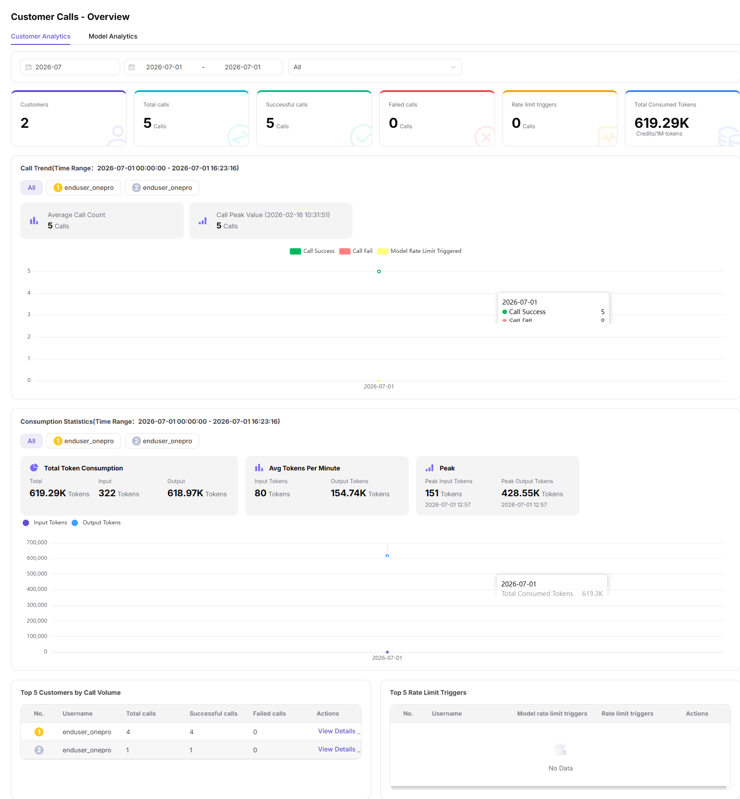

# Customer Call Overview

## Feature Overview

`Customer Call Overview` is used to maintain or view customer-level call volume, success rate, Token usage, fees, and active customers. It supports model publishing, experimentation, calling, statistics, and operational governance.

| Item | Content |
| --- | --- |
| Applicable role | Model provider |
| Navigation path | Customer Calls > Overview |
| Page route | /user/customer-calls/overview |
| Managed objects | Customer-level call volume, success rate, Token usage, fees, and active customers |
| Typical use | View overall customer-side call performance |

### Beginner Explanation

Customer Call Overview is like a customer operations dashboard. It shows call volume, activity, success rate, Token usage, and fee contribution across customers.
### Terms Quick Reference

| Term | Description |
| --- | --- |
| Customer dimension | Call data aggregated by customer, tenant, or app. |
| Active customers | Customers that generated calls during the statistical period. |
| Customer fees | Fees or consumption generated by customer calls. |
| Customer success rate | Percentage of successful customer requests. |

## Prerequisites

1. The current account has permission to view customer call overview.
2. The customer scope and time range to view have been clarified.
3. Customer names, business identifiers, and fee fields are displayed according to permissions.
## Page Description

This page only displays customer-level call overview. It is for model providers to observe customer activity, call volume, success rate, Token usage, and fee contribution.

Page screenshot:

Used to view customer-level call volume, activity, and revenue contribution.

## Main Operations

### Steps

1. Go to `Customer Calls > Overview`.
2. Select time range and customer scope.
3. View customer call volume, active customers, and success rate.
4. Filter by model or customer.
5. When abnormal customers are found, go to customer call logs or customer call analytics.

### Parameters

| Field Name | Required | Field Type | Example | Description |
| --- | --- | --- | --- | --- |
| Customer | No | Dropdown | `customer-a` | Filter by customer dimension. |
| Active Customers | System-generated | Number | `18` | Number of customers with calls during the statistical period. |
| Customer Call Volume | System-generated | Number | `5000` | Number of requests initiated by customers. |
| Customer Success Rate | System-generated | Percentage | `98%` | Percentage of successful customer requests. |
| Contributed Fees | System-generated | Number | `80 Credits` | Fees generated by customer calls. |

### Pitfalls

- Customer overview does not display customer request bodies.
- Customer names and business identifiers must be redacted before screenshots.
- Overview anomalies need to be located together with customer logs and analytics pages.

### Result Checks

1. Customer call volume, active customers, success rate, Token usage, and fee contribution have data.
2. After switching customer or model filters, cards and trends update together.
3. Abnormal customers can be further drilled down into customer call logs.
## FAQ

### Data for a Customer Is Empty

**Symptom:**

After selecting a customer, there is no call volume or fee data.

**Possible Causes:**

- The customer made no calls in the time range.
- The customer is not authorized to use this model.
- The current account has no permission to view this customer data.

**Handling:**

1. Expand the time range.
2. Check customer authorization and model binding.
3. Confirm the data viewing scope of the current account.

### Customer Success Rate Is Abnormal

**Symptom:**

A customer's success rate is significantly lower than that of other customers.

**Possible Causes:**

- Customer request parameters do not meet model requirements.
- Customer concurrency exceeds rate limits.
- Customer network or call entry is abnormal.

**Handling:**

1. Go to customer call logs and view error codes.
2. Split failed requests by model and time period.
3. Provide the customer with request IDs, error codes, and recommended parameters.
## Next Steps

1. Go to customer call logs to locate single failures.
2. Go to customer call analytics to view trends and contribution.
3. Adjust operations follow-up strategy based on customer usage.
## Notes

- Customer names, fees, and business identifiers are sensitive information.
- The overview page does not display complete request bodies.
- For external communication, provide only redacted statistical conclusions.
