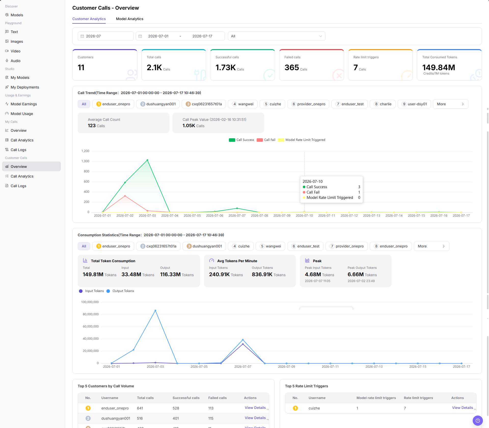
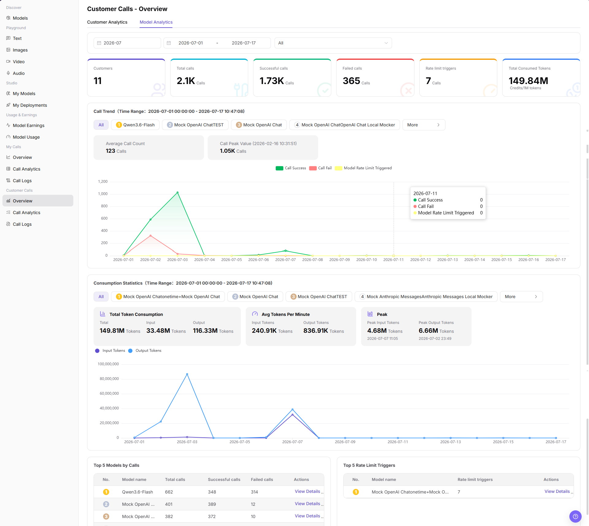

# Customer Calls - Overview

::: info Document Information
Version: v1.0
Updated: 2026-07-08
:::

## Feature Overview

`Customer Calls - Overview` is used to view customer-side call performance by customer and by model, including customers, total calls, successful calls, failed calls, rate limit triggers, total consumed tokens, call trends, consumption statistics, and TOP rankings. It helps model providers identify important customers, important models, and abnormal calls.

| Item | Content |
| --- | --- |
| Applicable role | Model provider |
| Navigation path | Model Services > Customer Calls > Overview |
| Page route | `/modelone/monitoring/monitor/overview` |
| Managed objects | Customer analytics, model analytics, call trends, token consumption, and rate limit triggers |
| Typical use | View customer-side call overview and locate important customers or models |

#### Beginner Explanation

Customer Calls - Overview is a customer-side operations dashboard. `Customer Analytics` shows which customers call more or behave abnormally, while `Model Analytics` shows which models are called more, fail more often, or trigger rate limits more often.

#### Terms Quick Reference

| Term | Description |
| --- | --- |
| Customer Analytics | Aggregates call data by customer or username. |
| Model Analytics | Aggregates call data by model name. |
| Call Trend | Shows changes in call success, call fail, and model rate-limit triggers over time. |
| Consumption Statistics | Shows total token consumption, input tokens, output tokens, average tokens per minute, and peaks. |
| Rate limit triggers | Number of calls that hit model rate-limit policies. |

## Prerequisites

1. The current account has access to the `Overview` page.
2. The statistical month, date range, and dimension to view have been clarified.
3. Customer names, model names, call volume, and cost-related fields are displayed according to permissions.

## Page Description

Customer calls overview may contain customer names, call volume, token consumption, costs, model usage, and abnormal-call data. This document only describes viewing the overview and does not display real customer information, Keys, request content, cost details, or internal test parameters. If the page provides an export entry, this document only describes the viewing boundary and does not guide exporting sensitive data.

Customer Analytics screenshot:

Model Analytics screenshot:

## Main Operations

### View Customer Calls by Customer

1. Go to `Model Services > Customer Calls > Overview`.
2. Click or confirm that the current tab is `Customer Analytics`.
3. Select the statistical month, date range, and `All` or a target customer filter.
4. View customers, total calls, successful calls, failed calls, rate limit triggers, and total consumed tokens.
5. View call trend, consumption statistics, Top 5 Customers by Call Volume, and Top 5 Rate Limit Triggers.
6. To view details for a target customer, click `View Details`. Before using screenshots externally, hide customer names, costs, and business identifiers.

### View Customer Calls by Model

1. Go to `Model Services > Customer Calls > Overview`.
2. Click the `Model Analytics` tab.
3. Select the statistical month, date range, and `All` or a target model filter.
4. View customers, total calls, successful calls, failed calls, rate limit triggers, and total consumed tokens.
5. View model-level call trend, consumption statistics, Top 5 Models by Calls, and Top 5 Rate Limit Triggers.
6. To view details for a target model, click `View Details`. To inspect a single request, go to `Customer Calls > Call Logs`.

## Parameter Reference

| Field Name | Required | Field Type | Example | Description |
| --- | --- | --- | --- | --- |
| Statistical Month | Yes | Month selector | `2026-07` | Controls the month of overview data. |
| Date Range | Yes | Date range | `2026-07-01 to 2026-07-17` | Controls the time range for trends, consumption statistics, and TOP rankings. |
| Analytics Tab | Yes | Tab | `Customer Analytics` / `Model Analytics` | Switches between customer aggregation and model aggregation. |
| Customer | No | Selector | `All` or target customer | Filters statistics by customer on Customer Analytics. |
| Model | No | Selector | `All` or target model | Filters statistics by model on Model Analytics. |
| Customers | System-generated | Number | Displayed on page | Number of customers that generated calls in the selected range. |
| Total Calls | System-generated | Number | Displayed on page | Total number of calls in the selected range. |
| Successful Calls | System-generated | Number | Displayed on page | Number of successful calls in the selected range. |
| Failed Calls | System-generated | Number | Displayed on page | Number of failed calls in the selected range. |
| Rate Limit Triggers | System-generated | Number | Displayed on page | Number of calls that hit model rate limits in the selected range. |
| Token Usage | System-generated | Number | Displayed on page | Shows total consumed tokens, input tokens, output tokens, average tokens per minute, and peaks. |
| Actions | No | Action entry | `View Details` | Opens customer-level or model-level details. |

## Result Validation

| Check Item | Success Criteria | Handling If Abnormal |
| --- | --- | --- |
| Page is accessible | The `Customer Calls - Overview` page opens normally, and `Customer Calls > Overview` is highlighted in the sidebar. | Check account permissions, navigation path, and page loading status. |
| Customer analytics data displays normally | The `Customer Analytics` tab shows customers, call trend, consumption statistics, and Top 5 Customers by Call Volume. | Adjust the date range or customer filter and retry. |
| Model analytics data displays normally | The `Model Analytics` tab shows model-level trends, consumption statistics, and Top 5 Models by Calls. | Adjust the date range or model filter and retry. |
| Filters are available | After switching month, date range, customer, or model, charts and TOP tables change accordingly. | Check whether filters are too narrow, and switch back to `All` if needed. |
| Detail entry is available | Clicking `View Details` opens the corresponding customer or model details. | Confirm data permissions and whether the statistical object still exists. |
| Statistics are consistent | Call trends, consumption statistics, and TOP tables match the selected filters. | Refresh the page or expand the time range for cross-checking. |

## FAQ

#### What if data for a customer is empty?

First confirm that the statistical month and date range cover the customer's call time, and then check whether the correct customer or model is selected. Switch back to `All` and view again if needed.

#### What if customer success rate or failed calls are abnormal?

Check failure changes in Call Trend first, and then go to customer call analytics or call logs to split troubleshooting by customer, model, and time range.

#### What if model rate limit triggers are abnormal?

Switch to `Model Analytics`, view Top 5 Rate Limit Triggers and the target model trend, and then go to customer call logs if single-request information is needed.

#### Can I export customer calls overview?

Customer calls overview may contain customer names, call volume, costs, and model usage. Before exporting, confirm permissions, redaction requirements, and usage scope. This document only describes viewing the overview and does not guide exporting sensitive data.

## Next Steps

1. Go to `Customer Calls > Call Analytics` to view more detailed statistical distribution.
2. Go to `Customer Calls > Call Logs` to locate single failed requests.
3. Adjust operations follow-up strategy based on customer or model call trends.

## Notes

- Customer names, call volume, costs, model usage, and business identifiers are sensitive operational information.
- Before external communication or screenshots, redact customer names, Keys, request content, cost details, and internal test parameters.
- The overview page shows aggregated data. Use call logs when troubleshooting a single request.
