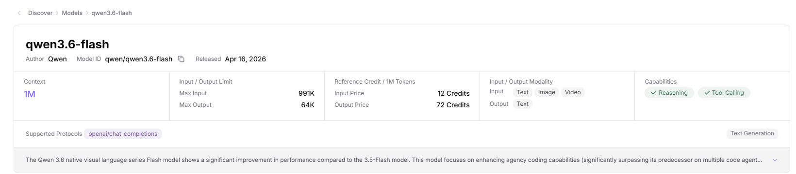

# Model Marketplace

## Preface

| Item | Content |
| ---- | ------- |
| Applicable Role | User |
| Navigation Path | Discover > Model Marketplace |
| Feature Positioning | Main entry for users to discover and browse platform models (the page title displays **"Model Square"**), including a **list view** (filter/search/sort models) + **4 detail sub-tabs** (Providers / Quick Start / Performance / Overview) |

## Page Structure

### Search Area

The top of the page provides a filtering and search toolbar:
- **"All Models"** / **"Private Models"** Tabs for switching model scope
- Search box: enter keywords such as "model name, author, series, or source"
- Sort dropdown (**"Latest"** by default)
- View toggle buttons (**List / Grid**)
- The left side provides an **"Expand Filters"** button (expand/collapse advanced filters: model type / input-output capability / tags, etc.)

### Action Button Area

- The upper-right corner of the page provides the **"Publish Model"** button (purple) for submitting a new model publishing request
- Each model card row provides a **">"** button at the end. Click it to enter the model details page

### Data List Description

The page displays model cards in a horizontal single-column layout. Each card contains: model icon + name + author + capability tags (Chat Model / Text / Tool Calling / Deep Thinking / 1M, etc.) + weekly calls + weekly Token volume + billing standard + release date.

## Operations

### View Model List

1. Enter the platform homepage and click **"Discover > Model Marketplace"** in the left navigation bar to enter the "Model Square" page.
2. The top of the page provides a filtering and search toolbar:
   - **"All Models"** / **"Private Models"** Tabs for switching model scope
   - Search box: enter keywords such as "model name, author, series, or source"
   - Sort dropdown (**"Latest"** by default)
   - View toggle buttons (**List / Grid**)
3. Click **"Expand Filters"** to expand/collapse advanced filters (model type / input-output capability / tags, etc.).
4. The **"Publish Model"** button (purple) in the upper-right corner is used to submit a new model publishing request.
5. The list displays model cards (horizontal single-column layout). Each card contains:
   - Model icon + name (for example, `DeepSeek-V4-Pro`) + author (for example, `DeepSeek`)
   - Capability tags (for example, `Chat Model / Text / Tool Calling / Deep Thinking / 1M`)
   - Weekly calls (for example, `14`) / weekly Token volume (for example, `1.2K` or `1,171/M`)
   - Billing standard (for example, `Credit from 8 / 48/M (≈ USD from $0.60 / $4.80/M)`) + release date (for example, `2026-06-24`)
   - End-of-row **">"** button to enter the details page
6. Click the target model row (or name / end-of-row button) -> enter the model details page (the top breadcrumb is **"Discover > Model Marketplace > Model Name"**, with a **"Best Practices"** external link in the upper-right corner).

#### Parameters - Model List Card

| Field Name | Field Type | Example | Description |
|----------|----------|------|------|
| Model Name | Text | `DeepSeek-V4-Pro` | Display name of the model |
| Author | Text | `DeepSeek` | Author / provider of the model |
| Capability Tags | Multiple Tags | `Chat Model / Text / Tool Calling / Deep Thinking / 1M` | Functional type + context length of the model |
| Weekly Calls | Number | `14` | Number of calls this week |
| Weekly Token Volume | Number | `1.2K` (chat model) / `1,171/M` (total Tokens) | Total Tokens consumed this week |
| Billing Standard | Text | `Credit from 8 / 48/M (≈ USD from $0.60 / $4.80/M)` | Input / output price of the model (dual currency) |
| Release Date | Date | `2026-06-24` | Model release date |

### View Model Details (4 Sub-Tabs)

The top of the details page is the breadcrumb **"Discover > Model Marketplace > Model Name"**, with a **"Best Practices"** link (external-link icon) in the upper-right corner. The details page contains 4 sub-tabs (**"Providers"** Tab by default).

- **Model metadata card** (top):
  - Title row: model name (for example, `DeepSeek-V4-Pro`) / author (for example, `DeepSeek`) / **Model ID** (for example, `deepseek/deepseek-v4-pro`, with **Copy** button) / release date (for example, `2026-06-24`)
  - 5 field cards: context (for example, `1M`) / input-output limits (max input 384K / max output 1M) / reference Credit (input 8 / output 48 Credit/M) / input-output modalities (input Text / output Text) / capability support (✓ Deep Thinking / ✓ Tool Calling / Text Generation)
  - **Supported Protocols** tags: openai/chat_completions / openai/responses / anthropic/messages
  - Description text: model release information + core features (for example, "Released on April 24, 2026, total parameters 1.6T, active 49B...")

#### Sub-Tab 1: Providers (Default)

- Top **"Switch Provider"** dropdown: select the target provider instance (for example, `AGIOneSystem:Model Mocker deepseek/deepseek-v4-pro/d7fe2`)
- Protocol selection: OpenAI-ChatCompletions (currently selected) / others (horizontal Tab)
- Two-level filter: All / Public / Private / **Aggregation** + All / By Provider / By Model Source
- Search toolbar: model name + sort + billing + Search / Reset
- **Provider instance card** list. Each card contains:
  - Instance name (for example, `Model Mocker:dsy-01`) + Model ID (for example, `deepseek/deepseek-v4-pro/d7fe2`, with copy button) + provider (for example, `AGIOneSystem`)
  - Status badges: **"Recommended"** + **"Listed"**
  - Billing information: input/output `Credits/M` (for example, `20 / From 120`) + Input/Output · billing details
  - 6 performance metric columns: context (for example, `1M`) / latency (for example, `-`) / throughput (for example, `0 t/s`) / success rate (for example, `-`) / weekly calls (for example, `14`) / weekly Token volume (for example, `1,171/M`)
  - Entry links: **Try →** / **Quick Start →** / **Claim Free Quota** (some instances)
  - Metadata row: 1M max output · Test Environment/China · ✓ Deep Thinking / ✓ Tool Calling

#### Sub-Tab 2: Quick Start

Top: **Switch Provider** dropdown.

2-step configuration under the **OpenAI-ChatCompletions** protocol:

- **Step 1: API Endpoint** (4 information blocks, each with a **"Copy"** button):
  - **Model ID** (call identifier): for example, `deepseek/deepseek-v4-pro/d7fe2`
  - **Base URL**: for example, `http://test.metis.opr/hyperone/xapi/api`
  - **Path**: for example, `/v1/chat/completions`
  - **Full URL**: for example, `http://test.metis.opr/hyperone/xapi/api/v1/chat/completions`

- **Step 2: Authentication**:
  - **Model Api Keys** dropdown: select a Personal Key (for example, `20260616-0958 / a...`, with **"Personal"** green tag), copyable
  - **Request Headers** table (2 columns: Request Header / Value):
    - Authorization: `Bearer {api-key}`
    - Content-Type: `application/json`
  - Prompt message: **"AGIOne unified API keys can access all supported protocols. One key can connect to all providers."**

The right side of the page is the **code example area** (**SDK / HTTP / Curl** 3 Tabs, HTTP highlighted in purple by default), with 3 action buttons: **Download** / **Copy Code**, and a code display window with line numbers below.

#### Sub-Tab 3: Performance

- **Select Time** range selector (for example, `2026-06-17 00:00:00 - 2026-06-23 15:07:00`)
- **Data Granularity** button (purple, currently **"Day"**)
- 4 chart cards (2x2 grid, with legends and multi-line comparison):
  - **Average Request Latency** (ms)
  - **Average First Token Latency** (ms)
  - **Real-Time Request Frequency**
  - **Request Success Rate** (%)

#### Sub-Tab 4: Overview

- **Introduction** section (English rich text): model introduction + 3 numbered highlights (architecture upgrade: Hybrid Attention Architecture / Manifold-Constrained Hyper-Connections (mHC) / Muon Optimizer) + training data scale (**32T** tokens) + sub-version descriptions (DeepSeek-V4-Pro-Max / DeepSeek-V4-Flash-Max)
- **Performance comparison charts**:
  - Horizontal bar chart: DeepSeek-V4-Pro-Max vs Claude-Opus-4.6-Max vs GPT-5.4-xHigh vs Gemini-3.1-Pro-High (multi-model benchmark comparison)
  - Line chart: DeepSeek-V3.2 vs DeepSeek-V4-Pro vs DeepSeek-V4-Flash (annotated with key metrics **3.7× lower** / **9.8× lower**)

#### Parameters - 4 Model Detail Sub-Tabs

| Field Name | Field Type | Example | Description |
|----------|----------|------|------|
| Providers - Model Name | Text | `DeepSeek-V4-Pro` | Details page title |
| Providers - Author | Text | `DeepSeek` | Model author |
| Providers - Model ID | Text | `deepseek/deepseek-v4-pro` | Unique identifier (with copy) |
| Providers - Release Date | Date | `2026-06-24` | Release date |
| Providers - Context | Number | `1M` | Maximum context window |
| Providers - Input Limit | Number | `384K` | Maximum Token input per request |
| Providers - Output Limit | Number | `1M` | Maximum Token output per request |
| Providers - Input Price | Number | `8 Credit / 1M Tokens` | Reference input price |
| Providers - Output Price | Number | `48 Credit / 1M Tokens` | Reference output price |
| Providers - Input Modality | Multi-select | `Text` | Supported input data type |
| Providers - Output Modality | Multi-select | `Text` | Supported output data type |
| Providers - Capability Support | Switch Tags | `✓ Deep Thinking / ✓ Tool Calling / Text Generation` | Extended model capabilities |
| Providers - Supported Protocols | Tags | `openai/chat_completions / openai/responses / anthropic/messages` | Compatible API protocols |
| Providers - Instance Name | Text | `Model Mocker:dsy-01` | Specific instance under the provider |
| Providers - Status Badges | Tags | `Recommended / Listed` | Display status of the instance |
| Providers - Billing | Number | `20 / From 120 Credits/M` | Input / output price of the instance |
| Providers - Weekly Calls | Number | `14` | Real-time call volume of the instance |
| Providers - Weekly Token Volume | Number | `1,171/M` | Real-time Token consumption of the instance |
| Quick Start - Model ID | Text | `deepseek/deepseek-v4-pro/d7fe2` | Exact model identifier for API calls |
| Quick Start - Base URL | URL | `http://test.metis.opr/hyperone/xapi/api` | API service address |
| Quick Start - Path | Path | `/v1/chat/completions` | API path |
| Quick Start - Full URL | URL | Concatenation of the above | Full call endpoint |
| Quick Start - API Key | Text | `Personal Key 20260616-0958` | Authentication key (Personal type) |
| Quick Start - Request Headers | Key-Value | `Authorization: Bearer {api-key}` / `Content-Type: application/json` | HTTP request headers (required) |
| Quick Start - Code Examples | Multi-Tab | SDK / HTTP / Curl | 3 types of call code examples |
| Performance - Time Range | Date Range | `2026-06-17 ~ 2026-06-23` | Time window of performance data |
| Performance - Data Granularity | Button | `Day / Hour / Minute` | Time aggregation granularity |
| Performance - Metrics | Chart | 4 line charts | Average request latency / first token latency / real-time request frequency / request success rate |
| Overview - Introduction | Rich Text | Introduction section | Complete model introduction + architecture upgrade highlights |
| Overview - Performance Comparison | Chart | Bar chart + line chart | Performance benchmark comparison with other models |

## Other Operations

| Operation | Steps |
|----------|----------|
| Filter Model Scope | Switch the top **"All Models"** / **"Private Models"** Tabs -> Filter the model list |
| Search Models | Enter keywords such as "model name, author, series, or source" in the search box -> The system filters matching models in real time |
| Sort Models | Click the sort dropdown (**Latest / Hottest / Weekly Calls**, etc.) -> The list is reordered by the selected rule |
| Expand Advanced Filters | Click **"Expand Filters"** -> Filter by model type / input-output capability / tags, etc. |
| Switch List/Grid View | Click the view toggle button -> Switch between list and grid view |
| Publish Model | Click the **"Publish Model"** button in the upper-right corner -> Enter the publishing flow (see [Publish Model](../publisher-quick-guide)) |
| View Provider Instances | Details page **"Providers"** Tab -> Select from **"Switch Provider"** dropdown -> The card contains billing / performance / entry links |
| Try Model | On the provider instance card, click **"Try →"** -> Enter Playground for trial |
| Claim Free Quota | On the provider instance card, click **"Claim Free Quota"** -> Claim free trial Credit (some instances) |
| Enter Quick Start | On the provider instance card, click **"Quick Start →"** -> Jump to the details page **"Quick Start"** Tab |
| Copy API Endpoint | Details page **"Quick Start"** Tab -> Step 1 API Endpoint area -> Click the **"Copy"** button for the corresponding field |
| Switch Call Code Language | Details page **"Quick Start"** Tab -> Right code area -> Select the **SDK / HTTP / Curl** Tab |
| Download Code | Details page **"Quick Start"** Tab -> Right code area -> Click **"Download"** |
| Copy Full Call | Details page **"Quick Start"** Tab -> Right code area -> Click **"Copy Code"** |
| View Performance Data | Details page **"Performance"** Tab -> Select time range + data granularity -> View line charts for 4 metrics |
| View Model Overview | Details page **"Overview"** Tab -> View Introduction rich text + performance comparison charts |
| View Best Practices | Upper-right corner of the details page -> Click **"Best Practices"** (external-link icon) -> Jump to documentation |

## Notes

- **Menu vs page title**: The menu displays **"Model Marketplace"** (Chinese: 模型市场), while the page title displays **"Model Square"**. Both refer to the same feature.
- **Private models**: Models filtered by the **"Private Models"** Tab are visible only to the current tenant and are distinguished from public models in the **"All Models"** Tab.
- **Multi-provider mechanism**: The same model can be deployed by multiple providers (for example, `DeepSeek-V4-Pro` has instances such as `Model Mocker:dsy-01` / `llm-guohe:Available` / `Model Mocker:dsy-01`). Different providers have different billing, performance, and regions.
- **Recommended vs ordinary instances**: Provider instances with the **"Recommended"** tag are recommended by the platform and usually have a better performance/price combination.
- **Billing display**: List cards display both **Credit price** and **USD price** (approximate). Credit is the platform's unified billing unit, and USD is based on the reference exchange rate.
- **Listed / Test Environment**: The **"Listed"** badge indicates that the provider instance has passed review and can be called. Region information (such as **"China"** / **"Test Environment"**) indicates the data compliance region.
- **Free quota**: Some provider instances provide a **"Claim Free Quota"** entry. Users can claim trial Credit for model experience.
- **Unified API key**: The Personal Key provided in the **"Quick Start"** Tab can access all supported protocols (OpenAI-ChatCompletions / OpenAI-Responses / Anthropic-Messages, etc.). You do not need to apply for separate keys for different protocols.
- **Performance data latency**: The Performance Tab displays historical data. Newly deployed provider instances may have no data yet.
- **Different instances under multiple cards**: Same model name + different provider instance = different Model ID (for example, `deepseek-v4-pro/d7fe2` / `deepseek-v4-pro/08700` / `deepseek-v4-pro/42bab`). Use the exact Model ID when calling.
