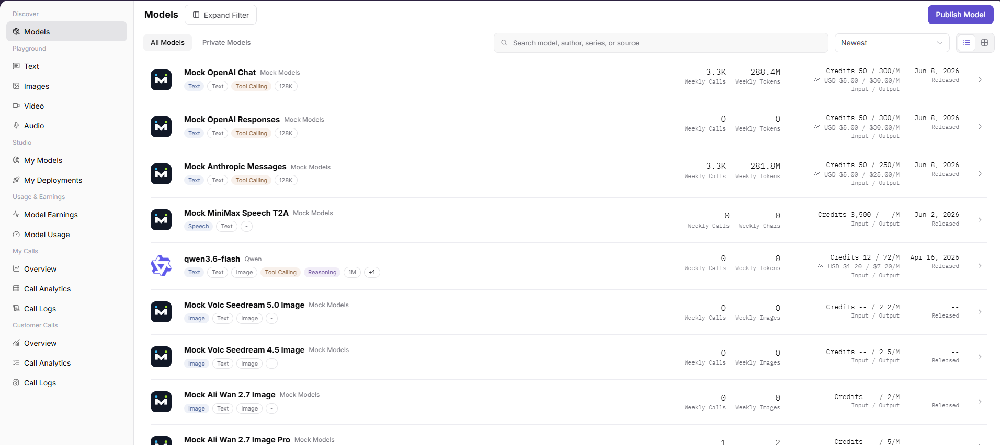
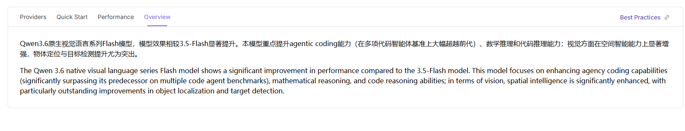
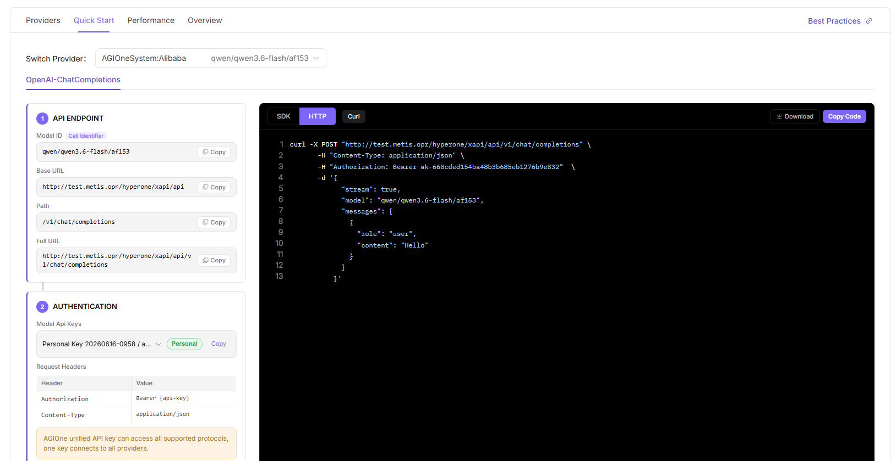

# Model Marketplace

:::: info Document Information
Version: v1.0
Updated: 2026-07-06
::::

## Feature Overview

`Model Marketplace` is used to maintain or view model lists, providers, quick start, performance metrics, and model overview. It supports model publishing, experimentation, calling, statistics, and operational governance.

| Item | Content |
| --- | --- |
| Applicable role | Regular user |
| Navigation path | Discover > Model Marketplace |
| Page route | /user/discover/models |
| Managed objects | Model lists, providers, quick start, performance metrics, and model overview |
| Typical use | Discover models, view providers, and obtain redacted call methods |

### Beginner Explanation

The model marketplace is like a model catalog. Users first check model capabilities and providers, then enter quick start to obtain Base URL, Path, Full URL, and authentication method. Call examples must use placeholders and must not contain real API Keys.

### Terms Quick Reference

| Term | Description |
| --- | --- |
| Base URL | Base address of the model service. The example uses `https://api.example.com/v1`. |
| Full URL | Complete call address. The example uses `https://api.example.com/v1/chat/completions`. |
| Provider | Organization or channel that provides the model instance. |
| Personal Key | Personal call key. This is a sensitive credential. |

## Prerequisites

1. The current account has model marketplace access permission.
2. The target model has been listed and is visible to the current account or customer.
3. Before calling, quota, pricing, context limits, and terms of use have been confirmed.
## Page Description

This page displays model list, model details, provider instances, recommendation tags, quick start, and performance information. Users should first confirm Model ID and provider, then copy call examples that use placeholders.

Page screenshot:

Used to search models, view providers, and filter tags.

## Main Operations

### Steps

1. Go to `Discover > Model Marketplace`.
2. Filter by model name, author, tag, or model type.
3. Open target model details.
4. In the provider tab, view recommendation tags, billing, and performance metrics.
5. Go to the quick-start tab and view examples for Model ID, Base URL, Path, and Full URL.

Key screenshots:

Confirm model capability, context, and pricing boundaries in the overview.

Replace placeholders in call examples with real credentials.

### Parameters

| Field Name | Required | Field Type | Example | Description |
| --- | --- | --- | --- | --- |
| Model Name | Yes | Text | `DeepSeek-V4-Pro` | Model display name. |
| Model ID | Yes | Text | `provider/model/version` | Identifier used when calling the model. |
| Provider | Yes | Dropdown | `AGIOneSystem` | Channel that provides the model instance. |
| Recommendation Tag | No | Tag | `Recommended` | Platform recommendation or status tag. |
| Full URL | Yes | URL | `https://api.example.com/v1/chat/completions` | Complete call address example. |

### Pitfalls

- The same model may have multiple providers. Confirm the selected provider instance before calling.
- Copy the exact Model ID from the provider instance.
- The API Key in quick-start examples must be replaced with a personal authorized key.

### Result Checks

1. The model details page displays capabilities, provider, pricing, context, and quick-start information.
2. After filters change, model list results update together.
3. Copied call examples use redacted placeholder credentials.
## FAQ

### Cannot Find the Target Model

**Symptom:**

After searching by model name, provider, or tag in the model marketplace, the expected model is not found.

**Possible Causes:**

- The model is not published to the current visibility scope.
- Filters restrict provider, modality, price, or recommendation tags.
- The model is delisted, under review, or its source is unavailable.

**Handling:**

1. Clear filters and search again by model name or Model ID.
2. Enter model details or provider information and confirm whether the model is open to the current account.
3. If the model should be visible but is still invisible, contact the model provider or operator to verify publishing scope.

### Model Details Are Incomplete

**Symptom:**

Model details are missing pricing, context length, input/output modalities, quick-start examples, or provider notes.

**Possible Causes:**

- The model provider has not completed model materials.
- Model template or meta-model fields are incomplete.
- Page data synchronization is delayed.

**Handling:**

1. First check whether model name, provider, Model ID, and protocol are complete.
2. Do not formally integrate models that lack pricing, rate limits, or usage boundary descriptions.
3. Report missing fields to the model provider and validate again after supplementation.

### Model Source Shows Unavailable

**Symptom:**

The model is visible in the marketplace, but details or quick start indicates that the source is abnormal, not callable, or temporarily unavailable.

**Possible Causes:**

- Upstream Endpoint, authentication request headers, or API Key expired.
- Model source connectivity test failed.
- Provider temporarily delisted or rate-limited the model.

**Handling:**

1. View source status, protocol, and available region prompts on the details page.
2. Use a similar available model for temporary validation.
3. Contact the provider to verify Endpoint, authentication method, and service health.

## Next Steps

1. Go to model details and view Model ID, context length, pricing, rate limits, and input/output modalities.
2. Use the redacted call example in quick start for local validation.
3. Go to text, image, audio, or video Playground pages and observe output.
4. Before production integration, confirm quota, call limits, and model source availability.

## Notes

- Do not externally share screenshots containing call credentials or customer identifiers from details pages.
- Model capabilities, pricing, and context limits are subject to the details page.
- Endpoints and API Keys in quick-start examples must be replaced according to the actual environment.
