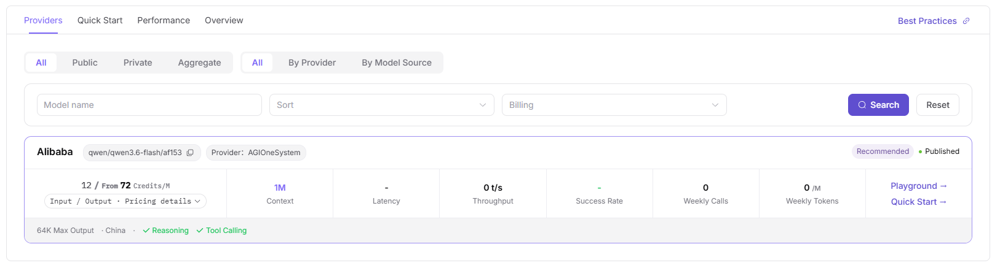
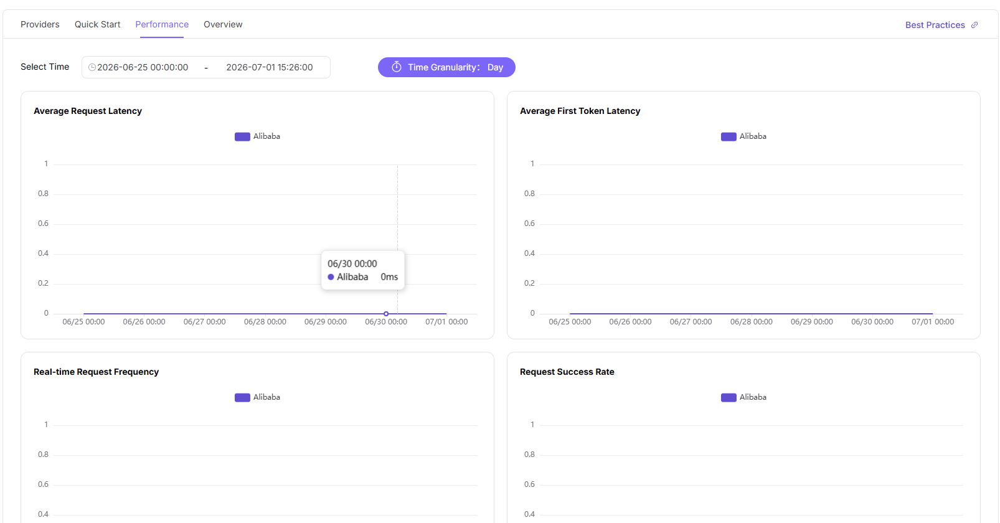

# Models

::: info Document Information
Version: v1.0
Updated: 2026-07-08
:::

## Feature Overview

The Models page helps users discover available models, compare providers, review quick-start information, and check performance details before trying or calling a model.

| Item | Content |
| --- | --- |
| Applicable role | Regular user |
| Navigation path | Model Services > Discover > Models |
| Page route | `/modelone/store/model` |
| Managed objects | Model lists, providers, quick start, performance metrics, and model overview |
| Typical use | Discover models, view providers, and obtain redacted call methods |

#### Beginner Explanation

The Models page is like a model catalog. Users first check model capabilities and providers, then enter quick start to obtain Base URL, Path, Full URL, and authentication method. Call examples must use placeholders and must not contain real API Keys.

#### Terms Quick Reference

| Term | Description |
| --- | --- |
| Base URL | Base address of the model service. The example uses `https://api.example.com/v1`. |
| Full URL | Complete call address. The example uses `https://api.example.com/v1/chat/completions`. |
| Provider | Organization or channel that provides the model instance. |
| Personal Key | Personal call key. This is a sensitive credential. |

## Prerequisites

1. The current account has model marketplace access permission.
2. The target model has been listed and is visible to the current account or customer.
3. Before calling, quota, pricing, context limits, and terms of use have been confirmed.

::: warning Call and Billing Risk
Trying a model, submitting a prompt, or calling an API may create call records, consume credits, or generate billing records. For page validation only, view the model list and details. Do not submit a real call request.
:::

## Page Description

This page displays model lists, model details, provider instances, recommendation tags, quick start, and performance information. Users should confirm the model name, Model ID, provider, capability tags, input/output modalities, pricing, and status before trying or calling a model.

Page screenshot:

Used to search models, view providers, filter model types, and confirm model card information.

## Main Operations

### View Model

1. Go to `Model Services > Discover > Models`.
2. In the model list, view model name, author, model type, input/output capabilities, billing method, weekly calls, weekly token volume, release time, and other information.
3. Filter target models by model name, author, model series, model source, model type, capability, context length, billing, or scenario.
4. Click `View` on the target model card to open the model details page.
5. On the details page, view model introduction, author, Model ID, context, input/output limits, reference pricing, input/output modalities, capabilities, and supported protocols.
6. Switch between `Providers`, `Quick Start`, `Performance`, and `Overview` to view provider instances, call methods, performance metrics, and model descriptions.
7. To try the model, use the `Playground` entry on the details page. For page validation only, view details and do not submit a call request.

The Providers tab shows provider instances, recommendation status, billing, context, latency, throughput, success rate, and weekly usage data.

Documentation examples and screenshots must remain redacted. Use real personal keys only in an approved integration environment.

The Performance tab shows time range, time granularity, average request latency, average first token latency, real-time request frequency, request success rate, and token request volume.

Confirm model capability, context, and pricing boundaries in the overview.

## Parameter Reference

| Field Name | Required | Field Type | Example | Description |
| --- | --- | --- | --- | --- |
| Model Name | Yes | Text | `Qwen3.7-Plus` | Display name used to identify the model in the list and details page. |
| Provider | Yes | Text / Filter | `AGIOneSystem` | Organization or channel that provides the model instance. |
| Model Type | No | Filter / Tag | `Text` | Distinguishes multimodal, text, image, speech, video, embedding, reranking, and other model types. |
| Capability Tags | No | Tag | `Tool Calling` | Shows model capabilities such as tool calling or reasoning. |
| Input/Output Modalities | No | Tag | `Text / Image` | Shows supported input and output types. |
| Billing Method | No | Text | `Credits / 1M Tokens` | Shows the model billing unit for input, output, or per-request pricing. |
| Status | No | Tag | `Published` | Shows the availability status of the model or provider instance. |
| Actions | No | Button | `View`, `Playground` | Used to open model details or enter the playground. |

## Pitfalls

- The same model may have multiple providers. Confirm the selected provider instance before calling.
- Copy the exact Model ID from the provider instance.
- The API Key in quick-start examples must be replaced with a personal authorized key.
- Trying a model or submitting a prompt may create call records, consume credits, or generate billing records. Do not submit real calls when learning the page.

## Result Validation

| Check Item | Success Signal | If Abnormal |
| --- | --- | --- |
| Model list is accessible | Model cards or list entries are displayed, and the filter area loads correctly. | Check account permissions, navigation path, and page loading status. |
| Filters are available | After changing model type, capability, provider, or scenario filters, list results update accordingly. | Clear filters and search again, or refresh the page. |
| Model details can be opened | Clicking `View` opens the details page with model introduction, providers, pricing, context, and modality information. | Return to the list and open the model again, or check whether the model is still visible to the current account. |
| Details match the list | Model name, author, status, and billing information in details are consistent with the list. | Use the details page as the source of truth and report synchronization issues if needed. |
| No real call is submitted | During learning or validation, no prompt is submitted, no API call is made, and no credits are consumed. | If the playground is opened accidentally, close it or go back without submitting a call request. |
## FAQ

#### Cannot Find the Target Model

**Symptom:**

After searching by model name, provider, or tag in the model marketplace, the expected model is not found.

**Possible Causes:**

- The model is not published to the current visibility scope.
- Filters restrict provider, modality, price, or recommendation tags.
- The model is delisted, under review, or its source is unavailable.

**Handling:**

1. Clear filters and search again by model name or Model ID.
2. Enter model details or provider information and confirm whether the model is open to the current account.
3. If the model should be visible but is still invisible, contact the model provider or operator to verify publishing scope.

#### Model Details Are Incomplete

**Symptom:**

Model details are missing pricing, context length, input/output modalities, quick-start examples, or provider notes.

**Possible Causes:**

- The model provider has not completed model materials.
- Model template or meta-model fields are incomplete.
- Page data synchronization is delayed.

**Handling:**

1. First check whether model name, provider, Model ID, and protocol are complete.
2. Do not formally integrate models that lack pricing, rate limits, or usage boundary descriptions.
3. Report missing fields to the model provider and validate again after supplementation.

#### Model Source Shows Unavailable

**Symptom:**

The model is visible in the marketplace, but details or quick start indicates that the source is abnormal, not callable, or temporarily unavailable.

**Possible Causes:**

- Upstream Endpoint, authentication request headers, or API Key expired.
- Model source connectivity test failed.
- Provider temporarily delisted or rate-limited the model.

**Handling:**

1. View source status, protocol, and available region Prompts on the details page.
2. Use a similar available model for temporary validation.
3. Contact the provider to verify Endpoint, authentication method, and service health.

## Next Steps

1. Go to model details and view Model ID, context length, pricing, rate limits, and input/output modalities.
2. Use the redacted call example in quick start for local validation.
3. Go to text, image, audio, or video Playground pages and observe output.
4. Before production integration, confirm quota, call limits, and model source availability.

## Notes

- Do not externally share screenshots containing call credentials or customer identifiers from details pages.
- Model capabilities, pricing, and context limits are subject to the details page.
- Endpoints and API Keys in quick-start examples must be replaced according to the actual environment.
