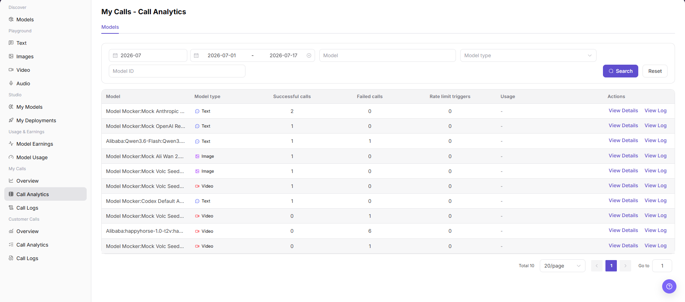

# My Calls - Call Analytics

::: info Document Information
Version: v1.0
Updated: 2026-07-08
:::

## Feature Overview

`My Calls - Call Analytics` is used to view call statistics for the current account by model, including successful calls, failed calls, rate limit triggers, usage, and action entries. It helps users locate abnormal models and jump to details or logs.

| Item | Content |
| --- | --- |
| Applicable role | Regular user |
| Navigation path | Model Services > My Calls > Call Analytics |
| Page route | `/modelone/monitoring/calls/list` |
| Managed objects | Model, model type, successful calls, failed calls, rate limit triggers, usage, and call log entries |
| Typical use | View call statistics and abnormal call status by model |

#### Beginner Explanation

`Call Analytics` is a model-level ranking table for personal calls. It summarizes success, failure, and rate-limit counts by model. Users can filter target models first, and then continue troubleshooting through `View Details` or `View Log`.

#### Terms Quick Reference

| Term | Description |
| --- | --- |
| Successful calls | Number of calls completed successfully within the filter range. |
| Failed calls | Number of calls that returned errors, timed out, or failed within the filter range. |
| Rate limit triggers | Number of calls blocked by model, Key, quota, or policy limits. |
| Usage | Model usage status or additional statistics shown by the page. |
| View Details | Entry to model-level statistical details. |
| View Log | Entry to call logs for the corresponding model. |

## Prerequisites

1. The current account has access to the `Call Analytics` page.
2. The current account has call records in the statistical period, or the billing cycle and date range to view have been confirmed.
3. Before viewing or screenshots, confirm whether model names, Key names, fees, business applications, and call volume need to be redacted.

::: warning Sensitive Information Boundary
Call analytics may contain sensitive operational data such as fees, call volume, Key names, business applications, model names, and abnormal calls. This document only describes viewing statistics. It does not display real accounts, Keys, request content, fee details, or internal test parameters. If an export entry exists, this document only describes the viewing boundary and does not guide exporting sensitive data.
:::

## Page Description

The top of the page provides filters for billing cycle, date range, model, model type, and model ID, with `Search` and `Reset` buttons. The table shows Model, Model type, Successful calls, Failed calls, Rate limit triggers, Usage, and Actions.

## Main Operations

### View My Call Analytics

1. Go to `Model Services > My Calls > Call Analytics`.
2. Select billing cycle and date range, and enter or select `Model`, `Model type`, and `Model ID` as needed.
3. Click `Search` to refresh statistics. To clear filters, click `Reset`.
4. In the statistics table, view `Model`, `Model type`, `Successful calls`, `Failed calls`, `Rate limit triggers`, and `Usage`.
5. To view model-level statistics, click `View Details`.
6. To view single-request details, click `View Log` or go to `Call Logs`.
7. Before screenshots or external communication, confirm that model names, Key names, fees, call volume, and business applications are redacted.

## Parameter Reference

| Field Name | Required | Field Type | Example | Description |
| --- | --- | --- | --- | --- |
| Time Range | Yes | Month / date range | `2026-07` | Controls the statistical period for call analytics. |
| Model | No | Input / selector | Enter on page | Filters statistics by model name. |
| Application | No | Selector | Displayed on page | If the page provides an application dimension, filters call analytics by business application. |
| Key | No | Selector | Displayed on page | If the page provides a Key dimension, identifies the call source by Key. |
| Calls | System-generated | Number | `2` | Number of model calls within the filter range, which may be composed of success and failure statistics. |
| Token Usage | System-generated | Number | Displayed on page | If the page shows token dimensions, it is used to view model consumption. |
| Cost | System-generated | Number | Displayed by page unit | If the page shows cost dimensions, redact it before sharing. |
| Success Rate | System-generated | Percentage / statistic | Calculated by page | Can be calculated from successful calls and total calls. |
| Failure Rate | System-generated | Percentage / statistic | Calculated by page | Can be calculated from failed calls and total calls. |
| Average Latency | System-generated | Number | Displayed on page | If the page shows latency dimensions, it is used to measure response speed. |
| Status | System-generated | Tag / statistic | `Success` / `Failed` / `Rate limited` | Distinguishes successful calls, failed calls, or rate-limit triggers. |

## Result Validation

| Check Item | Success Criteria | Troubleshooting |
| --- | --- | --- |
| Page is accessible | The `My Calls - Call Analytics` page opens normally, and `My Calls > Call Analytics` is highlighted in the sidebar. | Check account permissions, navigation path, and page loading status. |
| Statistics display normally | Model, Model type, Successful calls, Failed calls, Rate limit triggers, and action entries are displayed normally. | Expand the time range or confirm whether the current account has call records. |
| Chart or statistics table loads normally | The call analytics table loads and shows model-level data. | Refresh the page, or switch billing cycle and date range and retry. |
| Filters are available | Billing cycle, date range, Model, Model type, and Model ID can be entered or selected. | Click `Reset` and enter filter conditions again. |
| Search / Reset is available | Clicking `Search` refreshes the table, and clicking `Reset` clears filter conditions. | Check filter format and network status. |
| Statistics match filters | Model, model type, and call counts in the table update with filter conditions. | Compare Call Logs to confirm statistical delay and filter range. |

## FAQ

#### What if call analytics is empty?

Expand the billing cycle or date range first, and clear Model, Model type, and Model ID filters. If it is still empty, go to Call Logs to confirm whether request records exist.

#### Why are failed calls or rate limit triggers abnormal?

Possible causes include model source issues, request parameter changes, limited Key or quota, or rate-limit rules. Click `View Log` to check error codes, request time, and status.

#### Can I export call analytics?

Call analytics may contain model names, Keys, call volume, fees, and business application information. Before export, confirm permissions, redaction requirements, and usage scope. This document does not guide exporting sensitive data.

## Next Steps

1. Click `View Details` to view model-level statistics.
2. Click `View Log` or go to `Call Logs` to troubleshoot single requests.
3. Adjust call strategy based on failed calls, rate-limit triggers, and model type.

## Notes

- Do not write real accounts, Keys, request content, fee details, or internal test parameters in the document.
- Call analytics is aggregate data. Use Call Logs for single-request troubleshooting.
- Use only redacted statistics for external communication.
