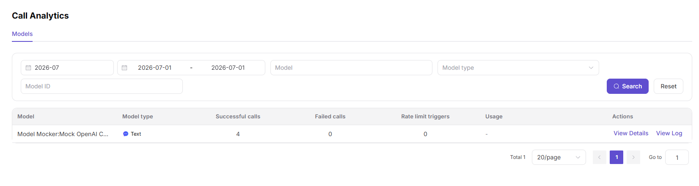

# My Call Analytics

:::: info Document Information
Version: v1.0
Updated: 2026-07-08
::::

## Feature Overview

`My Call Analytics` is used to maintain or view call trends, model distribution, Token trends, success rate, and fee analysis. It supports model publishing, experimentation, calling, statistics, and operational governance.

| Item | Content |
| --- | --- |
| Applicable role | Regular user |
| Navigation path | My Calls > Call Analytics |
| Page route | /user/my-calls/call-analytics |
| Managed objects | Call trends, model distribution, Token trends, success rate, and fee analysis |
| Typical use | Analyze trends and statistical rules for calls initiated by me |

### Beginner Explanation

My Call Analytics is like a call trend report. It is used to observe how your call volume, Tokens, success rate, and fees change over time.
### Terms Quick Reference

| Term | Description |
| --- | --- |
| Trend | Call changes aggregated by time. |
| Statistical granularity | Data summarized by hour, day, or month. |
| Model distribution | Call share across different models. |
| Fee trend | Call consumption changes over time. |

## Prerequisites

1. The current account has permission to view call analytics.
2. Statistical time range and granularity have been determined.
3. To locate anomalies, model, app, or status filters have been prepared.
## Page Description

This page only analyzes call trends and statistical rules for the current account. It is suitable for viewing call volume, Tokens, success rate, and fees over time.

Page screenshot:

Used to view call trends, Token trends, and success rate changes.

## Main Operations

### Steps

1. Go to `My Calls > Call Analytics`.
2. Select statistical time and granularity.
3. View call volume, Tokens, success rate, and fee trends.
4. Split trends by model or app.
5. After finding an abnormal date, return to call logs for sampling.

### Parameters

| Field Name | Required | Field Type | Example | Description |
| --- | --- | --- | --- | --- |
| Statistical Granularity | Yes | Enum | `Day` | Aggregation rule such as hour, day, or month. |
| Time Range | Yes | Date range | `Last 30 days` | Trend window. |
| Model | No | Dropdown | `qwen-plus` | Trend split object. |
| Call Volume Trend | System-generated | Chart | `Line chart` | Request volume changes. |
| Fee Trend | System-generated | Chart | `Bar chart` | Consumption changes. |

### Pitfalls

- Trend charts are aggregate data and cannot replace single logs.
- For cross-month statistics, pay attention to billing rules and time zone.
- Abnormal peaks need to be explained together with publishing, promotions, or customer call changes.

### Result Checks

1. Trend charts show call volume, Tokens, success rate, and fee data.
2. After switching statistical granularity, charts and summary rules update together.
3. Abnormal peaks can be cross-checked with request records in call logs.
## FAQ

### Trend Chart Has an Abnormal Peak

**Symptom:**

Call volume, Tokens, or fees increase significantly in a certain hour or day.

**Possible Causes:**

- Business traffic surged.
- Caller retries or loop calls occurred.
- Statistical backfill tasks merged data into the account.

**Handling:**

1. Split by model and app.
2. Go to call logs and sample failed and high-Token requests.
3. Check whether backfill or business activity exists.

### Trend and Overview Numbers Do Not Match

**Symptom:**

Call analytics chart totals do not exactly match overview cards.

**Possible Causes:**

- Statistical granularity or time range differs.
- Data synchronization is delayed.
- Overview and trend use different aggregation rules.

**Handling:**

1. Align time range and filters.
2. Wait for statistical synchronization.
3. Reconcile against exported details or system rule descriptions.
## Next Steps

1. Go to call logs and sample-check abnormal requests.
2. Adjust call strategy by model or app.
3. Evaluate cost changes together with fee data.
## Notes

- Trend charts are aggregate data and are not suitable for locating the cause of a single request.
- Pay attention to time zones and statistical periods for cross-day or cross-month analysis.
- Redact fees, customer identifiers, and business app names before screenshots.
