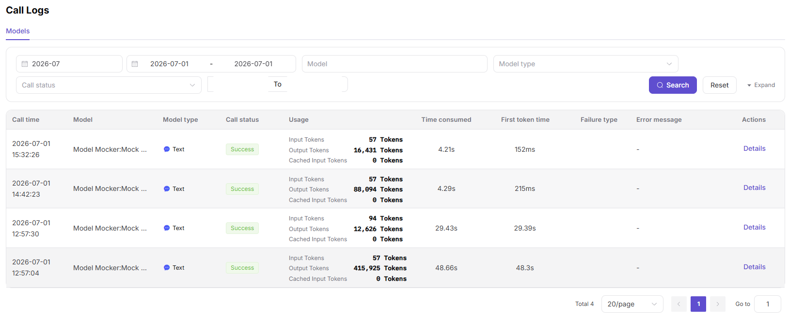

# My Call Logs

:::: info Document Information
Version: v1.0
Updated: 2026-07-06
::::

## Feature Overview

`My Call Logs` is used to maintain or view single-request logs, request IDs, error codes, latency, Tokens, and upstream return summaries. It supports model publishing, experimentation, calling, statistics, and operational governance.

| Item | Content |
| --- | --- |
| Applicable role | Regular user |
| Navigation path | My Calls > Call Logs |
| Page route | /user/my-calls/call-logs |
| Managed objects | Single-request logs, request IDs, error codes, latency, Tokens, and upstream return summaries |
| Typical use | Troubleshoot a single call initiated by me |

### Beginner Explanation

My Call Logs are like receipts for each request. They record request ID, error code, latency, Tokens, and redacted summary, and are suitable for locating a single failure.
### Terms Quick Reference

| Term | Description |
| --- | --- |
| Request ID | Unique tracking identifier for a single call. |
| Error code | Error type of a failed call. |
| Latency | Time from request initiation to response. |
| Upstream return | Status or error summary returned by the model provider. |

## Prerequisites

1. The current account has permission to view My Call Logs.
2. Location conditions such as request ID, time range, model name, or error code have been prepared.
3. Use only redacted request summaries for troubleshooting.
## Page Description

This page is only used to view single-request logs initiated by the current account. Troubleshooting focuses on request ID, error code, status, latency, and redacted response summary.

Page screenshot:

Used to locate a single call by request ID, error code, and latency.

## Main Operations

### Steps

1. Go to `My Calls > Call Logs`.
2. Enter request ID or select a time range.
3. Filter by model, status, or error code.
4. Open a single log and view latency, Tokens, and error summary.
5. Return to model configuration or quota pages based on the error code.

### Parameters

| Field Name | Required | Field Type | Example | Description |
| --- | --- | --- | --- | --- |
| Request ID | Conditionally required | Text | `req-20260706-001` | Single-request tracking identifier. |
| Error Code | No | Text | `429` | Failed request type. |
| Status | No | Enum | `Failed` | Request processing result. |
| Latency | System-generated | Number | `820ms` | Request elapsed time. |
| Token Usage | System-generated | Number | `2048` | Consumption for this request. |

### Pitfalls

- Do not copy complete Prompts or response content into public tickets.
- Request ID is key for troubleshooting. Keep the redacted ID in screenshots.
- 429 is mostly related to rate limits or quota and does not necessarily mean the model is unavailable.

### Result Checks

1. Records can be located by request ID, status, model, or time range.
2. Log details show error code, latency, Tokens, and redacted summary.
3. Failed requests can be associated with actionable handling suggestions.
## FAQ

### Cannot Find Logs by Request ID

**Symptom:**

No matching record appears after entering the request ID.

**Possible Causes:**

- The request ID is incomplete.
- The time range does not cover when the request occurred.
- The request does not belong to the current account.

**Handling:**

1. Verify the complete request ID.
2. Expand the time range.
3. Confirm whether the current account initiated the request.

### Log Shows 429 or Rate Limit

**Symptom:**

The request status is failed, and the error code points to rate limiting or frequency restriction.

**Possible Causes:**

- Short-term request volume exceeded model rate limits.
- Customer or account quota is insufficient.
- Retry strategy is too aggressive.

**Handling:**

1. Reduce concurrency or add exponential backoff.
2. Check quota and rate-limit policy.
3. Apply for rate-limit adjustment if needed.
## Next Steps

1. Adjust request parameters based on error code.
2. Provide request ID to the operator for further troubleshooting.
3. Return to call analytics to check whether this is a batch anomaly.
## Notes

- Do not copy complete Prompts, response bodies, or API Keys into tickets.
- Request ID, time range, and error code are the priority troubleshooting information.
- Log data may be cleaned according to retention period.
