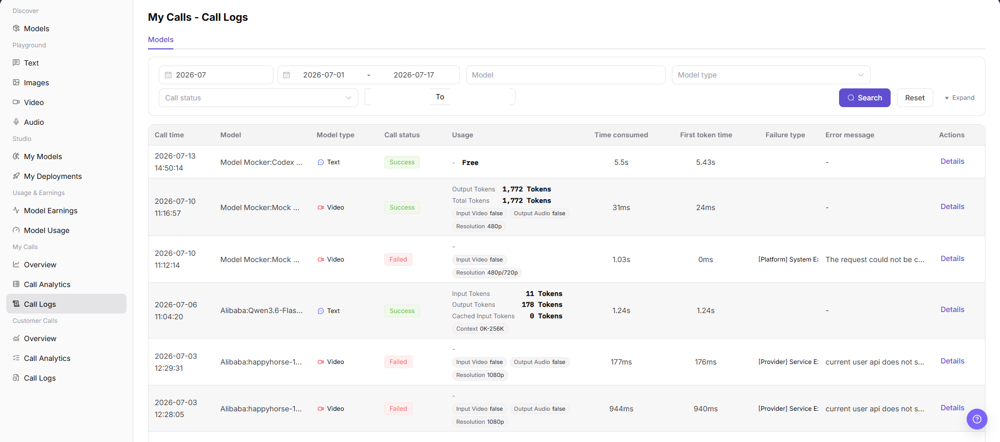

# My Calls - Call Logs

::: info Document Information
Version: v1.0
Updated: 2026-07-08
:::

## Feature Overview

`My Calls - Call Logs` is used to view model call records initiated by the current account, including call time, model, model type, call status, usage, time consumed, first token time, failure type, error message, and the details entry. It helps users locate single-call issues.

| Item | Content |
| --- | --- |
| Applicable role | Regular user |
| Navigation path | Model Services > My Calls > Call Logs |
| Page route | `/modelone/monitoring/calls/log` |
| Managed objects | Model call logs, call status, latency, token usage, and error messages for the current account |
| Typical use | View single-call logs and locate failed or slow calls |

#### Beginner Explanation

Call Logs are like receipts for model requests. Users can filter records by time, model, model type, or call status, and then click `Details` to view more information about a single call.

#### Terms Quick Reference

| Term | Description |
| --- | --- |
| Call time | Time when a single call occurred. |
| Call status | Call processing result, such as `Success` or `Failed`. |
| Usage | Token, free quota, or multimodal input/output usage shown by the page. |
| Time consumed | Total time consumed by the request. |
| First token time | Time consumed before the first token is returned by a text model. |
| Failure type | Category of a failed request, such as platform or provider errors. |

## Prerequisites

1. The current account has access to the `Call Logs` page.
2. The time range, model, model type, or call status to view has been clarified.
3. Use only redacted log information for troubleshooting.

## Page Description

Call logs may contain request content, response content, Key names, costs, error details, and business troubleshooting information. This document only describes viewing logs and does not display real requests, responses, Keys, accounts, cost details, or internal test parameters. If the page provides an export entry, this document only describes the viewing boundary and does not guide exporting sensitive data.

Page screenshot:

## Main Operations

### View My Call Logs

1. Go to `Model Services > My Calls > Call Logs`.
2. On the `Models` tab, view call time, model, model type, call status, usage, time consumed, first token time, failure type, error message, and action entries.
3. Select filters such as month, date range, model, model type, or call status.
4. Click `Search` to view matching call logs.
5. Click `Reset` to clear filters. To view more filters, click `Expand`.
6. Click `Details` for the target log to view more information about a single call. When viewing details, hide sensitive content such as requests, responses, Keys, and costs.

## Parameter Reference

| Field Name | Required | Field Type | Example | Description |
| --- | --- | --- | --- | --- |
| Month | Yes | Month selector | `2026-07` | Controls the statistical month for call logs. |
| Date Range | Yes | Date range | `2026-07-01 to 2026-07-17` | Controls the query time range for call logs. |
| Model | No | Input | Enter on page | Filters call logs by model name. |
| Model Type | No | Selector | `Text` / `Video` | Filters call logs by model capability type. |
| Call Status | No | Selector | `Success` / `Failed` | Filters logs by call processing result. |
| Call Time | System-generated | Time | Displayed on page | Shows when a single call occurred. |
| Usage | System-generated | Text / tag | Displayed on page | Shows token, free quota, or multimodal input/output usage. |
| Time Consumed | System-generated | Time | Displayed on page | Shows the total time consumed by a single call. |
| First Token Time | System-generated | Time | Displayed on page | Shows the time before the first token is returned. |
| Failure Type | System-generated | Text | Displayed on page | Shows the issue category for a failed request. |
| Error Message | System-generated | Text | Displayed on page | Shows the error summary for a failed request. Redact it before screenshots or external communication. |
| Actions | No | Action entry | `Details` | Opens single-call log details. |

## Result Validation

| Check Item | Success Criteria | Handling If Abnormal |
| --- | --- | --- |
| Page is accessible | The `My Calls - Call Logs` page opens normally, and `My Calls > Call Logs` is highlighted in the sidebar. | Check account permissions, navigation path, and page loading status. |
| Call log list loads normally | The list shows columns such as call time, model, call status, usage, latency, and error message. | Refresh the page or retry after adjusting the month and date range. |
| Filters are available | After filtering by month, date range, model, model type, or call status, the list refreshes. | Check whether filters are too narrow, and click `Reset` if needed. |
| Search / Reset works | `Search` displays matching logs, and `Reset` clears the filters. | Check network status, page API responses, and account permissions. |
| Log details can be opened | Clicking `Details` opens more information about a single call. | Confirm that the record is still within the log retention period. |
| Field information is consistent | Call status, time consumed, usage, failure type, and error message are consistent with the details page. | Reopen details or expand the time range for cross-checking. |

## FAQ

#### What if the target call log cannot be found?

First confirm that the month and date range cover the call time, and then check model, model type, and call status filters. Click `Reset` and search again if needed.

#### Why is the call status Failed?

Failures are usually related to request parameters, model services, provider APIs, platform errors, rate limits, or quotas. Check the failure type and error message first, and then open `Details` to view redacted single-call information.

#### Can I export call logs?

Call logs may contain requests, responses, Keys, costs, and error details. Before exporting, confirm permissions, redaction requirements, and usage scope. This document only describes viewing logs and does not guide exporting sensitive data.

## Next Steps

1. Adjust request parameters or calling methods based on the failure type and error message.
2. To troubleshoot a single request, open `Details` and view redacted log information.
3. To determine whether the issue is a batch anomaly, go back to `My Calls > Call Analytics` and view aggregated data.

## Notes

- Do not expose complete requests, response bodies, Keys, accounts, or cost details in documentation, screenshots, or tickets.
- Call log data may be cleaned according to the retention period. Confirm the time range first during troubleshooting.
- Error messages are only used for troubleshooting and must be redacted before public communication.
