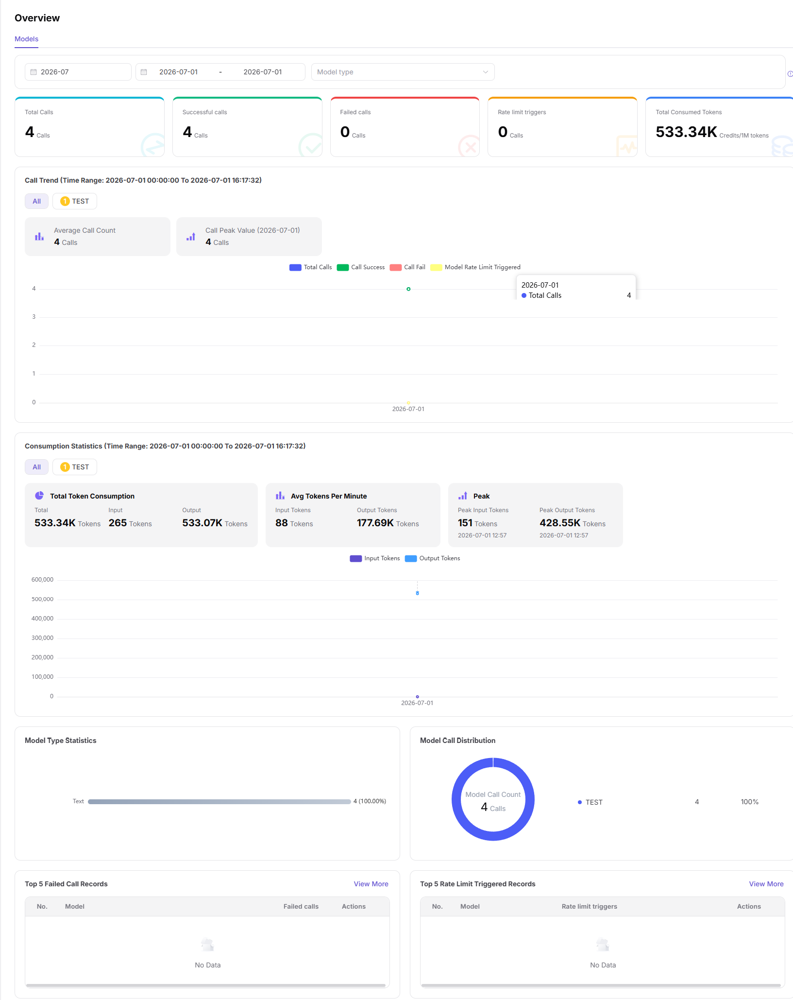

# My Call Overview

::: info Document Information
Version: v1.0
Updated: 2026-07-08
:::

## Feature Overview

My Call Overview summarizes call volume, success rate, Token usage, fees, and core model metrics for requests initiated by the current account. Use it as the starting point before opening logs or analytics.

| Item | Content |
| --- | --- |
| Applicable role | Regular user |
| Navigation path | My Calls > Overview |
| Page route | /user/my-calls/overview |
| Managed objects | Call volume, success rate, Token usage, fees, and core model metrics for calls initiated by me |
| Typical use | View my overall call status |

### Beginner Explanation

My Call Overview is like a personal billing homepage. It quickly shows call volume, success rate, Tokens, and fees for calls initiated by you.
### Terms Quick Reference

| Term | Description |
| --- | --- |
| Call volume | Number of requests initiated by the current account. |
| Token usage | Input and output Token consumption. |
| Success rate | Successful requests as a percentage of total requests. |
| Fees | Call consumption converted by billing rules. |

## Prerequisites

1. The current account has permission to view My Call Overview.
2. The time range to be counted has been selected.
3. For reconciliation, model, app, or caller filters have been confirmed.
## Page Description

This page only displays overview metrics for calls initiated by the current account, including call volume, success rate, Token usage, and fees. It is not used to view single-request details.

Page screenshot:

Used to view call volume, success rate, Tokens, and fees for calls initiated by yourself.

## Main Operations

### Steps

1. Go to `My Calls > Overview`.
2. Select a time range.
3. View call volume, success rate, Token usage, and fee cards.
4. Filter overview results by model or app.
5. After finding an anomaly, jump to call logs or call analytics.

### Parameters

| Field Name | Required | Field Type | Example | Description |
| --- | --- | --- | --- | --- |
| Time Range | Yes | Date range | `Last 7 days` | Overview statistical window. |
| Model | No | Dropdown | `qwen-plus` | Filter overview by model. |
| Call Volume | System-generated | Number | `1024` | Number of requests from the current account. |
| Success Rate | System-generated | Percentage | `99.5%` | Percentage of successful requests. |
| Fees | System-generated | Number | `12.3 Credits` | Call consumption. |

### Pitfalls

- Overview does not display request bodies. To troubleshoot a single error, go to call logs.
- Statistical data may be delayed and is not suitable for second-level troubleshooting.
- Fee anomalies need to be checked together with model usage and billing rules.

### Result Checks

1. Call volume, success rate, Token usage, and fee cards display data.
2. After switching time range, trends and summary cards update together.
3. Abnormal peaks in the overview can jump or map to call logs.
## FAQ

### Overview Data Is Empty

**Symptom:**

Call volume, Tokens, and fees are all empty in the current time range.

**Possible Causes:**

- The current account did not initiate calls in this time range.
- Model or app filters are too narrow.
- The statistics task has not completed.

**Handling:**

1. Expand the time range and view again.
2. Clear model or app filters.
3. Wait for statistical synchronization and review again.

### Success Rate Drops Suddenly

**Symptom:**

The overview card shows a success rate significantly lower than usual.

**Possible Causes:**

- A model is rate-limited, timed out, or unavailable.
- Request parameter errors are concentrated.
- Caller retries in a short time increase failures.

**Handling:**

1. Split by model to view the anomaly source.
2. Go to call logs and filter failed requests.
3. Adjust call parameters or contact the operator based on error codes.
## Next Steps

1. Go to My Call Logs to view single requests.
2. Go to Call Analytics to view trend changes.
3. Adjust call strategy based on abnormal models or time periods.
## Notes

- The overview page only displays aggregate data, not complete Prompts or response bodies.
- Fee and Token statistics may be delayed.
- Redact model names, app names, and sensitive fee information before export or screenshots.
