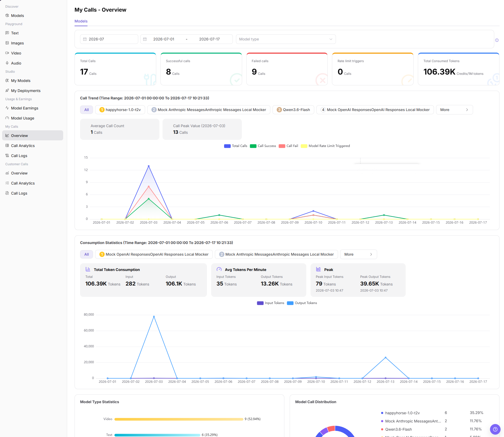

# My Calls - Overview

::: info Document Information
Version: v1.0
Updated: 2026-07-08
:::

## Feature Overview

`My Calls - Overview` shows the overall status of calls initiated by the current account, including total calls, successful calls, failed calls, rate limit triggers, total consumed tokens, call trends, consumption statistics, model type statistics, and model call distribution.

| Item | Content |
| --- | --- |
| Applicable role | Regular user |
| Navigation path | Model Services > My Calls > Overview |
| Page route | `/modelone/monitoring/calls/overview` |
| Managed objects | My calls, successful calls, failed calls, rate limit triggers, token consumption, model types, and call distribution |
| Typical use | View personal call health and consumption trends |

#### Beginner Explanation

`My Calls - Overview` is a personal call dashboard. It first shows total calls, success and failure status, and token consumption, and then uses trend charts and statistics to help locate abnormal models or time periods.

#### Terms Quick Reference

| Term | Description |
| --- | --- |
| Total Calls | Total number of requests initiated by the current account within the filter range. |
| Successful calls | Number of requests completed successfully. |
| Failed calls | Number of requests that returned errors, timed out, or failed. |
| Rate limit triggers | Number of calls blocked by model, Key, quota, or policy limits. |
| Total Consumed Tokens | Total input and output tokens consumed within the filter range. |
| Call Trend | Time-based chart for total calls, call success, call fail, and model rate-limit triggers. |
| Consumption Statistics | Shows total token consumption, average token consumption, and peak values. |

## Prerequisites

1. The current account has access to the `Overview` page.
2. The current account has call records in the statistical period, or the time range to view has been confirmed.
3. Before viewing or screenshots, confirm whether model names, Key names, fees, and business identifiers need to be redacted.

::: warning Sensitive Information Boundary
The call overview may show sensitive operational data such as fees, call volume, model names, Key names, token consumption, and abnormal trends. This document only describes viewing the overview. It does not display real accounts, Keys, request content, fee details, or internal test parameters. If an export entry exists, this document only describes the viewing boundary and does not guide exporting sensitive data.
:::

## Page Description

The top of the page provides billing-cycle, date-range, and model-type filters. The page shows overview cards such as `Total Calls`, `Successful calls`, `Failed calls`, `Rate limit triggers`, and `Total Consumed Tokens`, and uses Call Trend, Consumption Statistics, Model Type Statistics, Model Call Distribution, Failed Call Records TOP5, and Rate Limit Trigger Records TOP5 to support call analysis.

## Main Operations

### View My Calls Overview

1. Go to `Model Services > My Calls > Overview`.
2. Select billing cycle, date range, and model type in the filter area.
3. View overview metrics such as `Total Calls`, `Successful calls`, `Failed calls`, `Rate limit triggers`, and `Total Consumed Tokens`.
4. View `Call Trend` and `Consumption Statistics`, and check average call count, call peak value, total token consumption, average token consumption, and peak values.
5. View `Model Type Statistics`, `Model Call Distribution`, `Failed Call Records TOP5`, and `Rate Limit Trigger Records TOP5`.
6. To investigate abnormal models or time periods, click `View more`, `View logs`, or go to `Call Analytics` and `Call Logs` for details.
7. Before screenshots or external communication, confirm that model names, Key names, fees, tokens, and call volume are redacted.

## Parameter Reference

| Field Name | Required | Field Type | Example | Description |
| --- | --- | --- | --- | --- |
| Time Range | Yes | Month / date range | `2026-07` | Controls the overview statistical period. |
| Model | No | Tag / selector | `All` | Views data by model in trend or statistics areas. |
| Application | No | Selector | Displayed on page | If the page provides an application dimension, filters the call overview by application. |
| Key | No | Selector | Displayed on page | If the page provides a Key dimension, identifies the call source by Key. |
| Calls | System-generated | Number | `17` | Total calls within the filter range. |
| Token Usage | System-generated | Number | `106.39K` | Total consumed input and output tokens. |
| Cost | System-generated | Number | Displayed by page unit | Call cost or fee statistics, which should be redacted when shared. |
| Success Rate | System-generated | Percentage / statistic | Calculated by page | Can be calculated from successful calls and total calls. |
| Failure Rate | System-generated | Percentage / statistic | Calculated by page | Can be calculated from failed calls and total calls. |
| Status | System-generated | Tag / statistic | `Success` / `Failed` / `Rate limited` | Distinguishes successful calls, failed calls, or rate-limit triggers. |

## Pitfalls

- My Calls Overview shows only the current account's visible scope, not organization-wide or customer-wide totals.
- When balance, Credits, or call count looks abnormal, check call logs, model usage, and billing pages together.
- Align model and time range before comparing data, otherwise different model versions may be mixed.

## Result Validation

| Check Item | Success Signal | If Abnormal |
| --- | --- | --- |
| Page is accessible | The `My Calls - Overview` page opens normally, and `My Calls > Overview` is highlighted in the sidebar. | Check account permissions, navigation path, and page loading status. |
| Overview metrics display normally | Total Calls, Successful calls, Failed calls, Rate limit triggers, and Total Consumed Tokens are displayed normally. | Expand the time range or confirm whether the current account has call records. |
| Trend charts load normally | Call Trend, Consumption Statistics, Model Type Statistics, and Model Call Distribution are displayed normally. | Refresh the page, or switch billing cycle and date range and retry. |
| Filters are available | Billing cycle, date range, and model type filters can be selected. | Clear filter conditions and view again. |
| Search / Reset is available | If the page provides `Search`, `Query`, or `Reset`, filter results can be refreshed or cleared. | Check filter format and network status. |
| Data matches filters | Metrics, trend charts, and TOP5 records update with filter conditions. | Compare Call Analytics or Call Logs to confirm statistical delay and filter range. |

## FAQ

#### What if overview data is empty?

Expand the billing cycle or date range first, and then confirm whether the current account initiated calls in that range. If it is still empty, go to Call Logs to confirm whether request records exist.

#### What if the success rate drops suddenly?

Check Failed Call Records TOP5 and Call Trend to locate abnormal models or time periods. Then go to Call Logs to view error code, request time, Key, quota, rate limit, and model source status.

#### Can I screenshot or export the call overview?

It can be used for internal troubleshooting, but model names, Key names, fees, tokens, business identifiers, and other sensitive information must be redacted before screenshots or export. This document does not guide exporting sensitive data.

## Next Steps

1. Go to `Call Analytics` for more detailed trend and dimension analysis.
2. Go to `Call Logs` to view single requests, error codes, and request status.
3. Adjust call strategy based on failed records, rate-limit triggers, and token peaks.

## Notes

- Do not write real accounts, Keys, request content, fee details, or internal test parameters in the document.
- Overview statistics may have delays. Use Call Logs for single-request troubleshooting.
- Use only redacted aggregate information for external communication.
