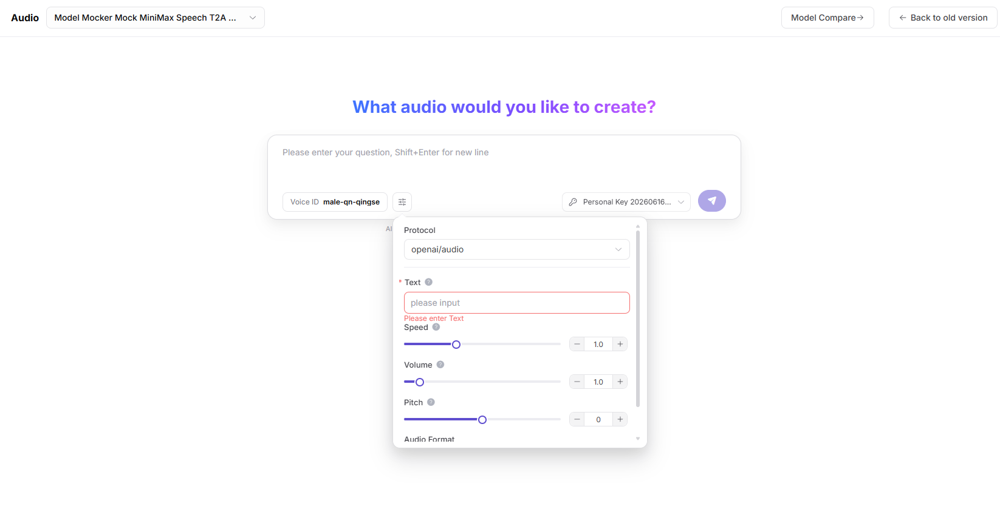

# Audio Playground

:::: info Document Information
Version: v1.0
Updated: 2026-07-08
::::

## Feature Overview

`Audio Playground` is used to maintain or view audio models, input files, recognition or generation parameters, and output results. It supports model publishing, experimentation, calling, statistics, and operational governance.

| Item | Content |
| --- | --- |
| Applicable role | Regular user |
| Navigation path | Playground > Audio |
| Page route | /user/playground/audio |
| Managed objects | Audio models, input files, recognition or generation parameters, and output results |
| Typical use | Test speech recognition, speech generation, or audio understanding models |

### Beginner Explanation

The audio Playground is like a listening room for models. You can upload or enter audio-related content and quickly validate speech recognition, speech generation, or audio understanding models.

### Terms Quick Reference

| Term | Description |
| --- | --- |
| Audio input | Audio sample used for speech recognition, speech generation, or audio understanding. |
| Sampling rate | Number of audio samples per second, affecting model compatibility and recognition quality. |
| Language | Language setting for audio content or output content. |
| Output format | Return form such as text, audio, or structured results. |
## Prerequisites

1. The current account has access to the audio Playground page.
2. The target audio model is available for trial.
3. Audio samples are redacted and authorized.
4. Format, sampling rate, and duration have been confirmed to be within model support.
## Page Description

This page is used to try audio models. It focuses on input audio format, sampling rate, language, output text or audio result, latency, and error prompts. Use redacted samples and do not upload raw recordings containing customer privacy.

Page screenshot:

Select a speech recognition, speech generation, or audio understanding model.

## Main Operations

### Steps

1. Go to `Playground > Audio`.
2. Select audio model and provider.
3. Upload redacted audio or fill in audio input parameters.
4. Set language, sampling rate, output format, and streaming return as needed.
5. Send the request and adjust parameters based on results, latency, and error prompts.

Key screenshot:

Confirm audio format, sampling rate, language, and output format.

### Parameters

| Field Name | Required | Field Type | Example | Description |
| --- | --- | --- | --- | --- |
| Audio File | Conditionally required | File | `sample.wav` | Audio sample used for recognition, understanding, or generation. |
| Language | No | Dropdown | `zh-CN` | Helps the model choose recognition or generation language. |
| Sampling Rate | No | Number | `16000` | Audio sampling rate. |
| Output Format | No | Enum | `text` | Returns text, audio, or structured result. |
| Stream | No | Toggle | `On` | Controls whether results are returned as a stream. |

### Pitfalls

- Do not upload sensitive recordings such as real customer calls, ID numbers, or phone numbers.
- Audio format or sampling-rate mismatches can cause recognition failure.
- Long audio may trigger timeout, Token, or billing limits.

### Result Checks

1. The page returns recognized text, generated audio, or structured result.
2. After language, sampling rate, and output format parameters change, results match expectations.
3. On failure, request ID, error code, or format limit prompt is visible.
## FAQ

### Recognition Fails After Audio Upload

**Symptom:**

The page returns a format error or cannot recognize the audio.

**Possible Causes:**

- Audio format is unsupported.
- Sampling rate or channel does not meet model requirements.
- File is too large or duration is too long.

**Handling:**

1. Convert to a model-supported format.
2. Adjust sampling rate and channel.
3. Retry with a shorter redacted sample.

### Returned Content Is Incomplete

**Symptom:**

Recognized text is missing, or generated audio is truncated.

**Possible Causes:**

- Input audio quality is poor.
- Output length limit is too small.
- Request timed out or streaming connection was interrupted.

**Handling:**

1. Use a clearer sample.
2. Increase output limits.
3. Check network and streaming settings.

### Audio File Is Too Large or Format Is Unsupported

**Symptom:**

After upload, the page reports unsupported format, file too large, duration exceeded, or parsing failure.

**Possible Causes:**

- File format, sampling rate, or channel is outside model support.
- Audio duration is too long and exceeds the single trial limit.
- The file contains damaged segments or nonstandard encoding.

**Handling:**

1. Convert to a model-supported format such as WAV or MP3.
2. Cut a short sample and confirm sampling rate, channel, and duration.
3. Retry with a redacted sample, and record request ID and error code if it fails.

## Next Steps

1. Save effective audio parameter combinations.
2. Go to call logs to view failed requests.
3. Evaluate whether the audio model is suitable for production integration.
## Notes

- Do not upload sensitive recordings such as real customer calls, ID numbers, or phone numbers.
- Long audio may trigger timeout, fee, or length limits.
- Confirm that audio content is redacted before export or screenshots.
