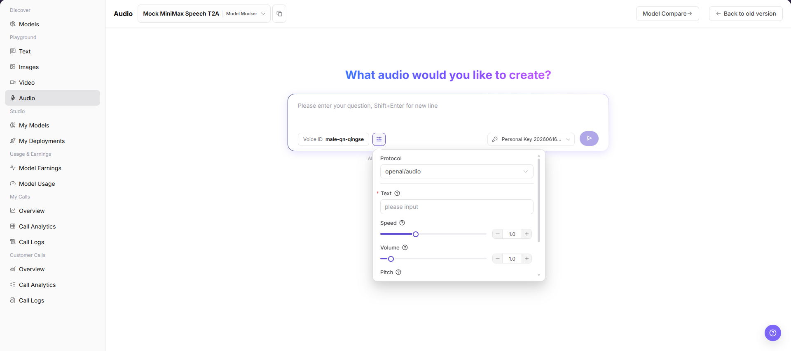
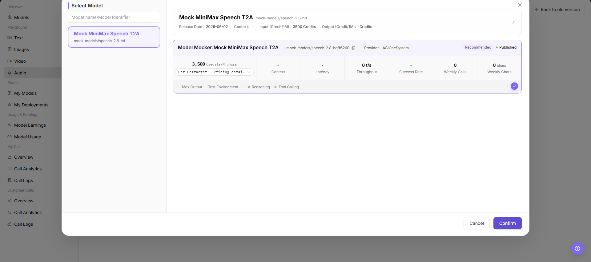

# Audio Playground

::: info Document Information
Version: v1.0
Updated: 2026-07-08
:::

## Feature Overview

Audio Playground is used to select an audio model, enter text to convert into speech, configure Voice ID, speed, volume, pitch, and other parameters, and view the generated audio result or call status.

| Item | Content |
| --- | --- |
| Applicable role | Regular user |
| Navigation path | Model Services > Playground > Audio |
| Page route | `/modelone/exploration/audio` |
| Managed objects | Audio models, Voice ID, text content, protocol, speed, volume, pitch, and generated results |
| Typical use | Try text-to-speech audio models on the page |

#### Beginner Explanation

The audio Playground is like a listening room for speech models. After selecting an audio model, users enter the text to synthesize, choose a Voice ID, adjust speed, volume, pitch, and other parameters according to page capability, and then check whether the generated result matches expectations.

#### Terms Quick Reference

| Term | Description |
| --- | --- |
| Voice ID | Voice or speaker identifier used for speech generation. |
| Text | Text content to convert into speech. |
| Protocol | Current model call protocol. The page example is `openai/audio`. |
| Speed | Controls how fast the generated speech is. |
| Volume | Controls the loudness of the generated speech. |
| Pitch | Controls the pitch of the generated speech. |

## Prerequisites

1. The current account has access to the audio Playground page.
2. The target audio model is published and available for trial.
3. Text content has been checked to avoid sensitive information, private data, or unauthorized content.
4. You understand that clicking the send or generation button may create a real model call and billing record.

::: warning Call And Content Risks
Clicking the send button creates a real model call and may consume quota, generate billing records, or write call logs. Do not enter personal data, customer information, secrets, copyrighted text, or unauthorized content. For page validation only, view the fields and parameter area without submitting a real call request.
:::

## Page Description

This page is used to try text-to-speech audio models. It focuses on model selection, Voice ID, text input, protocol, speed, volume, pitch, Personal Key, and the result area. The parameter panel is used to maintain generation parameters, and the top model selector is used to switch available audio models.

## Main Operations

### Try Audio Model

1. Go to `Model Services > Playground > Audio`.
2. In the model selector, choose the audio model to try.
3. Enter the text content to generate speech in the input box.
4. Select `Voice ID` as required by the page, and confirm `Protocol`, `Text`, `Speed`, `Volume`, `Pitch`, and other parameters.
5. Before clicking `Send` or the actual call button on the page, verify the input content, parameters, and Key selection.
6. For page validation only, do not submit a real call request. You can view only the fields, parameter area, and result area.

The Select Model dialog is used to view model name, model identifier, provider, pricing, context, latency, throughput, success rate, weekly calls, weekly chars, and other information, and close the selection with `Cancel` or `Confirm`.

The parameter area is used to confirm Voice ID, protocol, text, speed, volume, pitch, and the send entry.

## Parameter Reference

| Field Name | Required | Field Type | Example | Description |
| --- | --- | --- | --- | --- |
| Model | Yes | Dropdown | `Mock MiniMax Speech T2A` | The audio model currently being tried. |
| Voice ID | Yes | Input or selector | `male-qn-qingse` | Specifies the voice or speaker for generated speech. |
| Text | Yes | Text input | `please input` | Text content to convert into speech. |
| Protocol | Yes | Dropdown | `openai/audio` | Current audio model call protocol. |
| Speed | No | Slider / number input | `1.0` | Controls the speed of generated speech. |
| Volume | No | Slider / number input | `1.0` | Controls the volume of generated speech. |
| Pitch | No | Slider / number input | `1.0` | Controls the pitch of generated speech. |
| Key | Yes | Dropdown | `Personal Key` | Key used to initiate the trial call. |
| Generated Result | No | Result area | Audio result or status message | Shows generated audio, task status, or error messages. |

## Pitfalls

- Do not enter real customer information, ID numbers, phone numbers, secrets, or other sensitive text.
- Speech generation may involve voice synthesis, copyright, and compliance risks. Confirm text source and usage authorization before production use.
- Speed, Volume, or Pitch values that are too high or too low may produce abnormal audio.
- Clicking the send button creates a real call, which may consume quota and write call logs.

## Result Validation

| Check Item | Success Criteria | Troubleshooting |
| --- | --- | --- |
| Page is accessible | The `Audio` page opens normally, and the left Playground menu and top model selector are visible. | Check account permissions, navigation path, and page loading status. |
| Model can be selected | The Select Model dialog opens normally, and model name, provider, pricing, and status are visible. | Confirm whether available models are published, or switch to another model. |
| Input area is visible | Text input, Voice ID, Key, and send entry are displayed normally. | Refresh the page or check model capability configuration. |
| Parameter area is visible | `Protocol`, `Text`, `Speed`, `Volume`, `Pitch`, and other fields are displayed normally. | Check whether the parameter panel is expanded, or select the model again. |
| Result area is visible | If a real call is executed, the page shows an audio result, task status, or error message. | Record the request ID or error message, and check text, Key, and parameter configuration. |

## FAQ

#### What should I check before clicking Send?

Check that the model, Voice ID, Text, Key, Speed, Volume, Pitch, and other settings are correct, and confirm that the text does not contain sensitive or unauthorized content.

#### Why does the generated speech sound abnormal?

The text, Voice ID, Speed, Volume, or Pitch may be unsuitable. Restore the default parameters first, and then adjust them one by one.

#### Can I click Send when only learning the page?

Not recommended. Clicking Send creates a real model call and may consume quota, generate billing records, or write call logs. For page validation only, view the fields, parameter area, and result area.

## Next Steps

1. Record the model, Voice ID, and parameter combinations that fit the business scenario.
2. If the call fails, go to call logs to view error information.
3. Before production integration, confirm text source, audio generation compliance requirements, and budget.

## Notes

- Do not write test accounts, passwords, access parameters, or internal test processes.
- Do not display real keys, tokens, AK/SK, or private keys in the document.
- Before screenshots or export, confirm that the page does not contain sensitive text, personal voice information, or real business data.
