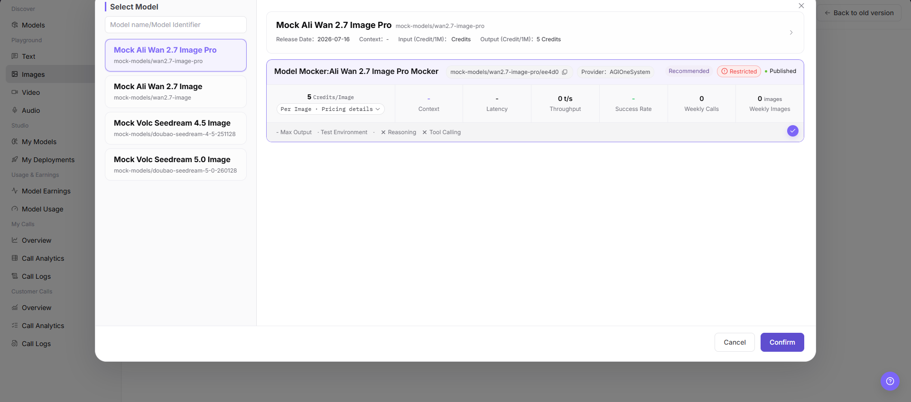
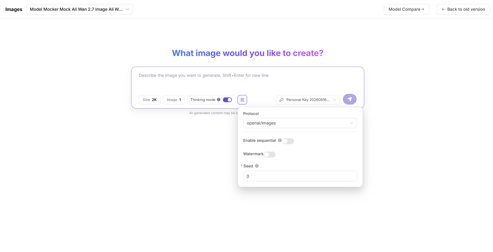

# Image Playground

::: info Document Information
Version: v1.0
Updated: 2026-07-08
:::

## Feature Overview

Image Playground is used to try image or multimodal models with redacted images, Prompts, size, style, safety settings, and generation results.

| Item | Content |
| --- | --- |
| Applicable role | Regular user |
| Navigation path | Playground > Image |
| Page route | /user/playground/images |
| Managed objects | Image models, Prompts, size, style, and generation results |
| Typical use | Test image understanding or image generation models |

### Beginner Explanation

The image Playground is like a test booth for models. It validates image understanding, image generation, or multimodal Q&A. Focus on whether input image quality, Prompt, and output format match.

### Terms Quick Reference

| Term | Description |
| --- | --- |
| Image input | Image used for image understanding, image-to-image, or multimodal Q&A. |
| Prompt | Text instruction describing the generation target or understanding task. |
| Size | Width and height specification for output or processed images. |
| Safety policy | Model blocking rules for sensitive, prohibited, or unauthorized content. |
## Prerequisites

1. The current account has access to the image Playground page.
2. The target image or multimodal model is available for trial.
3. Uploaded images are redacted and authorized for use.
## Page Description

This page is used to try image or multimodal models. It supports uploading redacted images, entering Prompts, setting size, quantity, quality, or safety filter parameters, and viewing generation results, error codes, and usage.

Page screenshot:

Select a model that supports image generation or image understanding.

## Main Operations

### Steps

1. Go to `Playground > Image`.
2. Select an image or multimodal model.
3. Upload a redacted image or enter a generation Prompt.
4. Set size, quantity, quality, and safety filter parameters.
5. Send the request and view image results, request ID, and usage.

Key screenshot:

Set size, quantity, quality, and safety filter parameters according to model capability.

### Parameters

| Field Name | Required | Field Type | Example | Description |
| --- | --- | --- | --- | --- |
| Image Input | Conditionally required | File | `sample.png` | Used for image understanding or image-to-image scenarios. |
| Prompt | Conditionally required | Text | `Generate a product poster` | Guides model understanding or generation. |
| Size | No | Enum | `1024x1024` | Output image size. |
| Quantity | No | Number | `1` | Number of images to generate. |
| Quality | No | Enum | `standard` | Controls generation quality or cost. |

### Pitfalls

- Do not upload customer IDs, contracts, medical records, or unauthorized materials.
- Larger size and quantity usually increase latency and cost.
- When multimodal understanding fails, first check whether the image is clear and correctly oriented.

### Result Checks

1. Image generation or understanding results are displayed on the page.
2. After size, quantity, or quality parameters change, results match expectations.
3. On failure, the page displays request ID, error code, or safety policy Prompt.
## FAQ

### Image Generation Fails

**Symptom:**

After submitting the Prompt, no image is generated or the page returns failure.

**Possible Causes:**

- The Prompt triggered a safety policy.
- Size, quantity, or quality parameters exceed model limits.
- The model is currently rate-limited or unavailable.

**Handling:**

1. Adjust the Prompt and avoid sensitive or infringing descriptions.
2. Lower image size, quantity, or quality requirements.
3. View the error code in call logs.

### Image Understanding Result Is Inaccurate

**Symptom:**

The model description does not match the image content or misses key objects.

**Possible Causes:**

- The image is blurry, occluded, or low resolution.
- The Prompt question is too broad.
- The model does not support this image task.

**Handling:**

1. Use a clearer image.
2. Split the question into specific instructions.
3. Switch to a model that supports image understanding.

### Image Format, Size, or Safety Policy Fails

**Symptom:**

After upload, the page reports format, file size, dimension, or safety check failure.

**Possible Causes:**

- Image format is unsupported.
- File is too large or resolution exceeds limits.
- Image contains sensitive, unauthorized, or prohibited content.

**Handling:**

1. Convert to a supported format.
2. Compress the image or reduce resolution.
3. Replace it with authorized and redacted image material.
## Next Steps

1. Save reusable Prompts and parameters.
2. View call logs to locate failed requests.
3. Evaluate whether the result is suitable for app or integration workflows.
## Notes

- Do not upload sensitive images such as IDs, contracts, medical records, or faces.
- Generated images may involve copyright and compliance boundaries.
- Before screenshots, confirm that images and output content can be public.
