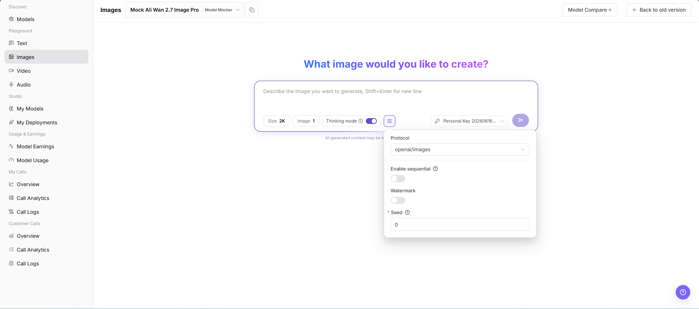

# Image Playground

::: info Document Information
Version: v1.0
Updated: 2026-07-08
:::

## Feature Overview

Image Playground is used to select an image model, enter a prompt, adjust image size, image count, and advanced parameters, and view generated results.

| Item | Content |
| --- | --- |
| Applicable role | Regular user |
| Navigation path | Model Services > Playground > Images |
| Page route | `/modelone/exploration/image` |
| Managed objects | Image models, prompts, image size, number of images, generation parameters, and generated results |
| Typical use | Try image generation models on the page |

#### Beginner Explanation

The image Playground is like a test booth for models. After selecting an image model, users enter the image they want to generate, adjust size, image count, thinking mode, watermark, seed, and other parameters, and then check whether the generated result matches expectations.

#### Terms Quick Reference

| Term | Description |
| --- | --- |
| Prompt | Text instruction describing the target image, style, and constraints. |
| Size | Output image size or quality tier. |
| Image count | Number of images generated by one request. |
| Thinking mode | Controls whether model thinking mode is enabled. |
| Protocol | Current image generation call protocol, such as `openai/images`. |
| Seed | Random seed used to influence or reproduce generation results. |
| Watermark | Controls whether a watermark is added to generated images. |
## Prerequisites

1. The current account has access to the image Playground page.
2. The target image model is authorized for the current account to try.
3. Prompts and reference materials do not contain real keys, customer privacy, unauthorized materials, or sensitive content.

::: warning Call, Billing, and Content Risk
Clicking the generate button creates a real model call and may consume credits, generate call logs, or create billing records. Generated images may also involve copyright, compliance, or sensitive content risks. For page validation only, view the model selector, input box, parameter area, and result area. Do not submit a real generation request.
:::

## Page Description

This page is used to try image generation models. Focus on selecting the model and provider, entering an image prompt, and adjusting `Size`, image count, `Thinking mode`, `Protocol`, `Enable sequential`, `Watermark`, `Seed`, and other parameters.

Page screenshot:

The Images page includes the model selector, prompt input box, size, image count, thinking mode, parameter entry, key selector, and generate entry.

## Main Operations

### Try Image Model

1. Go to `Model Services > Playground > Images`.
2. In the model selector at the top of the page, choose the image model and provider to try.
3. Fill in the prompt input box with the image content, style, aspect, composition, or other constraints to generate.
4. Adjust quick parameters such as `Size`, image count, and `Thinking mode` as needed.
5. Click the parameter button and view or adjust `Protocol`, `Enable sequential`, `Watermark`, `Seed`, and other advanced parameters as needed.
6. Before clicking the generate button, verify the input content, model, provider, key, and parameters.
7. For page validation only, do not submit a real generation request. You can view only the fields, parameter area, and result area.

The model selection dialog is used to search models, select provider instances, and confirm model pricing, context, latency, throughput, success rate, weekly calls, and listing status.

In the parameter area, view or adjust `Protocol`, `Enable sequential`, `Watermark`, `Seed`, and other settings. Do not click the generate button to submit a real request when learning the page.

## Parameter Reference

| Field Name | Required | Field Type | Example | Description |
| --- | --- | --- | --- | --- |
| Model | Yes | Dropdown | `Mock Ali Wan 2.7 Image Pro` | Image model currently being tried. |
| Provider | Yes | Dropdown | `Model Mocker` | Provider instance of the current model. |
| Prompt | Yes | Multiline text | `Generate a product poster` | Describes the image content and style to generate. |
| Size | No | Option | `2K` | Controls the generated image size or quality tier. |
| Number of Images | No | Number | `1` | Controls the number of images generated by one request. |
| Thinking mode | No | Toggle | `On` | Controls whether thinking mode is enabled. |
| Protocol | No | Dropdown | `openai/images` | Protocol used by the current image generation call. |
| Enable sequential | No | Toggle | `Off` | Controls whether sequential generation capability is enabled. |
| Watermark | No | Toggle | `Off` | Controls whether a watermark is added. |
| Seed | No | Number | `0` | Random seed used to influence or reproduce generation results. |
| Generated Result | No | Image area | Generated image | Displays generated images, error messages, or an empty state. |

## Pitfalls

- Do not enter real keys, customer privacy, or unauthorized material descriptions in prompts.
- Larger image size and image count usually increase latency and cost.
- Generated images may involve copyright, portrait rights, trademarks, or compliance boundaries. Confirm authorization before formal use.
- Do not click the generate button to submit a real request when learning the page or capturing screenshots.

## Result Validation

| Check Item | Success Signal | If Abnormal |
| --- | --- | --- |
| Page is accessible | The `Images` page opens normally, and the left Playground menu and top model selector are visible. | Check account permissions, navigation path, and page loading status. |
| Model selector loads | The model selector can be opened and shows model list, provider instances, and status information. | Refresh the page and retry, or confirm whether the target model is visible to the current account. |
| Input and parameter areas are visible | Prompt input box, Size, image count, Thinking mode, Protocol, Watermark, Seed, and other fields are visible. | Check whether the page has fully loaded. If needed, switch models and view again. |
| Result area is visible | The page can display generated results, error messages, or an empty state. | If there is no generation record, the input and parameter areas should still be displayed normally. |
| No real generation is submitted | During learning or screenshot capture, the generate button is not clicked, no prompt is submitted, and no credits are consumed. | If a generation action is triggered accidentally, record the time and model name, then check call logs later. |
| Real generation returns a result | When generation is explicitly allowed, the page returns generated images or clear error messages. | Adjust the prompt, lower image size or image count, and check error messages or call logs. |
## FAQ

#### Image Generation Fails

**Symptom:**

After submitting the prompt, no image is generated or the page returns failure.

**Possible Causes:**

- The prompt triggered a safety policy.
- Size, image count, Seed, or other parameters exceed model limits.
- The model is currently rate-limited, delisted, or unavailable.

**Handling:**

1. Adjust the prompt and avoid sensitive, infringing, or prohibited descriptions.
2. Lower image size or image count and retry.
3. View error messages or error codes in call logs.

#### Generated Result Does Not Match Expectations

**Symptom:**

The generated image does not match the prompt, or the style, composition, or subject is not as expected.

**Possible Causes:**

- The prompt is too broad and lacks subject, style, scene, or constraints.
- Seed, size, or model capability affects the generation result.
- The current model is not suitable for the target image type.

**Handling:**

1. Rewrite the prompt with clearer subject, background, style, color, and composition requirements.
2. Adjust Seed, Size, or image count and validate again.
3. Switch to an image model that better supports the target scenario.

#### Content or Safety Policy Fails

**Symptom:**

The page indicates that content is non-compliant, safety check failed, or generation cannot proceed.

**Possible Causes:**

- The prompt contains sensitive, infringing, unauthorized, or prohibited content.
- The generation target involves restricted people, brands, privacy, or content unsuitable for public distribution.
- The model or platform has enabled safety filtering policies.

**Handling:**

1. Remove sensitive, infringing, or unauthorized descriptions.
2. Use authorized materials and public-safe scene descriptions.
3. If the business requires this generation, confirm compliance requirements and authorization scope first.
## Next Steps

1. Save reusable prompts and parameter combinations.
2. When troubleshooting is needed, use model name, time, and error messages to view call logs.
3. Before using generated images formally, confirm copyright, compliance, and public distribution scope.
## Notes

- Do not upload or describe sensitive content such as IDs, contracts, medical records, or faces.
- Generated images may involve copyright, portrait rights, trademarks, and compliance boundaries.
- Before screenshots, confirm that prompts, images, and output content can be public.
