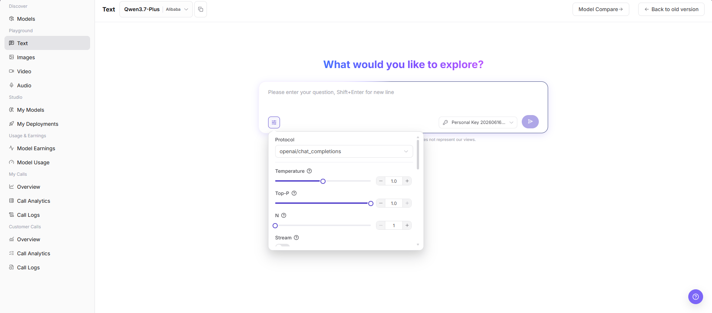
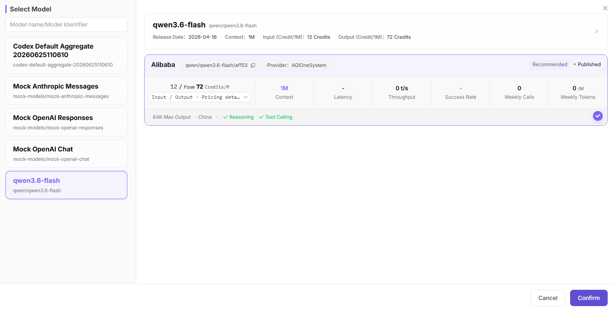

# Text Playground

::: info Document Information
Version: v1.0
Updated: 2026-07-08
:::

## Feature Overview

`Text Playground` is used to select text models on the page, write Prompts, adjust generation parameters, and observe response quality, latency, and error Prompts.

| Item | Content |
| --- | --- |
| Applicable role | Regular user |
| Navigation path | Model Services > Playground > Text |
| Page route | `/modelone/exploration/chat` |
| Managed objects | Text models, Prompts, generation parameters, output results, and debugging records |
| Typical use | Test text model output on the page |

#### Beginner Explanation

The text Playground is like scratch paper for a model. It is used to quickly draft Prompts, adjust Temperature, Top-P, Max Tokens, and Stream, and observe whether model responses are stable, complete, and as expected.

#### Terms Quick Reference

| Term | Description |
| --- | --- |
| Prompt | Prompt, question, or context input to the model. |
| Temperature | Parameter that controls randomness and divergence of responses. |
| Top-P | Parameter that controls the sampling range of candidate Tokens. |
| Max Tokens | Limits the maximum output length of the model. |
| Stream | Controls whether content is returned as it is generated. |
| Protocol | Selects the text model call protocol, such as `openai/chat_completions`. |
## Prerequisites

1. The current account has access to the text Playground page.
2. The target model is authorized for the current account to try.
3. The Prompt does not contain real keys, customer privacy, or production business data.

::: warning Call and Billing Risk
Clicking the send button creates a real model call and may consume credits, generate call logs, or create billing records. For page validation only, view the model selector, input box, and parameter area. Do not submit a real Prompt.
:::

## Page Description

This page is used to try text models. Focus on selecting the model and provider, entering a Prompt, adjusting Protocol, Temperature, Top-P, N, Stream, and other parameters, and observing the input area, response area, history, and error messages.

Page screenshot:

The Text page includes the model selector, Prompt input box, parameter entry, key selector, and send entry.

## Main Operations

### Try Text Model

1. Go to `Model Services > Playground > Text`.
2. In the model selector at the top of the page, choose the text model and provider to try.
3. Fill in the Prompt input box with a question, context, or other input content.
4. Click the parameter button and view or adjust `Protocol`, `Temperature`, `Top-P`, `N`, `Stream`, and other parameters as needed.
5. Before clicking the send button, verify the input content, model, provider, key, and parameters.
6. For page validation only, do not submit a real call request. You can view only the fields, parameter area, and history/response area.

The model selection dialog is used to search models, select provider instances, and confirm model context, pricing, latency, throughput, success rate, and listing status.

In the parameter area, view or adjust `Protocol`, `Temperature`, `Top-P`, `N`, `Stream`, and other settings. Do not click the send button to submit a real Prompt when learning the page.

## Parameter Reference

| Field Name | Required | Field Type | Example | Description |
| --- | --- | --- | --- | --- |
| Model | Yes | Dropdown | `Qwen3.7-Plus` | Text model currently being tried. |
| Provider | Yes | Dropdown | `Alibaba` | Provider instance of the current model. |
| Prompt | Yes | Multiline text | `Summarize this text` | Prompt, question, or context input to the model. |
| Protocol | No | Dropdown | `openai/chat_completions` | Protocol used by the current call. |
| Temperature | No | Number / Slider | `0.7` | Controls output randomness. Higher values are more divergent. |
| Top-P | No | Number / Slider | `0.8` | Controls candidate token sampling range. |
| N | No | Number / Stepper | `1` | Controls the number of candidate responses returned by one request. |
| Stream | No | Toggle | `On` | Controls whether output is returned as a stream. |
| Response | No | Text area | Model response content | Displays generated content, error messages, or status information. |

## Pitfalls

- Do not set both Temperature and Top-P too high.
- If Max Tokens is too small, answers may be truncated; if too large, costs may increase.
- Do not enter real keys or customer privacy in Prompts.
- Sending a Prompt may create call records, consume credits, or generate billing records. Do not submit real requests when learning the page.

## Result Validation

| Check Item | Success Criteria | Troubleshooting |
| --- | --- | --- |
| Page is accessible | The `Text` page opens normally, and the left Playground menu and top model selector are visible. | Check account permissions, navigation path, and page loading status. |
| Model selector loads | The model selector can be opened and shows model list, provider instances, and status information. | Refresh the page and retry, or confirm whether the target model is visible to the current account. |
| Input and parameter areas are visible | Prompt input box, parameter button, Protocol, Temperature, Top-P, N, Stream, and other fields are visible. | Check whether the page has fully loaded. If needed, switch models and view again. |
| History or response area is visible | The page can display conversation history, response content, error messages, or an empty state. | If there is no history, the input area should still be displayed normally. |
| No real call is submitted | During learning or screenshot capture, the send button is not clicked, no Prompt is submitted, and no credits are consumed. | If a send action is triggered accidentally, record the time and model name, then check call logs later. |
| Real call returns a response | When a call is explicitly allowed, the page returns a text response related to the Prompt. | Shorten the Prompt, lower parameters, and check error messages or call logs. |
## FAQ

#### Output Is Empty or Times Out

**Symptom:**

After sending a Prompt, no content is returned, or the page stays in generation for a long time.

**Possible Causes:**

- Prompt is too long, context is too large, or Max Tokens is too high.
- The model service is busy, queued, or rate-limited.
- Network connection is interrupted or the browser session has expired.

**Handling:**

1. Shorten the Prompt or reduce Max Tokens and retry.
2. Send again later and observe whether the timeout persists.
3. Record request time, model name, and error Prompt, then check call logs or contact the operator.

#### High Temperature Causes Divergent Results

**Symptom:**

Model responses become off-topic, repetitive, poorly formatted, or inconsistent with business expectations.

**Possible Causes:**

- Temperature is too high, making output too random.
- Top-P is also high, making the sampling range too broad.
- The Prompt lacks clear format, boundaries, or examples.

**Handling:**

1. Lower Temperature to the `0.2` to `0.7` range and retry.
2. Do not set both Temperature and Top-P very high.
3. Add output format, prohibited items, and examples to the Prompt.

#### Streaming Output Is Interrupted

**Symptom:**

After Stream is enabled, the page starts returning content but stops midway or misses the ending.

**Possible Causes:**

- Network connection is unstable or the browser tab was refreshed.
- The model server connection timed out.
- Max Tokens or output length limits caused early truncation.

**Handling:**

1. Disable Stream and resend to confirm whether complete content can be returned.
2. Reduce Max Tokens or shorten the Prompt to lower pressure on a single generation.
3. Record request ID, model name, and time, then view error codes in call logs.

## Next Steps

1. Save effective Prompt and parameter combinations.
2. When troubleshooting is needed, use request ID to view call logs.
3. Before production integration, organize API parameters and output format requirements.
## Notes

- Do not enter keys, access Tokens, or customer privacy in Prompts.
- Redact request IDs and sensitive output content before screenshots.
- When comparing parameters, adjust only a small number of variables at a time.
