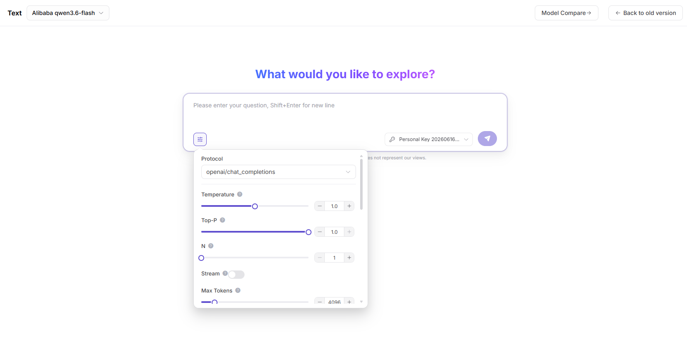

# Text Playground

::: info Document Information
Version: v1.0
Updated: 2026-07-08
:::

## Feature Overview

`Text Playground` is used to select text models on the page, write Prompts, adjust generation parameters, and observe response quality, latency, and error Prompts.

| Item | Content |
| --- | --- |
| Applicable role | Regular user |
| Navigation path | Playground > Text |
| Page route | /user/playground/text |
| Managed objects | Text models, Prompts, generation parameters, output results, and debugging records |
| Typical use | Test text model output on the page |

### Beginner Explanation

The text Playground is like scratch paper for a model. It is used to quickly draft Prompts, adjust Temperature, Top-P, Max Tokens, and Stream, and observe whether model responses are stable, complete, and as expected.

### Terms Quick Reference

| Term | Description |
| --- | --- |
| Prompt | Prompt, question, or context input to the model. |
| Temperature | Parameter that controls randomness and divergence of responses. |
| Top-P | Parameter that controls the sampling range of candidate Tokens. |
| Max Tokens | Limits the maximum output length of the model. |
| Stream | Controls whether content is returned as it is generated. |
## Prerequisites

1. The current account has access to the text Playground page.
2. The target model is authorized for the current account to try.
3. The Prompt does not contain real keys, customer privacy, or production business data.
## Page Description

This page is used to try text models. Focus on adjusting Prompt, Temperature, Top-P, Max Tokens, Stream, and other parameters, and observe output quality, latency, and error Prompts.

Page screenshot:

Select the model and provider to try first.

## Main Operations

### Steps

1. Go to `Playground > Text`.
2. Select target model and provider.
3. Enter a Prompt or conversation context.
4. Adjust Temperature, Top-P, Max Tokens, and Stream as needed.
5. Send the request and adjust parameters based on the output.

Key screenshot:

After adjusting Temperature, Top-P, Max Tokens, and Stream, observe output changes.

### Parameters

| Field Name | Required | Field Type | Example | Description |
| --- | --- | --- | --- | --- |
| Prompt | Yes | Multiline text | `Summarize this text` | Prompt input to the model. |
| Temperature | No | Number | `0.7` | Controls output randomness. Higher values are more divergent. |
| Top-P | No | Number | `0.8` | Controls candidate Token sampling range. |
| Max Tokens | No | Number | `1024` | Limits maximum output length. |
| Stream | No | Toggle | `On` | Controls whether output is returned as a stream. |

### Pitfalls

- Do not set both Temperature and Top-P too high.
- If Max Tokens is too small, answers may be truncated; if too large, costs may increase.
- Do not enter real keys or customer privacy in Prompts.

### Result Checks

1. The page returns a text response related to the Prompt.
2. After adjusting Temperature, Top-P, or Max Tokens, output length and style change as expected.
3. Stream toggle status matches the return mode.
## FAQ

### Output Is Empty or Times Out

**Symptom:**

After sending a Prompt, no content is returned, or the page stays in generation for a long time.

**Possible Causes:**

- Prompt is too long, context is too large, or Max Tokens is too high.
- The model service is busy, queued, or rate-limited.
- Network connection is interrupted or the browser session has expired.

**Handling:**

1. Shorten the Prompt or reduce Max Tokens and retry.
2. Send again later and observe whether the timeout persists.
3. Record request time, model name, and error Prompt, then check call logs or contact the operator.

### High Temperature Causes Divergent Results

**Symptom:**

Model responses become off-topic, repetitive, poorly formatted, or inconsistent with business expectations.

**Possible Causes:**

- Temperature is too high, making output too random.
- Top-P is also high, making the sampling range too broad.
- The Prompt lacks clear format, boundaries, or examples.

**Handling:**

1. Lower Temperature to the `0.2` to `0.7` range and retry.
2. Do not set both Temperature and Top-P very high.
3. Add output format, prohibited items, and examples to the Prompt.

### Streaming Output Is Interrupted

**Symptom:**

After Stream is enabled, the page starts returning content but stops midway or misses the ending.

**Possible Causes:**

- Network connection is unstable or the browser tab was refreshed.
- The model server connection timed out.
- Max Tokens or output length limits caused early truncation.

**Handling:**

1. Disable Stream and resend to confirm whether complete content can be returned.
2. Reduce Max Tokens or shorten the Prompt to lower pressure on a single generation.
3. Record request ID, model name, and time, then view error codes in call logs.

## Next Steps

1. Save effective Prompt and parameter combinations.
2. When troubleshooting is needed, use request ID to view call logs.
3. Before production integration, organize API parameters and output format requirements.
## Notes

- Do not enter keys, access Tokens, or customer privacy in Prompts.
- Redact request IDs and sensitive output content before screenshots.
- When comparing parameters, adjust only a small number of variables at a time.
