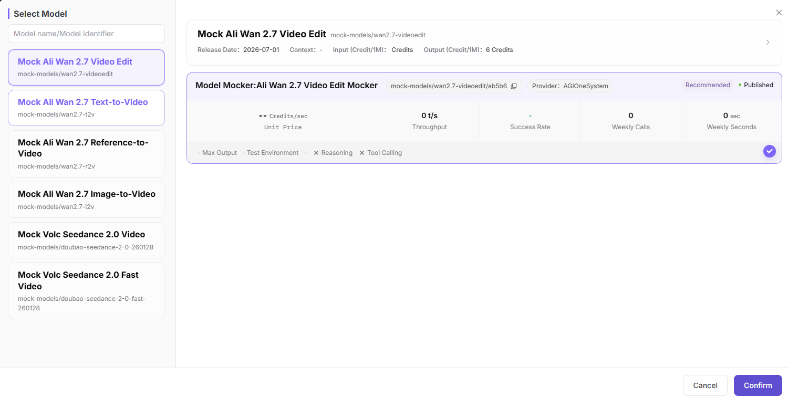
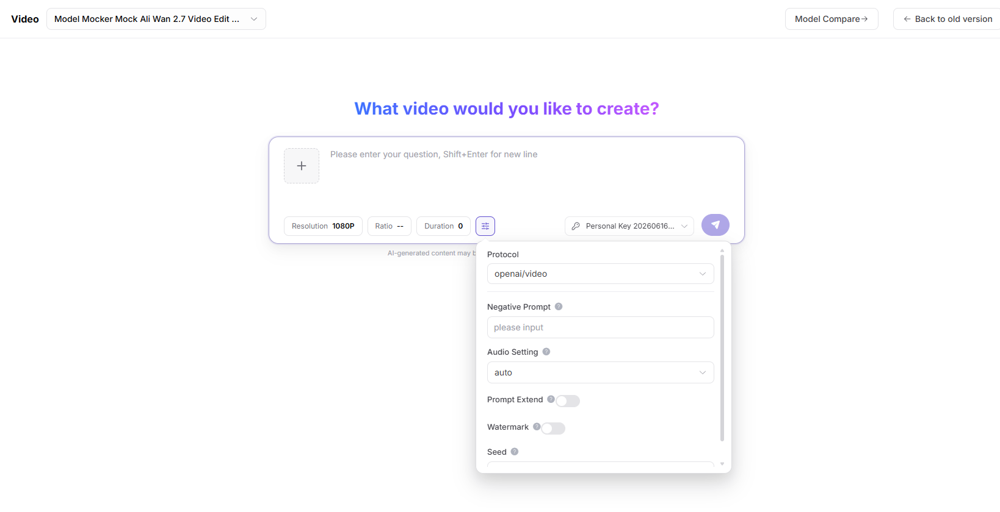

# Video Playground

## Feature Overview

`Video Playground` is used to maintain or view video models, input materials, frame sampling parameters, generation parameters, and results. It supports model publishing, experimentation, calling, statistics, and operational governance.

| Item | Content |
| --- | --- |
| Applicable role | Regular user |
| Navigation path | Playground > Video |
| Page route | /user/playground/video |
| Managed objects | Video models, input materials, frame sampling parameters, generation parameters, and results |
| Typical use | Test video understanding or video generation models |

### Beginner Explanation

The video Playground is like a screening room for video models. It validates video understanding, summarization, Q&A, or generation capabilities. Video duration, frame rate, and content compliance directly affect results.

### Terms Quick Reference

| Term | Description |
| --- | --- |
| Video input | Video material used for video understanding, summarization, Q&A, or generation. |
| Frame sampling interval | Time interval at which frames are sampled when the model analyzes the video. |
| Maximum duration | Video length allowed for a single request. |
| Output format | Return form such as summary, Q&A, or structured result. |
## Prerequisites

1. The current account has access to the video Playground page.
2. The target video model is available for trial.
3. Video materials are redacted and authorized.
4. Format, duration, and frame sampling parameters have been confirmed to be within model support.
## Page Description

This page is used to try video models. It supports uploading redacted videos or entering video input addresses, setting frame sampling, duration, output format, and prompt, and viewing return results, elapsed time, error codes, and usage.

Page screenshot:

Select a video understanding, summarization, Q&A, or generation model.

## Main Operations

### Steps

1. Go to `Playground > Video`.
2. Select video model and provider.
3. Upload a redacted video or fill in a placeholder video address.
4. Set duration, frame sampling, output format, and prompt.
5. Send the request and view result, request ID, and usage.

Key screenshot:

Confirm video duration, frame sampling interval, and output format.

### Parameters

| Field Name | Required | Field Type | Example | Description |
| --- | --- | --- | --- | --- |
| Video Input | Conditionally required | File / URL | `sample.mp4` | Input used for video understanding or generation. |
| Prompt | Conditionally required | Text | `Summarize the video content` | Guides model analysis or generation. |
| Maximum Duration | No | Number | `60s` | Limits the video length to process. |
| Frame Sampling Interval | No | Number | `2s` | Controls sampling granularity for video understanding. |
| Output Format | No | Enum | `summary` | Summary, Q&A, or structured result. |

### Pitfalls

- Do not upload videos containing customer privacy, license plates, faces, or unauthorized materials.
- Long videos increase latency, cost, and failure probability.
- Video URLs must use accessible placeholder or secure addresses. Do not write internal addresses in documentation.

### Result Checks

1. The page returns video summary, Q&A, or generation result.
2. After frame sampling, duration, and output format parameters change, results match expectations.
3. On failure, request ID, error code, or parameter limit prompt is visible.
## FAQ

### Video Processing Times Out

**Symptom:**

After submitting a video, there is no result for a long time or timeout is returned.

**Possible Causes:**

- Video duration is too long.
- Frame sampling interval is too dense.
- Model queue or upstream service is congested.

**Handling:**

1. Cut a shorter sample.
2. Increase the frame sampling interval.
3. Retry later or switch models.

### Video Result Does Not Match Expectations

**Symptom:**

The summary misses key points, or video Q&A answers are incorrect.

**Possible Causes:**

- Prompt is not specific enough.
- Key frames are not covered by frame sampling.
- Video clarity or subtitle quality is poor.

**Handling:**

1. Add a clearer question.
2. Adjust frame sampling strategy.
3. Use clearer video material.

### Video Format, Duration, or Frame Sampling Is Unsupported

**Symptom:**

The page reports unsupported video format, duration exceeded, or invalid frame sampling parameters.

**Possible Causes:**

- Video format is outside supported range.
- File is too large or duration is too long.
- Frame sampling interval or output format does not match model capability.

**Handling:**

1. Convert to a supported format.
2. Cut a short video sample.
3. Adjust frame sampling and output format according to page prompts.

### Video URL Is Inaccessible or Fails to Parse

**Symptom:**

After entering a video URL, the page reports download failure, parsing failure, access timeout, or insufficient permission.

**Possible Causes:**

- The video URL is not accessible to the platform.
- The URL requires login, the signature expired, or it is blocked by network policy.
- Video encoding, format, or file size does not meet model limits.

**Handling:**

1. Use a publicly accessible or platform-allowed redacted test address.
2. Confirm signature validity period, access permission, and network connectivity.
3. If needed, upload a short video sample instead, and record request ID and error code.

## Next Steps

1. Record effective parameter combinations.
2. View call logs to locate failed requests.
3. Evaluate whether the video model is suitable for integration into app workflows.
## Notes

- Do not upload videos containing customer privacy, faces, license plates, or unauthorized materials.
- Long videos significantly increase latency and cost.
- Video URL examples must use placeholder addresses.
