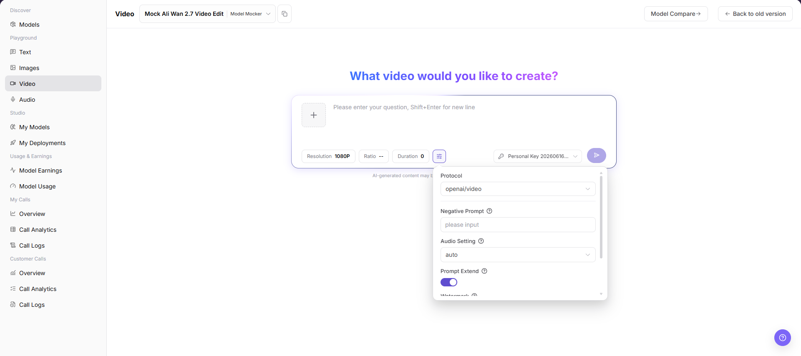

# Video Playground

::: info Document Information
Version: v1.0
Updated: 2026-07-08
:::

## Feature Overview

Video Playground is used to select a video model, enter a prompt, upload or select a reference image, adjust resolution, aspect ratio, duration, and advanced parameters, and view generated videos or task status.

| Item | Content |
| --- | --- |
| Applicable role | Regular user |
| Navigation path | Model Services > Playground > Video |
| Page route | `/modelone/exploration/video` |
| Managed objects | Video models, prompts, reference images, resolution, aspect ratio, duration, generation parameters, and generated results |
| Typical use | Try video generation models on the page |

#### Beginner Explanation

The video Playground is like a screening room for video models. After selecting a video model, users enter the video they want to generate, optionally add a reference image according to model capability, adjust resolution, aspect ratio, duration, negative prompt, audio, watermark, and other parameters, and then check whether the generated result or task progress matches expectations.

#### Terms Quick Reference

| Term | Description |
| --- | --- |
| Prompt | Text instruction describing the video subject, shot, action, style, and constraints. |
| Reference Image | Image material used as a reference for video generation. |
| Resolution | Output video resolution. |
| Aspect Ratio | Output video aspect ratio. |
| Duration | Output video duration. |
| Negative Prompt | Describes content that should not appear in the video. |
| Audio Setting | Audio-related configuration. |
| Prompt Extend | Controls whether prompt extension is enabled. |
| Watermark | Controls whether a watermark is added to generated videos. |

## Prerequisites

1. The current account has access to the video Playground page.
2. The target video model is authorized for the current account to try.
3. Prompts, reference images, and video materials do not contain real keys, customer privacy, unauthorized materials, or sensitive content.
4. Resolution, aspect ratio, duration, and advanced parameters have been confirmed to be within the target model support range.

::: warning Call, Billing, Async Task, and Content Risk
Clicking the generate button creates a real model call and may consume credits, generate call logs, create billing records, or create async task/queue records. Video generation usually takes longer, and generated videos may involve copyright, portrait rights, compliance, or sensitive content risks. For page validation only, view the model selector, input box, parameter area, and result area. Do not submit a real generation request.
:::

## Page Description

This page is used to try video generation models. Focus on selecting the model and provider, entering a video prompt or adding a reference image, and adjusting `Resolution`, `Ratio`, `Duration`, `Protocol`, `Negative Prompt`, `Audio Setting`, `Prompt Extend`, `Watermark`, and other parameters.

Page screenshot:

The Video page includes the model selector, reference image entry, prompt input box, resolution, ratio, duration, parameter entry, key selector, and generate entry.

## Main Operations

### Try Video Model

1. Go to `Model Services > Playground > Video`.
2. In the model selector at the top of the page, choose the video model and provider to try.
3. Fill in the prompt input box with the video content, shot, action, style, aspect ratio, or other constraints to generate.
4. If required by the page or supported by the model, add an authorized and public-safe reference image.
5. Adjust quick parameters such as `Resolution`, `Ratio`, and `Duration` as needed.
6. Click the parameter button and view or adjust `Protocol`, `Negative Prompt`, `Audio Setting`, `Prompt Extend`, `Watermark`, and other advanced parameters as needed.
7. Before clicking the generate button, verify the input content, model, provider, key, and parameters.
8. For page validation only, do not submit a real generation request. You can view only the fields, parameter area, and result area.

The model selection dialog is used to search models, select provider instances, and confirm model pricing, throughput, success rate, weekly calls, weekly generated seconds, and listing status.

In the parameter area, view or adjust `Protocol`, `Negative Prompt`, `Audio Setting`, `Prompt Extend`, `Watermark`, and other settings. Do not click the generate button to submit a real request when learning the page.

## Parameter Reference

| Field Name | Required | Field Type | Example | Description |
| --- | --- | --- | --- | --- |
| Model | Yes | Dropdown | `Mock Ali Wan 2.7 Video Edit` | Video model currently being tried. |
| Provider | Yes | Dropdown | `Model Mocker` | Provider instance of the current model. |
| Prompt | Yes | Multiline text | `Generate a product showcase video` | Describes the video content, action, and style to generate. |
| Reference Image | Conditionally required | Image upload | `reference.png` | Used for image-to-video, reference-to-video, or video editing scenarios. |
| Resolution | No | Option | `1080P` | Controls the generated video resolution. |
| Aspect Ratio | No | Option | `--` | Controls the generated video aspect ratio. |
| Duration | No | Number / Option | `0` | Controls the generated video duration. |
| Protocol | No | Dropdown | `openai/video` | Protocol used by the current video generation call. |
| Negative Prompt | No | Text | `blurry, shaky` | Describes content that should not appear in the video. |
| Audio Setting | No | Dropdown | `auto` | Controls audio generation or retention strategy. |
| Prompt Extend | No | Toggle | `On` | Controls whether prompt extension is enabled. |
| Watermark | No | Toggle | `Off` | Controls whether a watermark is added. |
| Generated Result | No | Video / Task area | Generated video or task progress | Displays generated videos, task progress, error messages, or an empty state. |

## Pitfalls

- Do not upload or describe videos or reference images containing customer privacy, faces, license plates, contracts, medical records, or unauthorized materials.
- Video generation usually takes longer. Higher resolution, longer duration, and more complex reference materials increase cost and failure probability.
- Generated videos may involve copyright, portrait rights, trademarks, and compliance boundaries. Confirm authorization before formal use.
- Video generation may create async tasks or queue records. Do not click the generate button when learning the page or capturing screenshots.

## Result Validation

| Check Item | Success Signal | If Abnormal |
| --- | --- | --- |
| Page is accessible | The `Video` page opens normally, and the left Playground menu and top model selector are visible. | Check account permissions, navigation path, and page loading status. |
| Model selector loads | The model selector can be opened and shows model list, provider instances, and status information. | Refresh the page and retry, or confirm whether the target model is visible to the current account. |
| Input and parameter areas are visible | Reference image entry, prompt input box, Resolution, Ratio, Duration, Negative Prompt, Audio Setting, Prompt Extend, and other fields are visible. | Check whether the page has fully loaded. If needed, switch models and view again. |
| Result area is visible | The page can display generated results, task progress, error messages, or an empty state. | If there is no generation record, the input and parameter areas should still be displayed normally. |
| No real generation is submitted | During learning or screenshot capture, the generate button is not clicked, no prompt is submitted, no task is created, and no credits are consumed. | If a generation action is triggered accidentally, record the time and model name, then check call logs later. |
| Real generation returns a result | When generation is explicitly allowed, the page returns a generated video, task progress, or clear error message. | Adjust the prompt, lower resolution, or shorten duration, and check error messages or call logs. |

## FAQ

#### Video Generation Times Out or Queues

**Symptom:**

After submitting the prompt, there is no result for a long time, or the page shows queued, generating, or timeout status.

**Possible Causes:**

- Video resolution is too high or duration is too long.
- Model queue or upstream service is congested.
- Reference image, prompt, or advanced parameters make the generation task complex.

**Handling:**

1. Lower the resolution or shorten video duration and retry.
2. Generate again later, or switch to a similar available model.
3. Record model name, submission time, and error messages, then check call logs.

#### Generated Result Does Not Match Expectations

**Symptom:**

The generated video does not match the prompt, or the action, shot, style, or subject is not as expected.

**Possible Causes:**

- The prompt is too broad and lacks subject, action, shot, style, or constraints.
- Reference image quality, aspect ratio, or content does not match the target video.
- The current model is not suitable for the target video type.

**Handling:**

1. Rewrite the prompt with clearer subject, action, shot, scene, style, and duration requirements.
2. Use a clearer, authorized, and public-safe reference image.
3. Adjust resolution, aspect ratio, duration, or switch to a video model that better supports the target scenario.

#### Content or Safety Policy Fails

**Symptom:**

The page indicates that content is non-compliant, safety check failed, or generation cannot proceed.

**Possible Causes:**

- The prompt or reference image contains sensitive, infringing, unauthorized, or prohibited content.
- The generation target involves restricted people, brands, privacy, or content unsuitable for public distribution.
- The model or platform has enabled safety filtering policies.

**Handling:**

1. Remove sensitive, infringing, or unauthorized descriptions.
2. Use authorized materials and public-safe scene descriptions.
3. If the business requires this generation, confirm compliance requirements and authorization scope first.

#### Reference Image or Video Material Fails Requirements

**Symptom:**

After adding a reference image or material, the page reports format, file size, dimension, or safety check failure.

**Possible Causes:**

- Material format is unsupported.
- File is too large or resolution exceeds limits.
- Material contains sensitive, unauthorized, or prohibited content.

**Handling:**

1. Convert to a format supported by the page.
2. Compress the material or reduce resolution.
3. Replace it with authorized and public-safe material.

## Next Steps

1. Save reusable prompts and parameter combinations.
2. When troubleshooting is needed, use model name, time, and error messages to view call logs.
3. Before using generated videos formally, confirm copyright, portrait rights, compliance, and public distribution scope.

## Notes

- Do not upload or describe videos containing customer privacy, faces, license plates, contracts, medical records, or unauthorized materials.
- Long videos and high-resolution generation significantly increase latency, cost, and failure probability.
- Before screenshots, confirm that prompts, materials, and generated content can be public.
